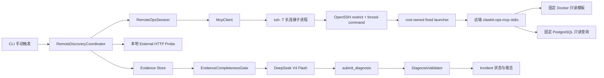

# OPS MVP-1：安全远程接口、SSH 生命周期与 Discovery Loop

> 日期：2026-07-25
>
> 状态：已实施的定版方案；本文保留为远端只读安全设计参考，当前状态以 [TODO.md](../TODO.md) 为准
>
> 范围：P0 远端只读安全接口、单靶机 SSH 生命周期、手动触发 Remote Discovery、DeepSeek 结构化诊断

## 1. 结论

阶段一采用以下唯一生产路径：

```text
本地 Claude/Clawkit 进程
  -> RemoteDiscoveryCoordinator（确定性采证）
  -> McpClient
  -> 单个长生命周期 ssh -T 子进程
  -> OpenSSH forced-command
  -> 远端固定 clawkit-ops-mcp stdio server
  -> allowlisted Docker / HTTP / PostgreSQL 只读能力
```

关键决策：

1. 不继续使用“本地 `DockerOpsBackend` + 通用 `SshCommandExecutor` + 远端命令字符串”作为生产远程路径。
2. SSH 只负责认证、加密和承载一个固定 MCP stdio 会话；客户端没有任意远程命令入口。
3. `opsro` 必须移出 `docker` 组。远端固定 launcher 是唯一特权边界，公钥只能启动该 launcher。
4. 一次 Discovery 复用一个长连接 MCP 会话。`ControlMaster` 不再是正确性前提，只作为后续可选性能优化。
5. 采证由确定性 workflow 完成；DeepSeek 不控制 SSH、不选择目标、不执行采证命令，只消费冻结且脱敏的 Evidence Bundle 并提交结构化 Diagnosis。
6. 第一版串行采集远端证据。远端 MCP server 当前按 stdio 顺序处理请求，暂不为几秒级收益引入并发协议和双重连接生命周期。

## 2. 背景与当前代码事实

### 2.1 已具备

- `OpsMcpServer` 已按 `OpsCapabilityProfile` 暴露固定只读工具，工具 schema、只读注解和参数 allowlist 已存在。
- `DockerOpsBackend` 已将 Docker 命令固定为 `compose ps/port/logs`、`container inspect/stats` 等模板。
- `JdbcPostgresDiagnosticBackend` 已提供活动会话、锁图和连接统计，不暴露自由 SQL。
- `StdioTransport` 已具备子进程启动、JSON-RPC 请求关联、stdout/stderr 并发读取、timeout、取消和三级关闭。
- `McpClient` 已具备 initialize、工具发现和工具调用。
- Incident、Evidence v2、Diagnosis、Flight Recorder 和确定性 Evaluator 已存在。
- OPS-0B 优化路径已验证“确定性基线采证完成后，模型只提交 Diagnosis”的窄工具面。

### 2.2 当前阻断

| 问题 | 代码事实 | 影响 |
| --- | --- | --- |
| `opsro` 属于 `docker` 组 | `ops-fixtures/remote/setup-opsro.sh` 执行 `usermod -aG docker` | Docker 官方将该权限视为 root 级能力，主机层只读不成立 |
| 通用远端命令形态 | `SshCommandExecutor` 将 `List<String>` 拼成远端 shell command | 客户端安全依赖命令模板永远不被绕过，服务端没有独立 operation gate |
| SSH 与业务错误混合 | SSH 错误先写入 stderr，随后常被 `DockerOpsBackend` 包装为 `COMMAND_FAILED` | Discovery 无法稳定区分控制面与业务面故障 |
| 数据库证据不在远端闭环 | `OpsMcpMain` 的 SSH 只替换 Docker `CommandExecutor`，JDBC backend 仍在本地 | 远端 PostgreSQL 未开放端口时无法采证；连接凭据边界不清晰 |
| 无显式会话所有者 | `ControlMaster=auto` 和临时 `ControlPath` 隐式工作 | 无 STARTING/READY/DRAINING/CLOSED 状态、无确定性清理和审计 |
| Discovery 固定且整体失败 | `McpEvidenceCollector.collect()` 串行写死调用，异常时整体抛出 | 部分证据成功无法形成可解释的缺失证据 |
| 模型与采证边界不够稳定 | 既有实验存在 Agent 调用采证工具和确定性基线两种路径 | Diagnosis Benchmark 容易混入采证策略变化 |

## 3. 调研结论

### 3.1 OpenSSH

- OpenSSH 支持 `authorized_keys` 的 `restrict` 与 `command="..."`，可禁用 PTY、端口转发、Agent 转发、X11 和用户 rc，并强制执行固定命令：
  <https://man.openbsd.org/sshd.8>
- `ssh -T` 禁止申请 PTY；`BatchMode=yes` 禁止交互式口令询问：
  <https://man.openbsd.org/ssh.1>
- `ControlMaster`、`ControlPersist` 和 `-O check/exit` 可管理复用连接，但会增加第二套生命周期：
  <https://man.openbsd.org/ssh_config.5>
- Windows OpenSSH 使用与上游一致的客户端配置入口，但不同系统版本和发行方式仍需真实 smoke，不能让连接复用成为正确性前提：
  <https://learn.microsoft.com/en-us/windows-server/administration/openssh/openssh-overview>

结论：一次 Discovery 使用单个长生命周期 SSH/MCP stdio 会话即可消除逐工具握手成本。MVP 不依赖 `ControlMaster`；只有真实基准证明跨 Discovery 重连成本值得优化时，才增加可探测、可降级的复用策略。

### 3.2 Docker 权限

Docker 官方明确说明：

- `docker` 组授予 root 级权限：
  <https://docs.docker.com/engine/install/linux-postinstall>
- 任何能够控制 Docker daemon/socket 的客户端都可向 daemon 下达完整指令：
  <https://docs.docker.com/engine/security/protect-access/>
- 未经约束地开放 Docker 远程 API 可能让非 root 用户取得主机 root 权限：
  <https://docs.docker.com/engine/daemon/remote-access/>

结论：不能把 `opsro + docker group` 描述为主机层只读。必须由一个 root 管理、代码和配置不可被 `opsro` 修改的窄 launcher 承担特权边界；`opsro` 自身不得访问 Docker socket。

### 3.3 DeepSeek

- DeepSeek 支持 OpenAI-compatible Tool Calls；官方仍要求调用方校验工具参数，不能信任模型一定生成合法参数：
  <https://api-docs.deepseek.com/guides/tool_calls>
- JSON Output 可能返回空内容，且可能因 token 上限截断：
  <https://api-docs.deepseek.com/guides/json_mode/>
- 当前项目默认模型已经迁移为 `deepseek-v4-flash`；阶段一不依赖 beta strict mode。

结论：DeepSeek 使用非思考模式的 `deepseek-v4-flash`，只暴露 `submit_diagnosis`，本地执行 JSON Schema 校验。空响应、截断、非法参数或证据引用不存在时返回 `INCONCLUSIVE`，最多进行一次协议级重试，不使用自由文本猜测兜底。

## 4. 威胁模型与安全不变量

### 4.1 保护对象

- SSH 私钥、host key pin 和目标真实连接参数。
- 远端 Docker socket、数据库只读凭据和 Fixture 控制面 token。
- 原始日志、业务数据、Ground Truth 和 Case manifest。
- Incident、Evidence、Diagnosis 与 RunEvent 的完整性。

### 4.2 假设的攻击或失误来源

- 模型生成恶意、越界或畸形参数。
- MCP 客户端发送未知工具、超大 JSON、重复字段或协议垃圾。
- SSH key 泄漏后尝试 shell、SFTP、端口转发或环境变量注入。
- service、endpoint、路径、日志窗口参数中的命令注入。
- 远端进程异常退出、网络断开、半包、stdout 污染或本地取消。
- 旧 Control socket、错误 host key、错误 target 配置和并发重复启动。
- DeepSeek 返回非法 JSON、虚构证据 ID、过期证据引用或无证据高置信度结论。

### 4.3 不变量

1. 模型上下文和报告只出现逻辑 `targetId`，不出现 host、user、key path、DB URL 或 token。
2. 远端 SSH key 不能启动 shell、任意命令、SFTP、SCP、PTY、端口转发或 Agent 转发。
3. `opsro` 不属于 `docker` 组，无 sudo 通配权限，不可读取远端秘密配置。
4. 特权 launcher 只接受 MCP JSON-RPC，且只注册当前 `OpsCapabilityProfile` 的工具。
5. 未知工具、未知字段、非 allowlist 参数、超大请求和非法编码全部 fail closed。
6. SSH/认证/host key/协议故障不能被包装为应用或数据库根因。
7. 采集失败是一条 `COLLECTION_FAILED` Evidence，不删除同轮已成功证据。
8. DeepSeek 不获得 SSH、shell、write、edit、SQL、Fixture control 或 Ground Truth 工具。
9. Diagnosis 只能引用当前冻结 Evidence Bundle 中存在且未过期的 ID。
10. Provider 失败、非法输出或证据不足时不生成确定根因，状态为 `INCONCLUSIVE` 或 `ESCALATED`。

## 5. 目标架构



### 5.1 模块职责

| 模块 | 新增或调整职责 | 禁止 |
| --- | --- | --- |
| `clawkit-ops-mcp` | 远端固定 stdio server、Profile、后端、输出塑形、服务端参数门禁 | SSH client、Incident、模型调用 |
| `clawkit-tools` | 继续提供通用 `StdioTransport`/`McpClient` | Ops target、SSH 错误分类 |
| `clawkit-ops-loop` | `RemoteOpsSession`、Discovery Profile、采证编排、Evidence Gate、DeepSeek Diagnosis | Docker/SQL 命令、远端秘密 |
| `ops-fixtures/remote` | 安装、加固、撤销、smoke 与 Fixture 生命周期脚本 | 被 Agent 或 DeepSeek 调用 |

## 6. P0：远端只读安全接口

### 6.1 远端身份

```text
opsro
  password locked
  no docker group
  no writable deployment/config directory
  one authorized key
  forced-command only
```

`authorized_keys` 使用等价配置：

```text
restrict,command="/usr/local/sbin/clawkit-ops-gateway" <public-key>
```

可选增加 `from="<operator CIDR>"`，但不能把易变 IP 写死在 Java 代码。

`sshd_config` 的 `Match User opsro` 至少设置：

```text
PasswordAuthentication no
KbdInteractiveAuthentication no
PermitTTY no
DisableForwarding yes
PermitUserEnvironment no
PermitUserRC no
```

### 6.2 Gateway 与特权 launcher

`clawkit-ops-gateway`：

- root 拥有、`0755`，`opsro` 不可修改。
- 不读取 `SSH_ORIGINAL_COMMAND`，不做 shell 参数拼接。
- 不输出 banner。
- 只执行固定命令：`sudo -n /usr/local/sbin/clawkit-ops-mcp-stdio`。

sudoers：

```text
Defaults:opsro env_reset,!setenv,secure_path=/usr/sbin:/usr/bin:/sbin:/bin
opsro ALL=(root) NOPASSWD: /usr/local/sbin/clawkit-ops-mcp-stdio
```

`clawkit-ops-mcp-stdio`：

- root 拥有且不可被 `opsro` 修改。
- 读取 root-only `/etc/clawkit/ops-mcp.env`。
- 校验 JAR 路径固定且不可写。
- `exec java -jar <fixed-path>`，不透传用户参数。
- stdout 只能输出 JSON-RPC；诊断和审计只进 stderr/syslog，且不含凭据和完整工具输出。

### 6.3 服务端能力

第一阶段只允许：

```text
service_status
container_status
ports
http_probe
logs
container_resources
business_metrics
db_activity
db_lock_graph
db_connection_stats
```

约束：

- service、port、endpoint 均从 root-only 配置加载并枚举校验。
- 日志窗口、行数、输出字节数均有硬上限。
- DB 使用专用只读角色；固定 SQL 中禁止拼接 identifier、predicate 或 order clause。
- MCP request 单行最大 64 KiB；工具参数使用 JSON Schema 和 Java 侧二次校验。
- response 只返回塑形字段，不返回 Docker 原始 inspect、环境变量、mount、labels、完整 DSN 或任意 SQL 文本。

### 6.4 部署与撤销

安装脚本必须幂等完成：

1. 校验 Linux、Java 21、OpenSSH 和 Docker。
2. 创建/修正 `opsro`，移除 `docker` 组。
3. 安装 root-owned JAR、gateway、launcher、env 与 sudoers。
4. 安装带 `restrict,command` 的公钥。
5. 使用 `sshd -t` 校验后 reload。
6. 执行安全 smoke。

撤销脚本必须：

1. 先移除/禁用公钥。
2. 删除 sudoers grant。
3. 删除 launcher 与秘密配置。
4. 删除或锁定 `opsro`。
5. 不清理 Fixture 数据，除非显式运行独立 Fixture destroy。

## 7. SSH 生命周期

### 7.1 配置分层

`RemoteTargetDescriptor`（可进入事件和报告）：

```text
targetId
capabilityProfile
expectedProbeVersion
expectedToolSetHash
```

`SshConnectionConfig`（仅本地进程）：

```text
host
port
user
identityFile
knownHostsFile
connectTimeout
requestTimeout
maxOutputBytes
```

禁止把两者合并成同一个可序列化对象。

### 7.2 SSH 参数

```text
ssh
  -T
  -o BatchMode=yes
  -o PasswordAuthentication=no
  -o KbdInteractiveAuthentication=no
  -o IdentitiesOnly=yes
  -o StrictHostKeyChecking=yes
  -o UserKnownHostsFile=<explicit path>
  -o ConnectTimeout=<bounded>
  -o ServerAliveInterval=10
  -o ServerAliveCountMax=2
  -o ClearAllForwardings=yes
  -i <identity>
  -p <port>
  user@host
```

不传远端 command；服务端 forced-command 自动启动 MCP。

### 7.3 状态机

```text
NEW
  -> STARTING
  -> INITIALIZING
  -> READY
  -> DRAINING
  -> CLOSED

STARTING / INITIALIZING / READY
  -> FAILED
  -> DRAINING
  -> CLOSED
```

状态语义：

- `STARTING`：`StdioTransport.start()` 已调用。
- `INITIALIZING`：MCP initialize 与 tools/list 正在执行。
- `READY`：协议版本、probeVersion、capabilityProfile 和 tool-set hash 全部匹配。
- `DRAINING`：拒绝新请求，等待当前请求完成或被 ExecutionControl 取消。
- `CLOSED`：stdin 关闭，ssh 正常退出；超时后才 TERM/KILL。
- `FAILED`：保留首次结构化失败，不允许后续请求复活该 session。

### 7.4 正确性与复用

- 一个 Discovery 建立一个 `RemoteOpsSession`，全部远端工具复用同一 SSH/MCP 子进程。
- 同一 session 第一版最多一个 in-flight request，避免远端 stdio server 并发语义不明确。
- session 不跨 Incident 共享，避免证据、取消和 stderr 污染。
- `ControlMaster` 默认关闭。后续若启用，必须先做 Windows/Linux 真实 capability smoke，并提供无复用自动降级；它不能改变上述状态机。

### 7.5 错误分类

```text
SSH_CLIENT_MISSING
SSH_KEY_UNREADABLE
SSH_HOST_KEY_REJECTED
SSH_DNS_FAILED
SSH_CONNECTION_REFUSED
SSH_CONNECT_TIMEOUT
SSH_AUTH_FAILED
SSH_TRANSPORT_CLOSED
SSH_REQUEST_TIMEOUT
REMOTE_GATEWAY_REJECTED
REMOTE_MCP_START_FAILED
REMOTE_MCP_PROTOCOL_ERROR
REMOTE_PROFILE_MISMATCH
REMOTE_TOOLSET_MISMATCH
REMOTE_TOOL_FAILED
REMOTE_OUTPUT_TRUNCATED
```

每个错误包含：

```text
layer: LOCAL_CONFIG | SSH | GATEWAY | MCP | TOOL
code
safeMessage
retryable
targetId
at
durationMs
```

stderr pattern 只用于 SSH 版本兼容分类，不能成为对上层的长期协议。

## 8. Remote Discovery Loop

### 8.1 Profile

第一阶段定义两个 Profile：

```text
REMOTE_APP_DOWN_V1
REMOTE_POSTGRES_DIAGNOSIS_V1
```

每个 Profile 静态声明：

- operation 与固定参数。
- required / optional。
- freshness TTL。
- 单项 timeout 与输出上限。
- EvidenceType、scope 和顺序号。
- 最低完整性条件。

Profile 不读取 Case manifest 或 Ground Truth。

### 8.2 执行流程

```text
1. Resolve targetId
2. Create Incident + discoveryId + runId
3. Start RemoteOpsSession
4. MCP initialize + tools/list + profile attestation
5. Collect remote evidence
6. Collect local external HTTP evidence
7. Persist every result as Evidence
8. Freeze EvidenceBundle
9. Run EvidenceCompletenessGate
10. If gate passes, call DeepSeek diagnosis
11. Validate diagnosis references and freshness
12. Transition to READ_ONLY_COMPLETE / INCONCLUSIVE / ESCALATED
13. Close session in finally
```

### 8.3 采集策略

MVP 按固定顺序串行：

1. `service_status`
2. `container_status`
3. `ports`
4. 本地外部 `http_probe`
5. `container_resources`
6. `business_metrics`
7. `db_activity`
8. `db_lock_graph`
9. `db_connection_stats`
10. `logs`

理由：

- 复用一个 SSH/MCP 连接后，握手成本已消除。
- 快速结构化证据先于日志，避免早期拉取大输出。
- DB 三项连续采集，缩短快照时间差。
- 日志最后采集，且使用与 Incident 对齐的绝对时间窗。

后续只有真实 MTTD 基准证明串行超预算，才允许在一个 session 支持并发请求，或使用最多两个独立只读 session。

### 8.4 部分失败

- 每个 operation 无论成功或失败都生成 Evidence。
- transport 断开后，尚未执行项生成 `NOT_COLLECTED_TRANSPORT_LOST`，不尝试用旧 session 继续。
- required Evidence 失败时，Completeness Gate 返回缺失列表。
- 只有 SSH preflight、profile/toolset attestation 或 Evidence Store 写入失败才中止整个 run。
- 外部 HTTP 失败是业务证据，不等同于 SSH 失败。
- 远端 HTTP 正常而外部 HTTP 失败时，保留网络入口候选，不由代码直接写死根因。

### 8.5 Evidence ID 与时间

- Evidence ID 在执行前按 Profile 顺序分配，避免并发或失败改变 ID。
- `observedAt` 来自执行证据的组件；`collectedAt` 为本地接收完成时间。
- 同时记录 `remoteClockOffsetEstimateMs`；偏差超过阈值时日志 Evidence 标为 `STALE` 或 `CLOCK_UNCERTAIN`。
- Bundle 冻结后不可追加；补采必须生成新 `discoveryId` 和新 Bundle。

## 9. DeepSeek 诊断边界

### 9.1 输入

DeepSeek 只接收：

- `incidentId`、逻辑 `targetId`、symptom。
- capability profile 和 prompt version。
- 塑形、脱敏、有界的 Evidence facts。
- 每条证据的 observedAt、validUntil、collectionStatus 和 ID。
- 明确的诊断 schema、允许的 rootCauseCode 枚举和 `INCONCLUSIVE` 规则。

不接收：

- SSH host/user/key/known_hosts。
- Docker 命令、compose 路径、容器完整 inspect。
- DB URL、用户名、密码和自由 SQL。
- Fixture control token、Case type、manifest 或 Ground Truth。
- 实现 Agent（Claude Code Agent + DeepSeek）的上下文、代码 diff 或测试秘密。

### 9.2 输出

模型唯一工具：

```text
submit_diagnosis(
  rootCauseCode,
  diagnosisStatus,
  currentCondition,
  confidence,
  supportingEvidence[],
  contradictingEvidence[],
  alternatives[],
  missingEvidence[],
  recommendedActionCode,
  claimedResolved=false
)
```

本地 `DiagnosisValidator` 必须检查：

- JSON 可解析且 schema 完整。
- 所有 evidence ID 存在。
- supporting evidence 当前有效且 collectionStatus 可用。
- `claimedResolved` 在只读阶段必须为 false。
- 没有必要证据时 status 必须是 `INCONCLUSIVE`。
- 模型不能用自由文本扩展 rootCauseCode/actionCode 枚举。

失败策略：

- 非流式、固定 max output。
- 非思考模式，避免保存或依赖 CoT。
- 协议错误最多重试一次；重试输入只增加 schema 修正提示，不增加新事实。
- 空 content、`finish_reason=length`、Provider timeout 或第二次非法输出：记录失败并返回 `INCONCLUSIVE`。

## 10. Claude Code Agent（DeepSeek 模型）实施与评审闭环

阶段一只有一个 AI 实现主体：**Claude Code Agent 是 Agent 运行框架，DeepSeek 是配置在该 Agent 内部的模型**。下文统一称为“实现 Agent”。这不是 Claude 与 DeepSeek 两个独立主体协作，也不要求 Claude 模型参与。

产品运行时的 DeepSeek Diagnosis 与研发期实现 Agent 是两个不同的调用场景：前者只能消费冻结 Evidence，后者在受控工作区内读取代码、修改允许范围内的文件并运行测试。两者不得共享会话、工具权限或上下文。

### 实现 Agent

- 运行形态固定为 Claude Code Agent + DeepSeek 模型。
- 每次只实现一个 PR 合同。
- 读取 `CLAUDE.md`、`DESIGN.md`、`TODO.md` 和本文档。
- 使用 fake SSH/MCP transport 完成自动化测试。
- 不能读取或提交真实 key、host 配置、远端 env、Fixture control token。
- 真实服务器操作只执行合同列出的安装/smoke 步骤；涉及移除权限、修改 sshd/sudoers 前输出待执行 diff，并保留第二管理通道。
- 发现需要开放任意命令、Docker socket、远程 TCP API 或真实生产数据时立即停止。

### 10.1 每个 PR 的强制隔离会话闭环

每个 PR 必须按以下顺序执行，不允许把多个 PR 合并后一次性评审：

1. **Codex/人工下发 PR 合同**：只给出本文对应 PR 的目标、允许范围、禁止项、验收和回滚，不下发下一 PR。
2. **实现会话**：Claude Code Agent 使用 DeepSeek 模型读取代码事实和前置测试，提交最小 diff、测试结果、未解决风险和回滚说明。
3. **确定性门禁**：执行该 PR 的单元/集成测试、`git diff --check`、敏感信息扫描和越权路径静态扫描。任一失败均不得送审为“可合入”。
4. **评审会话**：启动一个新的、只读的 Claude Code Agent + DeepSeek 会话，仅输入 PR 合同、脱敏 diff、测试清单与结果、剩余风险；固定输出 `Blocking / Missing Tests / Scope Cuts / Conclusion`，不得读取实现会话记录、密钥、主机地址、Fixture Ground Truth 或控制面 token。
5. **修正会话**：实现 Agent 逐条处理 Blocking 和必要 Missing Tests；拒绝采纳时必须给出代码事实或测试证据，不能只给文字判断。
6. **隔离复审**：再次启动全新的 Claude Code Agent + DeepSeek 只读会话，仅检查上轮问题是否关闭。最多两轮；仍有 Blocking 时停止该 PR，并升级人工决策，不自动放宽权限或删除安全测试。
7. **人工/Codex 验收**：只有确定性门禁全绿、评审 `Conclusion=PASS` 或“无 Blocking 的条件通过”、且回滚路径仍有效时，才允许合入并启动下一 PR。

交付物固定为：

```text
pr-contract.md
implementation-summary.md
test-results.txt
security-scan.txt
deepseek-review-1.json
review-resolution.md
deepseek-review-final.json
```

其中评审文件只保存结论和可验证依据，不保存模型思维链。Provider 空响应、非法结构、超时或截断均视为“评审未完成”，不能等价为通过；最多重试一次，仍失败则等待人工复核。

### 10.2 实现会话边界

- 实现 Agent 每次使用独立实现会话和独立分支，分支命名建议 `codex/ops-mvp1-pr-N-*`；只加载该 PR 必需上下文。
- 评审仍使用 Claude Code Agent + DeepSeek，但必须是新的只读会话，不能读取实现会话的对话记录，只读取上述脱敏交付物，避免被先前解释锚定。
- PR-0 至 PR-7 严格串行；PR 内可并行运行互不修改状态的测试，但不得并行修改共享安全边界。
- 真实服务器变更仅允许出现在 PR-1 smoke 和 PR-6 E2E，且执行前必须展示目标、配置 diff、验证命令和回滚命令；其余 PR 使用 fake transport/Fixture。
- 实现或评审会话提出开放 shell、恢复 docker 组、启用 Docker TCP、传入自由 SQL、跳过 host-key 校验或暴露凭据时，立即判定该轮失败。

## 11. PR 任务拆分

### PR-0：安全护栏测试

目标：在改变路径前固定必须拒绝的行为。

允许范围：

- `extensions/clawkit-ops-mcp/src/test`
- `extensions/clawkit-ops-loop/src/test`
- `ops-fixtures/remote` 下的测试辅助，不修改真实服务器

任务：

- 增加未知工具、参数注入、额外字段、超大请求、输出污染测试。
- 增加 transport EOF、timeout、取消、非法 JSON-RPC、profile/toolset mismatch 测试。
- 增加 Discovery 部分失败仍保留成功 Evidence 的测试骨架。
- 增加 gateway 忽略 `SSH_ORIGINAL_COMMAND`、不输出 banner，sudo `env_reset,!setenv` 和 launcher 不透传参数/环境的测试。

验证：

```text
mvn -pl extensions/clawkit-ops-mcp,extensions/clawkit-ops-loop -am test
git diff --check
```

回滚：纯测试提交，可直接回退。

### PR-1：远端固定 MCP 入口与安装脚本

目标：建立 P0 服务端门禁，不切本地主路径。

允许范围：

- `extensions/clawkit-ops-mcp`
- `ops-fixtures/remote`
- 必要的打包 POM

任务：

- 增加远端 stdio entrypoint 的 profile/probeVersion/toolset attestation。
- 增加请求和响应大小上限、stdout 纯 JSON 约束。
- 重写 `setup-opsro.sh`：移出 docker 组、安装 forced-command、gateway、fixed launcher、sudoers 和 root-only env。
- 增加 revoke/verify 脚本。
- 安装脚本重复执行不得重复追加公钥、sudoers 条目或放宽文件权限；失败后必须停在可识别状态。

真实 smoke：

- 保留 root/cloud console 第二通道。
- `sshd -t` 后再 reload。
- shell/SFTP/SCP/forwarding/任意 command 全部失败。
- 合法 MCP initialize/list/call 成功。
- revoke 后公钥认证和固定 launcher grant 均失效。

回滚：先撤销新公钥和 sudoers，再恢复旧账号；不得在同一脚本中自动恢复 `docker` 组。

### PR-2：RemoteOpsSession 与 SSH 生命周期

目标：本地建立单个长连接 SSH/MCP session。

允许范围：

- `extensions/clawkit-ops-loop`
- 仅当通用 transport 存在真实缺陷时修改 `clawkit-tools`

任务：

- 新增 secret-free `RemoteTargetDescriptor` 和本地 `SshConnectionConfig`。
- 使用 `StdioTransport("ssh", fixedArgs, ...)`、`McpClient` 和显式状态机。
- initialize 后校验 protocol、probeVersion、profile 和 tool-set hash。
- 结构化 SSH/MCP 错误，finally 关闭。
- 默认禁用 ControlMaster。

测试：

- fake ssh 子进程覆盖 READY、EOF、timeout、取消、重复 start/close。
- host key/auth/connect 错误 fixture 分类。
- 关闭后无存活进程、pending request 全部终结。
- 重复 `start()` 不创建第二进程，重复 `close()` 无异常且不改变首次失败事实。

回滚：新 session 尚未接生产入口，可直接回退。

### PR-3：RemoteOpsBackend 与旧 SSH 命令路径退场

目标：将远程路径从 command executor 切到 MCP session。

允许范围：

- `extensions/clawkit-ops-loop`
- `extensions/clawkit-ops-mcp`

任务：

- 本地 fixture 继续使用 `ProcessCommandExecutor + DockerOpsBackend`。
- 远程 Discovery 只通过 `McpClient`。
- `OpsMcpMain/OpsMcpHttpMain` 不再因 `CLAWKIT_OPS_SSH_HOST` 注入 `SshCommandExecutor`。
- PASSWORD/`sshpass` 配置停止进入生产路径并给出迁移错误。
- 保留旧类一个 PR 作为非生产兼容层，静态扫描确保无生产引用。

测试：

- local fixture 回归。
- remote composition test 断言不存在远端 shell command。
- DB 证据确认在远端 MCP 内采集。

回滚：功能开关仅在测试环境允许切回旧路径；合入后不得在真实远端恢复 docker-group 模式。

### PR-4：Discovery Profile 与部分失败语义

目标：替换硬编码 `McpEvidenceCollector.collect()`。

允许范围：

- `extensions/clawkit-ops-loop`

任务：

- 新增 `DiscoveryProfile`、`EvidenceSpec`、`CollectionOutcome`。
- 实现固定顺序采集、Evidence ID 预分配、TTL 和 completeness gate。
- 区分 transport、remote tool、external probe 和 persistence failure。
- 每项结果立即 append；Bundle 在 gate 前冻结。

测试：

- 全成功、单项失败、多项失败、transport 中断、外部 HTTP 失败、时钟偏差、过期证据。
- 成功 Evidence 不因后续失败丢失。
- required 缺失不调用 Provider。

回滚：保留旧 collector 仅供 OPS-0A 本地基准一个 PR，迁移完成后删除。

### PR-5：DeepSeek Diagnosis Gate

目标：让 DeepSeek 只处理冻结证据。

允许范围：

- `extensions/clawkit-ops-loop`
- 必要的 provider fixture，不修改通用路由策略

任务：

- 固定 `deepseek-v4-flash + reasoning disabled`。
- 模型只暴露 `submit_diagnosis`。
- 接入 `DiagnosisValidator`，禁止虚构、过期和失败 Evidence。
- 空响应、截断、非法 JSON、Provider 失败统一 fail closed。

测试：

- fake provider 覆盖合法、空、截断、坏 JSON、虚构 ID、过期 ID、错误高置信度和 claimedResolved。
- 最多一次协议重试。
- Provider 未被调用的 completeness gate 测试。

真实模型 smoke 不进入普通 CI，只记录 requested/completed/evaluable/passed。

### PR-6：远程 App Down 与 PostgreSQL E2E

目标：证明阶段一端到端成立。

允许范围：

- `ops-fixtures`
- `extensions/clawkit-ops-loop` 的 runner/evaluator
- 报告输出目录

顺序：

1. `REMOTE_APP_DOWN_V1` 10 次。
2. `LOCK_INJECTED_V1` 20 次。
3. 安全负例矩阵。
4. cleanup 与残留检查。

验收：

- 真实远端只读路径不出现任意 command。
- SSH 与业务故障分类正确。
- Ground Truth、连接信息和凭据泄漏为 0。
- 原始 requested/completed/evaluable/passed 与失败原因全部报告。

### PR-7：删除旧路径与文档收口

目标：完成迁移，不保留双主路径。

任务：

- 删除 `SshCommandExecutor`、PASSWORD/sshpass 和相关兼容配置，或证明它们仍有独立非生产职责。
- 删除 setup 脚本中的 docker-group 授权。
- 更新 `docs/ops-loop.md`、`TODO.md`、README 配置和安全说明。
- 静态扫描禁止 `ssh_exec`、任意远端 command、DB 凭据进入模型。

完成定义：

- 目标运行路径只剩 forced-command MCP stdio。
- 全量测试、ArchUnit 和 `git diff --check` 通过。
- 远端 revoke 流程已人工 smoke。

## 12. 测试矩阵

| 层级 | 必测 |
| --- | --- |
| Unit | Profile、参数 allowlist、toolset hash、状态机、错误分类、TTL、Diagnosis validator |
| Component | fake ssh stdio、MCP initialize/list/call、EOF、timeout、取消、stderr、非法 JSON |
| Security | shell/SFTP/SCP/PTY/forwarding、未知工具、参数注入、超大请求、opsro Docker socket、sudo 通配 |
| Integration | local fixture 不回归；remote session 采集 Docker/HTTP/DB；部分失败 Evidence |
| Manual | Linux 远端安装/revoke；Windows OpenSSH client；host key/auth/network failure |
| Benchmark | App Down 10 次、Lock Injected 20 次；之后再进入业务数据驱动 Case |

硬门禁：

- 任意 shell 成功次数为 0。
- `opsro` 直接访问 Docker socket 成功次数为 0。
- Ground Truth/凭据/host 泄漏次数为 0。
- SSH 故障误判业务根因次数为 0。
- 缺 required Evidence 仍给出确定根因次数为 0。
- session 关闭后残留 ssh/remote MCP 进程次数为 0。

## 13. 反向方案评审

### 13.1 尝试推翻主方案

#### 质疑一：为什么不保留现有 `SshCommandExecutor`

反例：

- 它仍拥有“把任意参数列表变成远端 shell command”的能力形态。
- 服务端只读依赖客户端模板不被未来代码绕过。
- DB 证据没有自然进入同一远端安全边界。
- 错误分类会在 command/backend 两层丢失。

结论：阻断。只能作为迁移期测试对象，不能进入最终生产路径。

#### 质疑二：为什么不直接开放 Docker TLS/SSH API

反例：

- Docker 凭据代表完整 daemon 控制权，不是只读 capability。
- 无法自然表达 service/port/log window 等业务 allowlist。
- 一次参数校验失误可能升级为主机 root。

结论：阻断。

#### 质疑三：为什么不部署 HTTPS/mTLS Remote Agent

优点：

- 生命周期、并发和状态接口更标准。

缺点：

- 新增长驻端口、证书签发/轮换、服务发现和远端升级面。
- 单靶机手动 MVP 没有足够收益。

结论：Scope Cut。多主机或持续调度前不做。

#### 质疑四：为什么不让模型按需采证

反例：

- 模型可能漏采、重复采、扩大日志窗口或因提示变化改变成本。
- Diagnosis Benchmark 无法区分“采证策略好”与“根因判断好”。
- SSH/安全接口错误可能被模型错误解释。

结论：阻断。阶段一使用确定性 Discovery，DeepSeek 只诊断冻结证据。

#### 质疑五：为什么不并行采集

反例：

- 当前 stdio server 顺序处理；客户端并发只会制造 pending 和取消复杂度。
- DB 视图并行采集并不形成原子快照。
- 单连接已经消除 SSH 握手成本。

结论：Scope Cut。先串行并测量，再决定是否最多两连接并行。

#### 质疑六：为什么不把 ControlMaster 做成第一优先级

反例：

- 单个长连接 session 已复用整个 Discovery。
- ControlMaster 引入 socket 所有权、过期清理、`-O check/exit` 和跨平台差异。
- 它优化的是跨 Incident 重连，不影响权限正确性。

结论：Scope Cut。默认关闭，不作为阶段一退出门禁。

### 13.2 对主方案本身的攻击

| 风险 | 是否阻断 | 修正 |
| --- | --- | --- |
| 特权 MCP parser 被恶意输入攻击 | 是 | forced-command、64 KiB 上限、严格 schema、无任意命令、root-owned artifact、专门安全负例 |
| stdout 任意日志破坏 JSON-RPC | 是 | stdout 只允许协议；日志全部 stderr；加入污染测试 |
| sudo launcher 被参数或环境注入 | 是 | sudoers 精确无参命令、`env_reset,!setenv`、固定 secure_path、不读取原始 command |
| key 泄漏后重复调用只读接口造成 DoS | 非阻断 | CIDR 可选限制、SSH 并发/速率限制、单 session、超时、审计和快速 revoke |
| DeepSeek 返回空或非法输出 | 非阻断 | schema validator、一次协议重试、随后 `INCONCLUSIVE` |
| 远端 MCP/JAR 版本漂移 | 是 | initialize 后 probeVersion/profile/toolset hash attestation，不匹配即拒绝采证 |
| Windows OpenSSH 行为差异 | 非阻断 | 不依赖 ControlMaster；真实 Windows smoke；失败时结构化启动错误 |
| 串行采证导致证据时间差 | 非阻断 | 记录 observedAt/offset；DB 项连续采集；超出 TTL 时 `INCONCLUSIVE` |

### 13.3 评审结论

**修正后可实现。**

进入编码前必须确认五个阻断条件：

1. `opsro` 移出 Docker 组，且真实验证无法访问 socket。
2. forced-command、sudoers、launcher 和 JAR 的所有权/权限有自动检查。
3. 远端生产路径不再使用通用 `SshCommandExecutor`。
4. DeepSeek 只看到冻结 Evidence 和 `submit_diagnosis`。
5. ControlMaster 从正确性门禁降为后续可选优化。

任何一项无法满足时，阶段一不得宣称“远程只读安全接口完成”。

### 13.4 DeepSeek 模型接口预检

2026-07-25 使用 `deepseek-v4-flash` API 对本文档执行了一次受约束的模型接口预检，输入不包含密钥、服务器秘密配置或 Ground Truth。该调用没有经过 Claude Code Agent 框架，因此只验证模型输出风险和评审问题集，不算正式的实现 Agent 反向评审：

- 第一次调用 `finish_reason=stop` 但 content 为空；按本文档的 Provider 失败策略只重试一次。
- 第二次调用成功返回 `Blocking / Missing Tests / Scope Cuts / Conclusion`。
- 结论为“修正后可实现”，五项 Blocking 与 13.3 的五个阻断条件一致。
- 新发现并采纳的漏测：gateway 必须忽略 `SSH_ORIGINAL_COMMAND` 且无 banner；sudo 环境隔离；launcher 不透传参数；setup 公钥/sudoers 幂等；revoke 后认证和 grant 同时失效；session `start/close` 幂等。
- 没有采纳“增加新架构或扩大范围”的建议；ControlMaster、并行采证和 HTTPS/mTLS Agent 继续延后。

该预检同时证明：即使 Provider 返回 `stop`，content 仍可能为空，因此无论 DeepSeek 位于 Claude Code Agent 内还是产品 Diagnosis 中，模型输出都必须经过本地终态、内容和 schema 校验，不能成为 PR 通过、安全接口完成、采证完成或 Incident 状态迁移的唯一事实。正式 PR 评审必须按 10.1 使用新的 Claude Code Agent + DeepSeek 只读会话执行。

## 14. 实施顺序与退出门禁

```text
PR-0 护栏测试
  -> PR-1 P0 forced-command 安全接口
  -> PR-2 SSH/MCP session 生命周期
  -> PR-3 切换远程主路径
  -> PR-4 Discovery 与部分失败
  -> PR-5 DeepSeek Diagnosis Gate
  -> PR-6 远程 E2E
  -> PR-7 删除旧路径与文档收口
```

阶段一只在以下条件全部满足后完成：

- P0 安全负例全部通过。
- 单靶机 App Down 与 PostgreSQL 远程 Case 可重复完成。
- SSH/网络/业务/证据缺失分层正确。
- DeepSeek 非法输出 fail closed。
- 旧通用远端命令路径已删除。
- 真实 key、host、DB 凭据、Ground Truth 和完整敏感日志泄漏为 0。
- 相关模块测试、全量 `mvn clean verify`、ArchUnit 和 `git diff --check` 通过。
