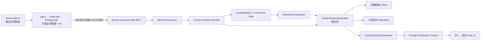

# OPS MVP-2：业务数据驱动 Fixture、报告聚合与飞书单向通知

> 日期：2026-07-26  
> 执行主体：Claude Code Agent（内部模型为 DeepSeek）  
> 前置版本：OPS MVP-1 `93d993b`  
> 目标：在单靶机只读 Discovery 之上，完成合成业务数据诱发故障、确定性人类报告和飞书固定群单向通知

## 1. 结论与实施顺序

阶段二严格按以下顺序实施：

```text
Gate-0 完整 Discovery → Diagnosis 实测
  → PR-1 Fixture Contract 与业务不变量
  → PR-2 HOT_ACCOUNT_CONTENTION_V1
  → PR-3 远端部署与只读 PostgreSQL Profile
  → PR-4 远端 20 轮业务故障 E2E
  → PR-5 人类友好报告聚合
  → PR-6 飞书固定群通知与 Outbox
  → PR-7 全链路 E2E、文档和退出门禁
```

不能跳过 Gate-0。当前代码中 `DeepSeekDiagnosisGate` 已存在，但
`RemoteDiscoveryMain` 仍只保存 `DiscoveryResult`，尚未形成可执行的
Discovery → Diagnosis 主链。报告和通知不得建立在这一缺口之上。

阶段二不包含：

- 多主机调度。
- 飞书入站消息、双向对话或飞书审批。
- 自动修复。
- 模型选择目标、工具、SQL、Fixture Case或收件人。
- 复制真实生产订单、用户、日志和凭据。
- Docker TCP API、远程 Shell或自由 SQL。

## 2. 总体架构



三条权限线必须独立：

| 平面 | 身份 | 能力 | 禁止 |
|---|---|---|---|
| Fixture控制面 | `fixture-admin`/root | deploy、seed、inject、reset、destroy | 暴露给opsro或模型 |
| 诊断面 | `opsro` forced-command | 固定只读MCP工具 | 控制接口、Docker socket、任意SQL |
| 通知面 | Feishu bot | 向固定群发消息/回复 | 动态选群、读消息、审批、触发修复 |

## 3. Gate-0：先关闭 MVP-1 主链缺口

### 目标

在开始远程 PostgreSQL Fixture之前，实际跑通一次：

```text
RemoteDiscoveryMain
  → RemoteOpsSession
  → RemoteDiscoveryCoordinator
  → DeepSeekDiagnosisGate
  → RemoteIncidentResult
```

### 必须实现

1. 新增稳定聚合结果：

```text
RemoteIncidentResult(
  discovery,
  diagnosis,
  providerCalled,
  diagnosisFailureCode,
  completedAt
)
```

2. `RemoteDiscoveryMain`：
   - COMPLETE且required Evidence有效时调用Diagnosis Gate。
   - INCOMPLETE/TRANSPORT_FAILED不调用Provider并返回INCONCLUSIVE。
   - 原子保存聚合结果，而不是只保存DiscoveryResult。
   - API key缺失时不得丢失Discovery；记录Provider未配置并返回明确退出码。

3. 使用当前 APP_DOWN远端 Fixture完成一次真实 Discovery → Diagnosis。
4. 保存脱敏E2E产物；不得只在文字总结中声称通过。
5. APP_DOWN产物中必须证明模型看到了脱敏 Evidence facts，而不只是ID。

### Gate-0通过条件

- 自动测试0失败、0跳过。
- providerCalled与Discovery状态一致。
- Diagnosis引用的Evidence ID存在、当前有效。
- claimedResolved=false。
- 输出不包含host、user、key、token和连接串。

## 4. 业务数据驱动 Fixture Contract

### 4.1 Case

阶段二只交付两个版本化Case：

1. `LOCK_INJECTED_V1`
   - 保留现有隐藏控制接口直接启动持锁事务。
   - 用于验证部署、采证、诊断和清理链路。
   - 报告必须明确这是直接注入Case。

2. `HOT_ACCOUNT_CONTENTION_V1`
   - 正常订单流量按固定种子产生账户倾斜。
   - 版本化“余额对账事务”锁定热点账户行。
   - 正常订单事务与对账事务自然竞争同一热点行。
   - 故障事实必须来自真实HTTP、连接池和PostgreSQL事务。

不得增加第三个Case，CPU、连接池直接耗尽和stale-log继续作为本地对抗测试，不进入本阶段远端主验收。

### 4.2 数据模型

扩展现有 schema：

```text
accounts(
  account_id,
  opening_balance_cents,
  balance_cents,
  account_class = HOT | NORMAL
)

orders(
  request_id,
  account_id,
  amount_cents,
  created_at
)

reconciliation_runs(
  reconciliation_id,
  account_id,
  started_at,
  completed_at,
  status
)
```

订单事务：

1. `SELECT account FOR UPDATE`。
2. `INSERT order ON CONFLICT DO NOTHING`。
3. 只有首次插入才扣减余额。
4. duplicate请求不得二次扣款。
5. commit。

确定性不变量：

```text
opening_balance_cents
  = balance_cents + SUM(unique orders.amount_cents)
```

每个账户必须分别满足，不只验证总表。

### 4.3 数据与负载

Case manifest必须包含：

- `caseVersion`
- `seed`
- 热点账户数量和普通账户数量
- 热点流量占比
- 请求速率、持续时间、VU边界
- DB pool size
- 对账事务周期和持锁时间
- 数据schema版本
- 期望退化阈值

建议初始参数：

```text
seed: ops-mvp2-v1
hotAccounts: 1
normalAccounts: 99
hotTrafficRatio: 0.85
rate: 20 req/s
duration: 90s
poolSize: 6
reconcileEvery: 3s
reconcileHold: 2s
```

这些参数必须通过本地校准后冻结，不能由模型动态调整。

### 4.4 Ground Truth隔离

- manifest和控制token仅在Fixture Runner控制面。
- gateway继续对 `/internal/control` 返回404。
- 控制接口只允许容器内部或root执行的Fixture Runner访问。
- `opsro`、远端MCP、Discovery、DeepSeek、报告和飞书均不得读取Case类型或Ground Truth。
- 报告只允许知道数据标签 `SYNTHETIC_BUSINESS_DATA`，不知道控制面注入状态。

## 5. 远端部署与只读采证

### 5.1 部署

新增幂等脚本：

```text
ops-fixtures/remote/postgres/
  install.sh
  seed.sh
  run-case.sh
  verify.sh
  reset.sh
  destroy.sh
```

规则：

- 只能由root/fixture-admin运行。
- `install/seed/reset/destroy`可重复执行。
- artifact和compose配置root-owned。
- reset/destroy前解析并验证目标项目名和目录，禁止通配和宽目录删除。
- 每次Case结束自动运行数据不变量和残留检查。

### 5.2 远端MCP

切换到 `POSTGRES_DIAGNOSIS_V1`：

- root-only env保存observer JDBC配置。
- observer只拥有 `pg_read_all_stats` 和必要元数据读权限。
- 不授予表写权限、DDL、pg_signal_backend、COPY PROGRAM或扩展安装。
- 所有SQL继续固定在 `JdbcPostgresDiagnosticBackend`。

Discovery Profile固定采集：

- service/container状态。
- gateway HTTP。
- order-api业务指标。
- order-api/postgres资源。
- PostgreSQL活动会话。
- lock graph。
- connection stats。
- order-api/postgres有界日志。

`EvidenceSpec.arguments`必须为固定值；当前 PostgreSQL Profile中没有参数的工具必须补齐并做profile/tool schema一致性测试。

## 6. PR任务拆分

### PR-1：Fixture Contract与确定性不变量

允许范围：

- `ops-fixtures/postgres-lock`
- `clawkit-evaluation`中只与新Case合同相关的代码

任务：

- schema升级和固定种子。
- 多账户订单API。
- 幂等扣款。
- conservation、重复订单、成功率、P95断言。
- Case manifest schema。
- gateway继续隐藏控制接口。

验收：

- 正常态全部不变量通过。
- 同requestId并发重复不会重复扣款。
- 失败事务不留下订单或余额变化。
- 不出现真实数据。

### PR-2：HOT_ACCOUNT_CONTENTION_V1

任务：

- k6固定种子热点分布。
- typed reconciliation任务。
- `LOCK_INJECTED_V1`和`HOT_ACCOUNT_CONTENTION_V1`共用Case Runner，但实现路径可区分。
- 控制面生成Ground Truth，Agent工作目录不可见。

验收：

- 热点请求比例在容差内。
- 正常态P95/成功率达标。
- 热点Case稳定产生锁等待、pending连接和业务退化。
- 清理后指标恢复。
- 金额守恒和幂等在故障期间仍成立。

### PR-3：远端部署与PostgreSQL只读Profile

任务：

- install/seed/run/verify/reset/destroy脚本。
- root-only observer凭据。
- MCP `POSTGRES_DIAGNOSIS_V1` attestation。
- 补全Profile固定参数。
- setup失败回滚，不影响MVP-1的APP_DOWN配置备份。

验收：

- opsro仍不能访问Docker socket、env和控制接口。
- observer写SQL、DDL和危险函数全部失败。
- MCP固定DB工具成功。
- shell/SFTP/SCP/forwarding继续失败。

### PR-4：远端业务故障E2E与Benchmark

顺序：

1. 正常态基线5轮。
2. `LOCK_INJECTED_V1`冒烟3轮。
3. `HOT_ACCOUNT_CONTENTION_V1`连续20轮。
4. 每轮reset并验证无残留。

每轮保存脱敏：

- manifest hash，不保存manifest内容。
- Evidence Bundle。
- Diagnosis。
- 确定性业务断言。
- 采证完整度、Provider调用和时延。

通过条件：

- 20轮全部完成清理。
- 越权和Ground Truth泄露为0。
- 成功Evidence不因单项失败丢失。
- 无证据或冲突时返回INCONCLUSIVE。
- 不要求模型每轮都猜中根因；准确率进入Benchmark报告，不篡改结果。

### PR-5：人类友好报告聚合

新增：

```text
HumanIncidentReport
IncidentReportAssembler
ReportEvidenceView
ReportTimelineEvent
MarkdownIncidentRenderer
JsonIncidentRenderer
FeishuSummaryRenderer
```

报告必须由确定性代码生成，DeepSeek的自由文本不能改写Evidence。

结构：

1. 一屏摘要。
2. 影响与数据标签。
3. 当前状态。
4. 根因或不确定性。
5. 关键证据。
6. 反证。
7. 缺失信息。
8. 建议动作。
9. 时间线。
10. Evidence引用和完整JSON路径。

规则：

- 标题和首屏明确 `SYNTHETIC_BUSINESS_DATA`。
- Severity由确定性规则映射，不由模型自由生成。
- supporting/contradicting ID必须解析成Evidence视图。
- 过期、失败和缺失证据显式展示。
- 日志只展示脱敏有界片段和引用。
- `INCONCLUSIVE`不得渲染成确定根因。
- `claimedResolved=false`不得出现“已恢复”。
- Markdown和JSON共享同一展示模型，禁止两套事实逻辑。
- 每份报告包含 `schemaVersion`、`reportVersion`、`contentHash`。

### PR-6：飞书固定群通知与Outbox

复用 `clawkit-im` 的 `FeishuApi`，不要创建独立webhook客户端。

扩展：

```text
sendChatMessage(chatId, content, idempotencyKey)
replyMessage(messageId, content, idempotencyKey)
```

经 `lark-cli --dry-run` 核实的API形态：

```text
POST /open-apis/im/v1/messages?receive_id_type=chat_id
body: receive_id, msg_type, content, uuid

POST /open-apis/im/v1/messages/{message_id}/reply
body: msg_type, content, uuid
```

身份与权限：

- 只使用bot身份和tenant access token。
- bot必须加入固定群。
- 最小scope为发送消息所需的 `im:message`。
- 不执行user `auth login`。
- `FEISHU_APP_SECRET`只允许环境变量，不写YAML、日志和事件。
- `FEISHU_OPS_CHAT_ID`为固定配置，不允许Agent或Incident输入覆盖。

新增持久化Outbox：

```text
PENDING
  → SENDING
  → SENT
  → RETRYABLE_FAILED
  → PERMANENT_FAILED
```

幂等键：

```text
sha256(incidentId | reportVersion | chatId | eventType)
```

转换为稳定UUID并放入飞书请求 `uuid` 字段。

规则：

- 首次报告发固定群，持久化返回的message_id。
- 同Incident后续reportVersion回复原message_id。
- 崩溃发生在“飞书已收、SENT未落盘”时，以相同uuid重试。
- 飞书失败只改变Delivery状态，不改变Incident、Discovery和Diagnosis状态。
- 429/5xx/timeout可重试；4xx权限/参数错误永久失败并升级人工。
- 不记录token、appSecret、完整请求体和chatId明文；日志只记录chat hash。
- MVP只发送脱敏一屏摘要；完整报告仅在有稳定安全链接时附链接。
- 不上传本地文件，不发送本地路径。

不实现：

- 读取群消息。
- edit/recall。
- 动态建群或拉人。
- read receipt。
- 飞书审批。
- 飞书消息触发修复。

### PR-7：全链路E2E与收口

场景：

1. 正常态：报告为健康/无活动故障，按策略可不通知。
2. 热点锁竞争：报告展示业务影响、锁图、连接等待和反证，飞书发送一条。
3. Evidence不足：报告明确INCONCLUSIVE，飞书发送人工升级摘要。
4. 飞书timeout：Incident不变，Outbox重试且不重复发送。
5. 飞书权限错误：Delivery永久失败，Incident不变。
6. reportVersion增加：回复原消息，不新建主消息。

## 7. 报告与通知数据边界

飞书允许出现：

- incidentId、逻辑targetId。
- `SYNTHETIC_BUSINESS_DATA`。
- 影响指标、状态码、P95、失败率。
- 根因码、诊断状态、置信度。
- Evidence ID和脱敏短摘要。
- 建议的只读下一步或人工升级。

飞书禁止出现：

- SSH host/user/key/known_hosts。
- DB URL/user/password。
- appId/appSecret/token。
- chat_id/message_id原文日志。
- Fixture control token、Case manifest、Ground Truth。
- 完整日志、订单ID、账户ID和本地文件路径。

## 8. 测试矩阵

### Fixture

- 固定种子重现。
- 正常/热点分布。
- 并发duplicate。
- 事务回滚。
- 金额守恒。
- k6阈值。
- setup/reset/destroy幂等。
- 控制接口外部404。

### Discovery与Diagnosis

- 正常、锁等待、连接堆积、HTTP退化。
- required/optional缺失。
- 过期、冲突和自恢复证据。
- profile/tool/arguments一致。
- Ground Truth不进入prompt。

### Report

- ACTIVE、RECOVERED、UNKNOWN。
- CONFIRMED、PROBABLE、INCONCLUSIVE。
- Evidence失败/过期。
- 日志截断和脱敏。
- Markdown/JSON事实一致。
- contentHash稳定。

### Feishu

- chat_id请求。
- 初次send和后续reply。
- uuid稳定。
- timeout/429/5xx重试。
- 4xx永久失败。
- crash-after-send恢复。
- 重复workflow不重复通知。
- secret/chatId不进日志。

## 9. 退出门禁

最终必须满足：

```text
mvn -B -ntp clean verify
git diff --check
git status --short
```

以及：

- Gate-0完整 Discovery → Diagnosis真实产物存在。
- HOT_ACCOUNT连续20轮无清理残留。
- 数据不变量20轮全部通过。
- opsro越权为0。
- Ground Truth泄露为0。
- 报告包含事实、反证、不确定性和时间线。
- 飞书同Incident首发1条，后续只回复。
- 飞书失败不改变Incident状态。
- 凭据和完整敏感日志泄露为0。
- 真实飞书联调只向用户明确指定的测试群执行。

## 10. Claude Code Agent + DeepSeek执行协议

每次只实现一个PR：

1. 实现会话读取本文合同和允许范围。
2. 先写失败测试。
3. 实现最小diff。
4. 运行确定性门禁。
5. 新建只读Claude Code Agent + DeepSeek会话反向评审。
6. 固定输出 `Blocking / Missing Tests / Scope Cuts / Conclusion`。
7. Blocking未关闭不得进入下一PR。

任何会话提出以下内容立即停止：

- 让模型控制Fixture。
- 把Ground Truth加入Evidence。
- 允许任意SQL或Docker命令。
- 使用飞书incoming webhook绕过bot身份和幂等。
- 根据模型置信度自动修复。
- 动态选择飞书接收人。

