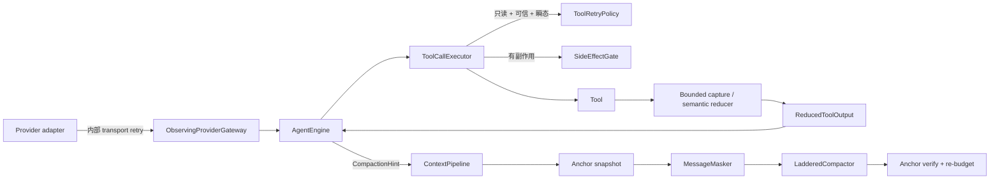

# P1-A 前三项技术方案与反方评审

状态：设计定版（2026-07-19）；已完成阶段性实施，当前代码事实与剩余项见
[P1-A 实施状态与阶段冻结说明](p1-a-implementation-status.md)。

依据：[P1-A 前三项需求分析与技术调研](p1-a-requirements-and-technical-research.md)、
[P1-G 写操作前强制门禁](p1-g-design.md) 与当前代码事实。

## 1. 方案结论

本方案确认三项产品语义：

1. **PA-1**：对失败分类，判断是否允许以完全相同的输入再次执行，并定义次数、退避、停止和观测策略。
2. **PA-2**：在固定输出预算内按工具语义选取信息，而不是只截取前 N 行；所有省略都必须显式、可计数、可追踪。
3. **PA-3**：在现有 compact 链路上增加通用 task hint，并为 OPS 诊断保留结构化状态、反证、未解决假设和证据引用。

定版采用以下约束：

- Provider 与 Tool 各自拥有本层重试；Engine 不重放 Provider 调用。
- PA-1 第一阶段只自动重试**可信元数据声明的只读工具**。任何副作用工具仍由 P1-G `SideEffectGate` / `ActionAttemptCoordinator` 唯一管理。
- `INVALID_ARGUMENTS` 的动作是修复参数后重新发起新调用，不是原样重试。
- Tool 同输入调用默认总 attempts 不超过 3 次，包含首次。
- PA-2 用 `ReducedToolOutput` 作为输出文本、信封和统计的原子结果，消除当前三份字段漂移。
- PA-2 明确区分“从源数据保留的 bytes”和“加入标签后模型实际看到的 rendered bytes”，不强求两个不同量相等。
- PA-3 保留的是“继续完成任务所需的最小充分状态”，不是完整原始输出。原始证据通过真实 `evidenceRef` 回查。
- compact anchor 是 run 内临时上下文，不写入普通 session；OPS 状态由 OPS 自己的状态存储重建。
- required anchor 补回后仍超过硬限制时结构化失败，不继续调用主任务 Provider。

## 2. 总体架构



模块责任保持如下：

| 模块 | 新增或调整责任 | 明确不负责 |
|---|---|---|
| `clawkit-tools` | 输出契约、工具错误事实、恢复指令枚举 | 决定是否自动重试 |
| `clawkit-reliability` | 纯函数重试决策 | 执行工具、调用 Provider |
| `clawkit-engine` | 执行只读工具 retry loop、传递 compact hint、发事件 | 重试副作用工具、解释 OPS 领域对象 |
| `clawkit-provider` | Provider transport retry 和真实 retry metadata | Tool retry |
| `clawkit-context` | 通用 anchor 渲染、压缩、验证和审计 | 依赖 OPS 模块或保存 session |
| `clawkit-observability` | 记录已发生的 attempts、输出和 compact 审计 | 改变决策 |
| 未来 OPS workflow | 维护诊断状态并生成通用 anchor | 实现 compact 算法 |

## 3. PA-1：失败分类与有界重试

### 3.1 契约校准

保留现有 `FailureClass -> RecoveryDirective` 结构，不再新建一套平行的恢复状态机。
`RecoveryDirective` 新增：

```java
REPAIR_INPUT
```

决策表至少调整为：

| FailureClass | RecoveryDirective | 是否可能同输入重试 |
|---|---|---|
| `INVALID_ARGUMENTS` | `REPAIR_INPUT` | 否 |
| `PRECONDITION_FAILED` | `RECOLLECT` | 否 |
| `APPROVAL_REJECTED` / `PERMISSION_BLOCKED` | `USER_INPUT` | 否 |
| `BUDGET_EXHAUSTED` / `CANCELLED_BEFORE_DISPATCH` | `ABORT` | 否 |
| `DEADLINE_EXCEEDED_BEFORE_DISPATCH`（新增） | `ABORT` | 否 |
| `SERVER_REJECTED_BEFORE_EXECUTION` | `RETRY_ALLOWED` | 还需 `ToolError.retryable` 等门槛 |
| `LOCAL_ERROR_NO_EFFECT` | `RETRY_ALLOWED` | 还需 `ToolError.retryable` 等门槛 |
| 结果未知类 | `RECOLLECT` 或 `VERIFY` | PA-1 第一阶段否 |
| `PARTIAL_EXECUTION` | `VERIFY` | 否 |

由此修复当前 `INVALID_ARGUMENTS -> RETRY_ALLOWED` 可能导致原样循环的问题。

`FailureClass` 说明失败事实，`RecoveryDirective` 说明下一类动作，
`ToolRetryPolicy` 只回答一个更窄的问题：**现在能否自动执行同输入的下一次只读 attempt**。

### 3.2 ToolRetryPolicy

放置于 `clawkit-reliability`：

```java
public interface ToolRetryPolicy {
    ToolRetryDecision decide(ToolRetryContext context);
}

public record ToolRetryContext(
    ToolExecutionResult lastResult,
    ToolMetadata metadata,
    int attemptsMade,
    int maxAttempts,
    Duration elapsed,
    Duration remaining
) {}

public record ToolRetryDecision(
    boolean retrySameInput,
    Duration delay,
    String reasonCode
) {
    public static ToolRetryDecision stop(String reasonCode) { ... }
    public static ToolRetryDecision retry(Duration delay, String reasonCode) { ... }
}
```

`reasonCode` 使用稳定枚举值或稳定字符串：

- `TRANSIENT_READ_FAILURE`
- `NOT_RETRYABLE`
- `UNTRUSTED_METADATA`
- `NOT_READ_ONLY`
- `ACTION_NOT_RETRY`
- `ATTEMPT_LIMIT`
- `CONTROL_HALTED`
- `DEADLINE_TOO_CLOSE`

只有以下条件同时成立才返回 `retrySameInput=true`：

1. `metadata.isReadOnly()`；
2. `metadata.sideEffects().isEmpty()`；
3. `metadata.provenance().trusted()`；
4. `lastResult.effectCertainty() == NO_EFFECT_CONFIRMED`；
5. `FailureDecisionTable.directiveFor(...) == RETRY_ALLOWED`；
6. `lastResult.toolError() != null && lastResult.toolError().retryable()`；
7. `attemptsMade < maxAttempts`；
8. 取消、deadline 和预算均允许下一次 attempt。

默认 `maxAttempts=3`，含首次。退避使用 full jitter：

```text
cap(attempt) = min(200ms * 2^(attemptsMade - 1), 2000ms)
delay        = random(0, cap(attempt))
```

测试中注入 `RetryBackoff` 和 `RetrySleeper`，不使用真实等待。

PA-1 不根据错误消息文本猜测瞬态性。工具或可信 adapter 必须显式构造
`ToolError.retryable(code, message)`；未知异常仍按不可重试处理。

### 3.3 ToolCallExecutor 接入

`ToolCallExecutor.executeOne` 保持权限判断和副作用分流入口不变：

```text
校验参数
  -> 冻结 ToolMetadata
  -> 权限/审批
  -> 首次 acquireToolCall
  -> side effect ? SideEffectGate : executeReadOnlyWithRetry
```

`executeReadOnlyWithRetry` 的行为：

1. 执行首次 attempt。
2. 成功则立即返回。
3. 用 `ToolRetryPolicy` 判断最后一次结果。
4. 若停止，返回最后结果。
5. 若重试，先发 `ToolRetryScheduled` 事件。
6. 使用可取消等待；等待前后都执行 control checkpoint。
7. 下一次 attempt 前再次 `acquireToolCall()`，使每次真实执行都消耗 tool-call budget。
8. 重复到成功或达到 attempts 上限。
9. 对模型只回注一个最终 tool result，原 tool call 的顺序不变。

权限只对原始只读调用评估一次；元数据在 loop 前冻结，不能在 attempts 之间由 registry
悄然切换。由于第一阶段排除了所有副作用工具，不存在“审批一次后多次写入”的语义。

若退避期间取消、deadline 或预算触发：

- 不开始新 attempt；
- 最终结果的 `FailureClass` 改为相应的
  `CANCELLED_BEFORE_DISPATCH`、`DEADLINE_EXCEEDED_BEFORE_DISPATCH`
  或 `BUDGET_EXHAUSTED`；
- `ToolError.details` 保留 `previousFailureClass`、`attemptsMade` 和停止原因。

新增 `ToolExecutionResult.halted(...)`，统一映射 `ExecutionHaltedException.Reason`。
首次 `acquireToolCall()` 失败也必须使用该工厂，修复当前把预算/deadline 错归类为
`PERMISSION_BLOCKED` 的行为。

为避免污染跨模块公共结果，executor 内部使用：

```java
record ExecutedToolCall(
    ToolExecutionResult result,
    int attemptCount,
    long logicalDurationMs,
    String finalStopReason
) {}
```

串行和并行分支都等待该包装结果；批次对外仍返回现有
`ToolExecutionBatchResult`。最终 `ToolExecutionResult.durationMs` 和完成事件使用从权限通过到
最终停止的 logical wall time，而不是只记录最后一次 attempt；发生过重试时，最终
`ToolError.details` 同步记录累计 `attemptsMade`。

### 3.4 与 P1-G 的边界

以下路径不会进入 `executeReadOnlyWithRetry`：

- `readOnly=false`；
- 声明了任意 `sideEffects`；
- `EffectCertainty` 不是 `NO_EFFECT_CONFIRMED`；
- MCP/未知工具的元数据不可信；
- `RECOLLECT`、`VERIFY`、`USER_INPUT`、`COMPENSATE` 或 `ABORT`。

有副作用的幂等重试仍由 `SideEffectGate` / `ActionAttemptCoordinator` 管理，
必须复用 `actionId/idempotencyKey`、次数门禁和 reconciliation。PA-1 不绕过也不复制该能力。

### 3.5 Provider retry

Provider 保持单层所有权：

- 429、500、502、503、504 和网络/超时错误按 adapter 策略重试；
- 400、401、403、上下文超限和协议错误不重试；
- 优先尊重合法的 `Retry-After`，否则使用 exponential backoff + full jitter；
- 每次等待和发送前检查 `ExecutionControl`；
- Engine/`ObservingProviderGateway` 不再次提交同一 Provider request。

为修复当前 `retryCount=0` 的假观测：

1. 将 `ProviderResponseMetadata` 移为公开 record 和独立文件；
2. 非流式 `sendWithRetry` 返回 `ProviderExchange(body, retryCount)`；
3. `OpenAIProvider` 的 V2 `generate(ModelRequest)` 返回真实 metadata；
4. `LLMException` 增加兼容构造的 `retryCount`；
5. `ObservingProviderGateway` 从成功 metadata 或失败 exception 写入事件。

V2 override 直接调用抽取后的私有执行函数；V1 `generate(messages, tools, control)`
只把 V2 response 适配为 `Message`，禁止 V1/V2 相互默认委托形成递归。

`LLMConfig.maxRetries` 继续表示“首次之后的额外次数”，不与 Tool 的
`maxAttempts` 混用；配置和指标中必须使用完整名称，避免 off-by-one。

流式调用第一阶段维持当前“不在收到响应后自动重放流”的策略，`retryCount=0`。
建立连接前是否重试可后续单独设计，不能复用非流式响应重试而造成 token 流重复。

### 3.6 观测

新增 `ToolRetryScheduledPayload`：

```text
toolCallId, toolName, attemptNumber, maxAttempts,
delayMs, failureClass, retryReason
```

`ToolCompletedPayload` 兼容增加：

```text
attemptCount, failureClass, recoveryDirective, finalStopReason
```

旧构造器默认 `attemptCount=1`。事件不保存完整工具输出。

Provider 完成事件写入真实：

```text
retryCount, providerErrorClass
```

### 3.7 PA-1 验收

- 瞬态只读失败两次后成功：真实执行 3 次，只回注 1 个最终 tool result。
- 第三次仍失败：停止且 `attemptCount=3`。
- `INVALID_ARGUMENTS`：同参数自动重试 0 次，directive 为 `REPAIR_INPUT`。
- 不可信 MCP 即使声称 `readOnly/retryable` 也不自动重试。
- 任意副作用工具不进入 PA-1 loop。
- 取消、deadline、预算在退避期触发后不再开始 attempt。
- 并行 batch 中每个调用独立重试，最终结果顺序仍等于输入顺序。
- Provider 已内部重试 N 次时 Engine 重放次数为 0，事件 `retryCount=N`。

## 4. PA-2：有限预算内的语义保留

### 4.1 原子输出结果

新增 `clawkit-tools` 内部稳定契约：

```java
public record ReducedToolOutput(
    String text,
    OutputEnvelope envelope,
    ToolOutputStats stats
) {
    public ReducedToolOutput {
        // 校验 source bytes、rendered bytes、envelope 和 stats 一致
    }
}
```

语义输出会加入 `[head]`、行号和 omitted marker，这些 bytes 不属于源数据。
因此契约明确区分：

```text
stats.totalBytes          == envelope.totalBytes
stats.retainedSourceBytes == envelope.returnedBytes
stats.returnedBytes       == UTF8(reduced.text).length
stats.inputComplete       == envelope.inputComplete
```

`ToolExecutionResult.withReducedOutput(ReducedToolOutput)` 一次性同步：

- `output`
- 平铺 `outputBytes = stats.returnedBytes`
- 平铺 `truncated`
- `outputStats`
- `outputEnvelope`

现有 `withOutputEnvelope` 标为 deprecated；迁移完成前若信封与平铺字段不一致，
compact constructor 直接拒绝，而不是静默选择任一值。

### 4.2 ToolOutputStats

扩展为：

```java
public record ToolOutputStats(
    long totalBytes,
    long returnedBytes,
    long retainedSourceBytes,
    long totalLines,
    long returnedLines,
    boolean truncated,
    String truncationReason,
    String retentionPolicy,
    boolean inputComplete
) {}
```

定义：

- `total*` 是实际观察到的输入量；未扫描完整时不能冒充全量。
- `returnedBytes` 沿用现有语义，是加入标签、行号和 omitted marker 后模型实际看到的
  UTF-8 字节数。
- `retainedSourceBytes` 是被 reducer 选择代表的原始源 bytes 数量，按脱敏前的源数据计数。
- `returnedLines` 只计被选择的源数据行，不计 `[head]` 等渲染标签行。
- `inputComplete=false` 表示 timeout、取消或达到扫描上限后提前停止。
- 未知行数用 `-1`，不用 `0`。
- `truncated == (retainedSourceBytes < totalBytes || !inputComplete)`；不能使用
  `returnedBytes` 判断，因为标签可能让它大于源数据量。
- `truncationReason` 是稳定代码：`MAX_OUTPUT_BYTES`、`MAX_MATCH_GROUPS`、
  `TIMEOUT`、`CANCELLED`、`SOURCE_LIMIT`。
- `retentionPolicy` 是带版本的稳定代码：
  `GENERIC_DIAGNOSTIC_V1`、`GREP_CONTEXT_V1`、
  `LOG_SEVERITY_V1`、`PG_BLOCKING_CLOSURE_V1`。

保留 3 参数兼容构造器；其
`retainedSourceBytes=min(returnedBytes,totalBytes)`、行数为 `-1`、策略为
`LEGACY_V0`，避免改变旧字段 `returnedBytes` 的语义。

### 4.3 OutputEnvelope

`OutputEnvelope` 继续是完整性和回查元数据：

- 全量观察字节数；
- 模型可见字节数；
- omitted bytes；
- SHA-256；
- redaction；
- evidence refs。

兼容增加 `inputComplete`，旧构造器默认为 `true`。`truncated()` 改为：

```text
omittedBytes > 0 || !inputComplete
```

`totalBytes` 和 SHA-256 都只覆盖已观察到的源数据；只有 `inputComplete=true`
时才可解释为全源 hash。`returnedBytes` 表示被 reducer 选择代表的脱敏前源 bytes，
不包含渲染标签；即使脱敏替换改变可见长度，源空间的不变量也不变。
`omittedBytes=totalBytes-returnedBytes` 仍保持现有不变量。

第一阶段不为没有实际 artifact/evidence store 的输出伪造 URI。只有原始证据确实可回查时
才写 `evidenceRefs`；否则为空，并依赖 hash 和省略统计明确“不完整”。

为兼容当前结构，不在 PA-2 核心 PR 中重做 `OutputEnvelope` 类型层级。
`errorExcerpts` 的语义收窄为“高置信错误摘录”；WARN 由 reducer 渲染到最终文本并通过
内部 `SelectedLine(kind, lineNumber, byteOffset, text)` 维护，不混进名为 error 的字段。

### 4.4 两阶段处理

```text
Stage A: bounded capture / bounded scan
  bytes, hash, redaction, line offsets, head/tail

Stage B: type-specific selection
  generic diagnostics / grep groups / log events / relation closure

Stage C: render once
  ReducedToolOutput(text, envelope, stats)
```

任何阶段都不得为了“更智能”而先构造无界字符串。选择器使用有界 priority queue、
ring buffer、rolling context 或结构化 rows。

### 4.5 通用 Bash

`BoundedOutputCollector` 增加有界 WARN 识别和行位置计数：

- head；
- tail；
- 最多 8 个 ERROR/FATAL/EXCEPTION 摘录；
- 最多 8 个 WARN 摘录；
- 每个摘录最多 300 chars；
- 行号可得时记录行号，否则记录 byte offset；
- 最终渲染时按位置去重，避免同一行同时出现在 head、tail 和 diagnostics。

推荐可见格式：

```text
[head]
...
[diagnostics]
L128 ERROR ...
L141 WARN ...
[tail]
...
[omitted: 42310 bytes; sha256=...; policy=GENERIC_DIAGNOSTIC_V1]
```

`stdout/stderr` 分别采集，合并时保留 stream 标签；组合 hash 使用现有两份 hash 派生，
envelope 的组合 `returnedBytes` 为实际选入的源 bytes，stats 的 `returnedBytes`
从最终文本重新计算。

Bash 是副作用工具，PA-2 只改变输出，不改变其失败 certainty 或 PA-1 重试资格。

### 4.6 Grep

`GrepTool` 迁移到 V2 execute，输入兼容增加：

```text
beforeContext, afterContext, context
```

实现使用逐行 streaming reader：

1. deque 保存 `beforeContext`；
2. 命中时创建 match group；
3. 继续收集 `afterContext`；
4. 相邻或重叠区间合并；
5. 同一行只输出一次并标识 `match/context`；
6. 先为每个文件保留首个 group，再按稳定路径和行号补充，避免单文件吞掉预算；
7. 达到 `MAX_MATCH_GROUPS` 或扫描上限后停止，并设置 `inputComplete=false`；
8. 不在 group 中间截断。

若选择继续扫描只计数而不保存，可给出准确总 matches；否则只报告
`observedMatches` 并明确 `inputComplete=false`。

### 4.7 日志与 PostgreSQL

PA-2 核心 PR 只提交 reducer contract 和 fixture，不提前创造不存在的完整 OPS adapter。

`LogReducer` fixture 验证：

- 结构化 severity/timestamp 优先于正则；
- ERROR/FATAL、stack/cause/request-id 上下文、WARN、时间窗 head/tail 的优先级；
- 重复异常折叠但保留次数；
- 无法解析时间时不伪造时间范围。

`RelationReducer` fixture 验证：

- waiting session 和 `pg_blocking_pids()` 关系闭包；
- root blocker 到 waiter 的稳定排序；
- 环和最大深度保护；
- 链上行优先于无关 activity；
- query 仅保留有界文本和 hash/ref。

实际 `LogReadTool` 和 PostgreSQL adapter 分别随 OPS-0A/0B 接入这些 reducer。

### 4.8 事件一致性

`ToolCompletedPayload` 再增加：

```text
totalSourceBytes, retainedSourceBytes, returnedOutputBytes,
totalLines, returnedLines,
truncationReason, retentionPolicy, inputComplete
```

事件值只从最终 `ReducedToolOutput.stats` 投影，不从旧平铺字段重新计算。

### 4.9 PA-2 验收

- 构造 ERROR/WARN 位于中段的大输出，关键行在固定预算内保留且无重复。
- Bash 的 source bytes、rendered bytes、stats、envelope、event 按上述不变量一致。
- Grep 匹配行及上下文成组保留，重叠区间合并，预算不切半个 group。
- 扫描提前停止时 `inputComplete=false`，不声称全量总数。
- Read/WebFetch/Grep 等旧路径迁移后能准确报告截断；迁移前使用 `LEGACY_V0`。
- 未持久化原始输出时 `evidenceRefs` 为空，不出现不可解析引用。
- 日志和阻塞链 fixture 的关键内容 invariant 通过。

## 5. PA-3：面向 OPS 的 task-aware compact

### 5.1 通用 hint，不引入 OPS 依赖

新增：

```java
public enum CompactionProfile {
    GENERAL,
    OPS_DIAGNOSIS
}

public enum AnchorKind {
    USER_CONSTRAINT,
    INCIDENT,
    CONFIRMED_FACT,
    COUNTER_EVIDENCE,
    OPEN_HYPOTHESIS,
    PENDING_CHECK,
    APPROVAL_BOUNDARY,
    EVIDENCE
}

public enum AnchorProvenance {
    USER,
    TOOL_EVIDENCE,
    WORKFLOW_STATE,
    MODEL_DERIVED
}

public record CompactionAnchor(
    String id,
    AnchorKind kind,
    String summary,
    String evidenceRef,
    boolean required,
    String state,
    AnchorProvenance provenance,
    Instant observedAt
) {}

public record CompactionHint(
    CompactionProfile profile,
    List<CompactionAnchor> anchors
) {
    public static final CompactionHint GENERAL = ...;
}
```

`state` 使用稳定值，例如 `OPEN`、`CONFIRMED`、`REFUTED`、`DONE`。
`summary` 是已结构化状态的有界表达，不允许放原始大输出。

OPS workflow 负责从自己的 diagnosis state 生成 anchors：

- 事实和反证必须来自工具结果或人工输入；
- `EVIDENCE` 必须引用真实、可回查的 evidence；
- `MODEL_DERIVED` 只能用于 `OPEN_HYPOTHESIS`，不能用于
  `CONFIRMED_FACT` 或 `COUNTER_EVIDENCE`；
- 非用户提供的 confirmed fact/counter-evidence 必须有 evidenceRef；
- 状态变化时复用同一 anchor id，避免无限追加。

### 5.2 请求和返回契约

只给 `CompactionRequest` 增加 `CompactionHint`，兼容构造器默认
`CompactionHint.GENERAL`。`ContextRequest` 不重复携带同一份 hint，避免 build/compact
形成两个注入点。

`clawkit-context` 新增领域无关的：

```java
public interface CompactionHintProvider {
    CompactionHint snapshot(String runId, int turn);
}
```

默认实现永远返回 GENERAL；未来 OPS workflow 注入自己的 provider。Engine 每轮只取一次
不可变 snapshot，并传给 `EngineContextCoordinator.compact(...)`。`AgentEngine` 只持有
该接口，composition root 负责装配。因此 Engine 和 context 都不依赖 OPS 类型，手动
compact 也能复用当前 provider。

`ContextManager` 增加兼容 overload：

```java
CompactionResult compact(
    List<Message> messages,
    int maxTokens,
    CompactionOptions options
);

record CompactionOptions(
    CompactionProfile profile,
    List<TurnGroup> evictedTurnGroups
) {}
```

旧 overload 委托 `GENERAL`，`LadderedCompactor` 只消费 profile 来选择摘要提示。

`CompactionResult` 增加：

```java
public record CompactionAudit(
    String profile,
    List<String> retainedAnchorIds,
    List<String> lostRequiredAnchorIds,
    List<DiscardedTurnRange> discardedRanges,
    int evictedGroups,
    long durationMs,
    String failureCode
) {}

public record DiscardedTurnRange(
    int fromTurn,
    int toTurn,
    int messageCount,
    List<String> roles,
    String reason
) {}
```

第一阶段只记录可确定的 turn range、角色、数量和原因。
不从自由文本猜测 topic 或时间戳；OPS 时间信息由带来源的 anchor 表达。

### 5.3 Pipeline 顺序

当前问题是 ConstraintExtractor 在 MessageMasker 已经丢弃旧消息后才运行。
调整为：

```text
1. 从未经 destructive normalization 的原始 modelContext 提取 legacy constraints
2. 执行 always-on normalization
3. 合并 explicit hint anchors，并按 id 去重
4. 校验 anchor 大小、来源和必填字段
5. 渲染一个 EPHEMERAL [Runtime][Compaction Anchors] system fragment
6. 对普通历史执行 MessageMasker
7. budget analyze
8. 需要时执行 LadderedCompactor
9. 用内部 `AnchorSnapshot` sidecar 校验 canonical snapshot 的 hash 和 required ids
10. 删除结果中的旧 snapshot，并最多重新插入一份 canonical snapshot
11. re-budget
12. 返回 CompactionResult + CompactionAudit
```

为保证第 1 步真的看到原始上下文，删除 `AgentEngine` 在
`ContextPipeline.compact()` 之前直接调用 `context.applyAlwaysOnRules()` 的重复路径；
always-on 只由 Pipeline 编排一次。

anchor snapshot 不依赖旧消息继续存活，因此 MessageMasker 无需保护整段历史 turn。
它只需永远保留该 system fragment。验证不通过扫描任意消息中的 `id=` 文本完成，避免
工具输出伪造 anchor；Pipeline 始终以 sidecar 为真相源重建一份 canonical snapshot。

旧 `ConstraintExtractor` 结果转为 `USER_CONSTRAINT` anchors；提取发生在 mask 前。
这同时修复 GENERAL 模式下现存的约束丢失窗口。

### 5.4 Anchor 渲染和预算

系统片段使用稳定、可验证格式：

```text
[Runtime][Compaction Anchors]
profile=OPS_DIAGNOSIS
- id=ev-17 kind=COUNTER_EVIDENCE state=CONFIRMED required=true
  provenance=TOOL_EVIDENCE observedAt=2026-07-19T08:12:00Z
  summary=...
  evidenceRef=...
```

renderer 必须：

- 校验 id 只含允许字符且长度不超过 64；
- 对 summary 的换行、控制字符和结构分隔符做 canonical escaping；
- 把非 `USER_CONSTRAINT` 内容明确标为 data/evidence，不解释为指令；
- 只接受 evidence store 支持的 ref scheme，并在渲染前脱敏；
- 计算 snapshot hash，验证时比较内部结构和 hash，不在自由文本中模糊搜索。

限制：

- 单 anchor summary 默认不超过 512 Unicode code points；
- anchors 默认不超过 64 个；
- 非 required anchor 按 OPS 优先级、`observedAt` 和输入稳定顺序淘汰；
- anchor snapshot 预算上限为 context target 的 10%，且绝对上限为 8192 tokens；
- 相同 id 只保留最新状态；
- 已解决 hypothesis 可折叠为有界 resolved summary。

OPS 优先级：

1. 用户约束和审批边界；
2. incident 身份和时间范围；
3. required 事实、反证和 evidence refs；
4. OPEN hypothesis 和 pending checks；
5. 已解决或低相关状态。

若 required anchors 自身超过允许的 anchor budget，返回
`REQUIRED_ANCHORS_OVER_BUDGET`；不能静默裁剪。

### 5.5 compact 与验证

L3 摘要 prompt 在 `OPS_DIAGNOSIS` 下增加：

- 保留事件先后和因果；
- 区分事实、反证和假设；
- 不把 refuted hypothesis 写成结论；
- 保留待执行检查和审批边界；
- 工具原始输出只保留摘要和 evidence ref。

安全性不依赖 LLM 摘要是否遵循提示。required anchor 独立于摘要存在，
验证逻辑使用 `AnchorSnapshot` sidecar；缺失或 hash 不一致时只重建一次并重新预算。

补回后：

- 未丢 required anchor 且低于硬限制：成功；
- 仍有 required anchor 丢失：`REQUIRED_ANCHOR_LOST`；
- 无丢失但仍超硬限制：`COMPACT_HARD_LIMIT`。

后两者均由 Engine 结束为 `RunStatus.COMPACT_FAILED`，不继续主任务 Provider。

### 5.6 生命周期和 session

anchor fragment 是 `EPHEMERAL`。为防当前基于内容的 persistence filter 把它写入 session：

- 将 `[Runtime][Compaction Anchors]` 纳入统一 ephemeral system message 判断；
- `filterPersistable` 必须有专门测试；
- compact 后替换 session 时剔除 anchor fragment 和 conversation summary 等运行时派生内容；
- 手动 `/compact` 使用当前 run 的 hint；没有 hint 时为 GENERAL。

不扩展普通 session schema 保存 anchor。跨进程恢复由 OPS diagnosis store 重新生成，
避免 session 同时成为对话记录和业务状态数据库。

### 5.7 观测

`CompactCompletedPayload` 兼容增加：

```text
profile, retainedAnchorIds, lostRequiredAnchorIds,
discardedRanges, evictedGroups, durationMs, failureCode
```

Engine 必须写真实 `evictedGroups` 和 `durationMs`，不再固定为 0。
事件只记录 anchor id 和有界审计，不记录完整证据正文。

### 5.8 PA-3 验收

- GENERAL 模式在空 hint 下保持原行为，并修复 legacy constraint 的提取顺序。
- 20+ turns 的 OPS fixture 中，旧工具正文可被 mask，但 required 事实、反证、
  OPEN hypothesis、pending check 和 evidenceRef 仍存在。
- 摘要器故意遗漏 required anchors 时，verify/reinsert 能恢复。
- required anchors 补回后超限时结构化失败，Provider 调用次数不增加。
- 相同 anchor id 多次更新不会重复膨胀。
- anchor 和派生 summary 不进入持久化 session。
- `evictedGroups`、duration 和 failureCode 与实际结果一致。

## 6. 三项的组合关系

三项不是三套独立补丁：

```text
PA-1 让瞬态采集失败可安全恢复
  -> PA-2 把成功采集的大结果压成高信号输出
  -> OPS workflow 把结论和证据引用写成 anchors
  -> PA-3 在长任务 compact 后保留这些 anchors
```

关键不变量：

- retry 不能改变原始 tool call 的模型协议顺序；
- semantic reduction 不能隐瞒截断或伪造回查地址；
- compact 不能把 hypothesis 提升为 fact；
- 完整性指“任务状态 + 可回查证据关系完整”，不指所有原始 bytes 常驻上下文。

## 7. 实施拆分

### PR A1：恢复契约校准

- 新增 `REPAIR_INPUT`；
- 新增 `DEADLINE_EXCEEDED_BEFORE_DISPATCH` 和 control-halt 映射；
- 修正 FailureDecisionTable；
- 增加分类矩阵测试；
- 不改变执行次数。

### PR A2：只读工具 retry loop

- `ToolRetryPolicy`；
- `ToolCallExecutor` 包装结果与 retry loop；
- control/budget/jitter；
- retry 和完成事件；
- 串行、并行、取消和不可信 metadata 测试。

### PR A3：Provider retry 可观测性

- 公开 response metadata；
- success/failure retryCount；
- `Retry-After` 和 jitter；
- 非流式测试，流式明确为 0。

### PR A4：统一输出事实

- 扩展 `ToolOutputStats`；
- 新增 `ReducedToolOutput` 和原子同步；
- 修复 Bash 当前 stats/envelope 漂移；
- 迁移 Read/WebFetch/Grep V2 输出；
- 事件投影测试。

### PR A5：语义 reducer

- Bash diagnostics；
- Grep match groups；
- Log/Relation fixtures 和 contract；
- 内存上界与 Unicode 测试。

### PR A6：compact contract

- hint、anchor、audit；
- 兼容构造器；
- GENERAL 空 hint 回归；
- persistence filter。

### PR A7：hint-aware compact

- mask 前提取；
- anchor fragment；
- OPS prompt；
- verify/reinsert/re-budget；
- 真实 compact 事件。

### PR A8：OPS 闭环 benchmark

- 假 diagnosis state producer；
- 失败恢复、输出缩减、compact 的组合长任务；
- 后续由 OPS-0A/0B 替换为实际日志和 PostgreSQL adapter。

每个 PR 可独立回滚；A2 依赖 A1，A5 依赖 A4，A7 依赖 A6。
A8 是产品级完成率闸门，不替代各模块单测。

## 8. 测试与 benchmark

### 8.1 单元和性质测试

- FailureClass × directive 全覆盖，无未登记分类。
- 任意生成的非只读 metadata 都不能得到 PA-1 retry。
- `envelope.returnedBytes + envelope.omittedBytes == envelope.totalBytes`。
- `ReducedToolOutput.text` 的 UTF-8 bytes 等于 `returnedBytes/outputBytes`，
  retained source bytes 与 envelope 投影一致。
- reducer 输入增长时内存占用不随全量线性增长。
- Grep group 不被从中间切断。
- required anchor 集合在成功 compact 前后是子集关系。
- summary 中伪造 `id=`、换行和 system-like 文本不能改变 snapshot 结构或验证结果。
- verify/reinsert 最多一次，不存在无限循环。

### 8.2 故障注入

- retryable/fatal 工具错误序列；
- budget 在第二次 attempt 前耗尽；
- 退避期间取消；
- Provider 429 + `Retry-After`、503、400；
- 输出中段包含 ERROR/WARN、无换行超长行、非法 UTF-8 边界；
- summarizer 返回空、超时、漏 anchor 或错误改写 hypothesis。

### 8.3 内容 invariant scorer

现有只检查 `RunStatus/EventInvariant/MetricBudget` 不足以证明完成率。
新增 benchmark scorer：

```text
ContainsAnchor(id)
ContainsEvidenceRef(ref)
ContainsMatch(path, line)
ContainsBlockingEdge(blockerPid, waiterPid)
NoDuplicateToolResult(toolCallId)
MaxAttempts(toolCallId, n)
NoProviderCallAfterCompactFailure
```

组合场景至少包含：

1. read-only transient failure -> retry success -> large semantic output；
2. 20+ turns 后 compact；
3. 事实、反证和未解决假设跨 compact 保留；
4. 后续检查引用先前 evidenceRef 并完成任务。

## 9. 反方评审

以下按“尽量否决该方案”的立场评审，结论已反馈到上述定版方案。

| 反方意见 | 严重度 | 处理结论 |
|---|---:|---|
| 新建统一 `RecoveryAction` 会与 P1-G 的 `RecoveryDirective` 和 SideEffectGate 重叠，出现两个真相源 | 高 | 接受；删除平行状态机，只新增 `REPAIR_INPUT` 和窄 `ToolRetryPolicy` |
| `ToolError.retryable=true` 可能由不可信 MCP 伪造 | 高 | 接受；自动重试还要求 trusted provenance、readOnly 和 no-effect |
| 只看 FailureClass 会把永久本地错误反复执行 | 高 | 接受；`retryable` 必须显式为真，未知异常默认 false |
| 在 Engine 给副作用工具套 retry loop 会绕过 actionId、去重和审批 | 致命 | 接受；PA-1 loop 只接只读分支，副作用完全留给 P1-G |
| 权限只检查一次后多次执行不安全 | 高 | 对只读可信工具可接受；副作用不适用。metadata 在 loop 前冻结 |
| retry 没有计入 tool-call budget，可绕过用户限制 | 高 | 接受；每个新增 attempt 前再次 acquire |
| 当前首次 acquire 失败会被误写成权限阻断，导致错误恢复动作 | 高 | 接受；增加 control-halt factory 和 deadline failure class |
| Provider 已重试，Engine 再重放会形成乘法放大 | 致命 | 接受；Provider 单层拥有，Engine 只读取 retry metadata |
| 为流式响应自动重试会重复已输出 token | 高 | 接受；第一阶段流式 retryCount 固定 0，不自动重放已开始的流 |
| 用新的通用 reducer 层级一次覆盖 Bash、日志和数据库属于过度设计 | 中 | 接受；核心只落地原子输出 + Bash/Grep，Log/Relation 先做 contract/fixture |
| `OutputEnvelope`、stats、平铺字段仍可能漂移 | 高 | 接受；新增 `ReducedToolOutput` 原子同步，构造时验证 |
| 渲染标签不是源数据，强令 envelope returnedBytes 等于可见 outputBytes 在数学上不成立 | 高 | 接受；拆分 retained source bytes 与 returned output bytes |
| ERROR/WARN 正则会漏掉未知格式，所谓“智能”可能比 head/tail 更糟 | 高 | 接受；head/tail 永远保留，语义行只是附加；策略和省略量显式可见 |
| 为语义截断先读完整输出会引入 OOM | 致命 | 接受；所有 reducer 规定 bounded streaming，不允许无界中间字符串 |
| evidenceRef 没有真实存储时只是悬空链接 | 高 | 接受；禁止伪造 ref，没有 artifact store 就保持为空 |
| 保护包含 anchor 的整个历史 turn 会导致 token 永不下降 | 高 | 接受；只保护有界 anchor snapshot，不保护原始 turn |
| anchor producer 可能把模型猜测写成确认事实 | 致命 | 接受；producer 由 OPS state 驱动，模型内容只能进入 hypothesis，事实需来源 |
| 工具输出可伪造 `id=` 或换行注入 anchor 结构，文本搜索验证可被绕过 | 致命 | 接受；canonical escaping + sidecar/hash 验证，不信任渲染文本 |
| 方案没有定义 OPS hint 如何进入 Engine，接口会成为无人调用的空壳 | 高 | 接受；增加默认 GENERAL 的 `CompactionHintProvider` 注入点 |
| required anchors 会无限增长并最终让 compact 永远失败 | 高 | 接受；id 更新、状态折叠、数量/字符/token 上限和显式 over-budget |
| 依赖摘要 prompt 保留信息不可靠 | 高 | 接受；prompt 只改善质量，安全由独立 snapshot 和 ID 验证保证 |
| reinsert 后再次压缩可能无限振荡 | 高 | 接受；只允许一次 reinsert，随后成功或结构化失败 |
| “丢弃 topic/时间范围”无法从当前 Message 可靠得到 | 中 | 接受；第一阶段只记录确定的 turn range/role/reason，时间由来源 anchor 提供 |
| 把 anchors 写入 session 会污染真实对话并重复注入 | 高 | 接受；anchors 为 ephemeral，持久化 filter 加机械测试 |
| Engine 已在 Pipeline 前截断一次，所谓“mask 前提取”仍可能来不及 | 高 | 接受；删除 Engine 重复 always-on，原始提取成为 Pipeline 第一步 |
| PA-3 在 OPS workflow 尚未落地时无法证明有效 | 中 | 部分接受；先用 fake diagnosis producer 做契约 benchmark，实际 adapter 随 OPS 接入 |
| “完整保留 OPS 信息”承诺不现实 | 高 | 接受；重新定义为最小充分状态和可回查证据关系，不承诺 raw bytes 常驻 |
| 事件字段持续增加会破坏旧 reader | 中 | 接受；全部 additive、提供旧构造器默认值，并做 codec 前后兼容测试 |

### 9.1 反方评审后的范围削减

相较需求分析阶段的宽方案，本设计主动删去：

- 通用的第二套恢复动作状态机；
- PA-1 对幂等副作用工具的自动重试；
- PA-2 一次性实现完整 Log/PostgreSQL adapter；
- 没有真实存储支撑的通用 evidence URI；
- PA-3 对整段历史消息的 anchor 保护；
- 从自由文本猜测丢弃 topic 和时间范围；
- 把 compact hint/anchor 写入普通 session。

这些削减不降低前三项目标，反而让安全边界、实施依赖和验收事实更清楚。

## 10. 上线与回滚

功能开关：

```text
reliability.toolReadRetry.enabled=false
tools.semanticReduction.enabled=false
context.taskAwareCompaction.enabled=false
```

灰度顺序：

1. 只开观测，确认失败分类和输出统计分布。
2. 为内置只读工具开启 PA-1，MCP 保持关闭。
3. 为 Bash/Grep 开 PA-2，对比 token、关键行召回和完成率。
4. GENERAL 模式启用 PA-3 contract，不传 OPS anchors。
5. OPS benchmark 通过后只在 `OPS_DIAGNOSIS` 开 anchor snapshot。

回滚时：

- 关闭 PA-1 后恢复单次只读执行；
- 关闭 PA-2 后使用 `LEGACY_V0`，但保留新统计字段读取兼容；
- 关闭 PA-3 后空 hint 走 GENERAL 旧策略；
- 新事件字段保留，旧 reader 按默认值解析。

## 11. 定版闸门

进入实现前必须认可：

- PA-1 第一阶段不自动重试任何副作用工具；
- `INVALID_ARGUMENTS` 明确映射为 `REPAIR_INPUT`；
- Tool attempts 上限含首次，Provider `maxRetries` 表示额外次数；
- PA-2 的完成标准是关键信息召回和诚实省略，不是重建完整原始输出；
- evidence ref 只有真实可回查时存在；
- PA-3 的完整性定义是任务状态和证据关系，而非 raw output；
- required anchor 超限时允许任务显式失败；
- anchors 不写入普通 session；
- Log/PostgreSQL adapter 随 OPS 模块接入，P1-A 先交付 contract、fixture 和 benchmark。

上述闸门通过后，建议按 A1 → A2/A3 → A4 → A5/A6 → A7 → A8 实施。
