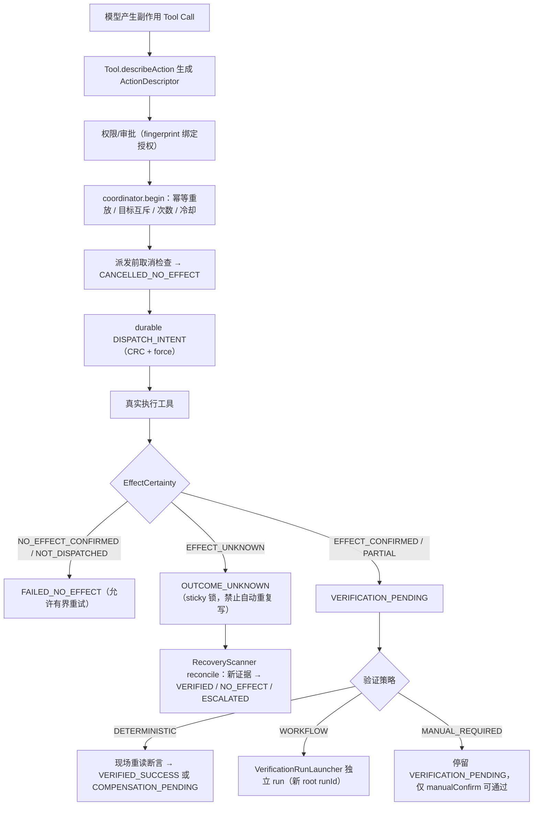

# P1-G 写操作前强制门禁 — 定版设计（已实现）

> 修订日期：2026-07-18
>
> 状态：**已实现（P1-G0..G6）**；本文为经反方向评审后的定版设计与实现对照。
> 早期轻量方案（仅 CancellationToken + TIMED_OUT 警告）已被本定版取代。

## 一、设计目标

P1-G 统一约束所有副作用工具，包括本地文件写入、Shell、消息发送、MCP 写工具和未来 Ops 远程动作。

七项强制门禁：

1. 取消与预算贯穿。
2. 远程结果未知建模。
3. 输出截断保真。
4. 失败分类与确定性恢复策略。
5. Attempt 幂等、次数、冷却、预算和目标互斥。
6. 进程重启恢复。
7. 独立 Verification 隔离。

核心保证不是"每个动作恰好执行一次"（客户端单方面无法做到远端 exactly-once），而是：

- 取消或超时不等于动作未执行。
- 结果未知时不自动重复写。
- 自动重试只发生在"确认无副作用"或"服务端可信去重"场景。
- 未经独立验证的动作不得宣称最终成功。
- 无可靠性契约的副作用工具 fail closed。

## 二、模块边界与实现对照

### `clawkit-tools` — 跨模块稳定契约

| 契约 | 实现 |
| --- | --- |
| `ExecutionControl` | `control/ExecutionControl.java`：取消信号、deadline、共享预算句柄、checkpoint、onCancel 注册 |
| `TokenBudget` | `control/TokenBudget.java`：reserveUpTo/settle，多退少补可透支 |
| `ExecutionHaltedException` | `control/ExecutionHaltedException.java`：CANCELLED / DEADLINE_EXCEEDED / BUDGET_EXHAUSTED |
| `ActionIdentity` | `action/ActionIdentity.java`：logicalActionId、idempotencyKey(=id#seq)、targetKey、actionFingerprint |
| `ActionDescriptor` | `action/ActionDescriptor.java`：动作代码、canonical target、参数摘要、风险、可逆性、恢复能力、验证策略、preconditions、expected effects、补偿、blast radius；`fingerprint()` 绑定审批 |
| `EffectCertainty` | `action/EffectCertainty.java`：NOT_DISPATCHED / NO_EFFECT_CONFIRMED / EFFECT_CONFIRMED / PARTIAL_EFFECT / EFFECT_UNKNOWN |
| `FailureClass` | `action/FailureClass.java`：17 类确定性失败，每类固有 certainty（唯一事实来源） |
| `RecoveryDirective` | `action/RecoveryDirective.java`：RETRY_ALLOWED / RECOLLECT / VERIFY / USER_INPUT / COMPENSATE / ABORT |
| `OutputEnvelope` | `OutputEnvelope.java`：head/tail/errorExcerpts/totalBytes/returned/omitted/truncationReason/sha256/evidenceRefs/redactionApplied/encoding |
| Request/Result 扩展 | `ToolExecutionScope` 携带 ExecutionControl；`ToolExecutionResult` V3 增加 effectCertainty/failureClass/outputEnvelope/attemptId，未显式给出时保守派生（只读→NO_EFFECT_CONFIRMED，其余取 FailureClass 固有 certainty） |
| `Tool.describeAction()` | 副作用工具必须实现；返回 null 时统一执行器 fail closed |

规则：`readOnly=false` 或声明了 side effect 的工具，如果无法生成可信 `ActionDescriptor`，统一执行器拒绝执行。MCP annotations 只能辅助风险判断，不能单独证明幂等或可恢复（[MCP ToolAnnotations](https://modelcontextprotocol.io/specification/2025-11-25/schema#toolannotations)）。

### `clawkit-reliability` — 可靠性内核（新模块）

依赖 `clawkit-tools`，不依赖 engine 或具体 Ops 领域；是控制面事实来源，不把控制正确性依赖在 best-effort recorder 上。

| 组件 | 实现 |
| --- | --- |
| `CancellationTree` | 级联取消、deadline 取父子较小值、预算共享同一账本；`childOf()` 从任意 ExecutionControl 派生 |
| `BudgetLedger` | 线程安全共享账本；子账本 `childCapped()` 只能得到更小配额且仍从共享池扣除 |
| `FailureDecisionTable` | FailureClass → RecoveryDirective 固定映射；`autoRetryAllowed()` 仅在确认无副作用、服务端可信去重或本地可信幂等+可采证时为 true |
| `ActionAttemptCoordinator` | begin（幂等重放/连续无效果次数/冷却/审批分支）、durable DISPATCH_INTENT、按 certainty 归类结果、验证收敛、人工确认、补偿关联 |
| `FileActionAttemptStore` | append-only journal（CRC + `FileChannel.force(true)`）+ 原子 snapshot（仅加速读取）+ 跨进程文件锁事务 + 事务前回放其他进程新记录 + 幂等键唯一索引 + 持久化 target ownership |
| `TargetMutex` | 内嵌于 store：非释放状态持有 targetKey；`OUTCOME_UNKNOWN` sticky 不自动过期 |
| `RecoveryScanner` | 启动扫描：pre-intent → CANCELLED_NO_EFFECT；DISPATCH_INTENT → OUTCOME_UNKNOWN → reconcile；reconcile 只用新采集确定性证据 |
| `SideEffectGate` | ToolCallExecutor 的唯一副作用门禁：无描述符 fail closed、journal 不可写阻断写动作、intent 先落盘、DETERMINISTIC 断言先行、MANUAL_REQUIRED 永不自动 VERIFIED |
| `DeterministicVerifier` | `file-sha256:` / `file-absent:` 断言，现场重新采集；未知断言 fail closed |
| `BoundedOutputCollector`（tools.impl） | 有界 head + tail 环形缓冲 + 错误行片段 + 总字节数/SHA-256 + 凭据脱敏；UTF-8 边界安全 |

### `clawkit-engine`

- ReAct、TWO_STAGE、Plan、SubAgent 共用根 `ExecutionControl`（`CancellationTree`）；`interrupt()` 级联取消。
- 父子 Agent 使用同一预算账本（`CancellationTree.childOf` 共享 ledger），子任务只能得到更小配额。
- `ToolCallExecutor` 是唯一 Side Effect Gate 入口；internal tools 同样注册 metadata + descriptor。
- 并行工具由虚拟线程 executor 持有真实 `Future`；取消时禁止 fork 新任务、`cancel(true)` 中断并等待终态归并（`ExecutorService.close()`）。
- Provider、Tool、compact、memory hooks 调用前执行 checkpoint；`ExecutionHaltedException` 映射为 `INTERRUPTED` / `DEADLINE_EXCEEDED` / `BUDGET_EXHAUSTED` 终态。
- `EFFECT_UNKNOWN` / `PARTIAL_EFFECT` 结果注入结构化安全警告（ephemeral，不持久化）："不要假设已失败或已成功；只允许重新采证，不得自动重复执行同一动作"。
- `VerificationRunLauncher`：独立 Verification Run（新 root runId、全新引擎、PLAN 只读、输入只含 Action Contract、确定性断言先行且模型结论不可推翻）。
- `recoverPendingAttempts()` 由 ApplicationBootstrap 在进程启动时调用一次。

Java 21 的 `StructuredTaskScope` 仍是 preview API，本实现未启用 preview，任务组使用 `Executors.newVirtualThreadPerTaskExecutor()` + Future 句柄（[JEP 453](https://openjdk.org/jeps/453)）。

### `clawkit-provider`

- `ModelRequest` 携带 `ExecutionControl`；`LLMProvider` 增加 control 感知重载（默认忽略，向后兼容）。
- 单次请求 timeout 取"配置 timeout"和"剩余 deadline"的较小值。
- 每次尝试和退避前重新检查取消、deadline、预算（checkpoint）。
- 阻塞请求经 `onCancel → Thread.interrupt()` 可被取消中断；流式路径额外注册关闭 SSE 连接。
- 中断后请求仍可能已送达并开始处理，因此取消不返回"无副作用失败"，抛 `ExecutionHaltedException(CANCELLED)` 由上层按 EFFECT_UNKNOWN 语义处理（[Oracle HttpClient](https://docs.oracle.com/en/java/javase/21/docs/api/java.net.http/java/net/http/HttpClient.html#send(java.net.http.HttpRequest,java.net.http.HttpResponse.BodyHandler))）。
- 预算在 `ObservingProviderGateway`（模型请求唯一入口）预留（estimate）→ 真实 usage 结算；失败调用保守不退还预留。
- 控制面停止不计入熔断失败。

### `clawkit-observability`

- 新增 `AttemptTransitionPayload`（attempt/outcome-unknown/reconcile/verification 由 state 表达）；旧 reader 通过 `UnknownEventPayload` 前向兼容。
- RunEvent 写入失败不改变控制面状态；Reliability Journal 写入失败必须阻断写动作（`SideEffectGate` T-SEG-005）。
- 新增 `RunStatus.DEADLINE_EXCEEDED` / `BUDGET_EXHAUSTED`。

### `clawkit-ops-loop` / `clawkit-ops-mcp`（未来模块约束）

未在本阶段实现。注册任何 Ops 写工具前必须满足：

- 写工具不提供任意 Bash、sudo、SQL 或路径；服务端支持时真正消费并持久化 idempotencyKey。
- 每个写工具必须有只读 reconcile 能力或明确声明 `MANUAL_REQUIRED`。
- Incident 与通用 ActionAttempt 关联，冷却/预算/目标策略经 `ActionAttemptCoordinator.AttemptPolicy` 配置。
- Ops 的 logicalActionId 来自计划步骤，不来自模型 toolCallId。

## 三、统一执行流程（已实现）

审批授权绑定 `ActionDescriptor.fingerprint()`：actionCode、canonical target、参数摘要、risk/reversibility、expected effects、验证与补偿策略、blast radius 任一漂移都改变指纹。`approve-same-type` 对 HIGH 风险不可缓存；声明副作用的工具授权缓存键按全参数 hash 绑定。

## 四、Attempt 状态机（已实现）

主链：`CREATED → (WAITING_APPROVAL) → PRECHECKING → READY → DISPATCH_INTENT → EXECUTION_REPORTED → VERIFICATION_PENDING → VERIFYING → VERIFIED_SUCCESS`

异常分支：

- 派发前取消/拒绝 → `CANCELLED_NO_EFFECT` / `FAILED_NO_EFFECT`（终态，释放目标）。
- intent 落盘后 timeout / cancel / 断网 / 崩溃 → `OUTCOME_UNKNOWN`（sticky）→ `RECONCILING` → `VERIFICATION_PENDING | FAILED_NO_EFFECT | ESCALATED`。
- 验证失败 → `COMPENSATION_PENDING`；补偿是关联原 Attempt 的**新** Attempt，同样接受全部门禁；完成后原 Attempt → `COMPENSATED`。
- `ESCALATED`：人工接管，终态；迟到事件经 version CAS 无法反转。

崩溃一致性：

- append-only journal + sequence + CRC + `FileChannel.force(true)`；snapshot 仅加速读取。
- 进程在"落盘后、实际发送前"崩溃 → 恢复仍按 `OUTCOME_UNKNOWN` 处理（宁牺牲可用性不重复写）。
- 尾部损坏在持锁恢复时截断；中段损坏 → store 进入 degraded，全部变更 fail closed。
- 目标互斥：跨进程文件锁事务 + `targetKey → activeAttemptId` 持久化 + 幂等键唯一索引；事务前回放其他进程新追加记录。

目标锁范围（定版微调，评审结论一致）：持锁 = 派发不确定窗口（CREATED..EXECUTION_REPORTED）+ `OUTCOME_UNKNOWN`/`RECONCILING`（sticky）+ `COMPENSATION_PENDING`（效果错误）；效果确认并进入验证链（`VERIFICATION_PENDING`/`VERIFYING`）后释放——互斥防"并发副作用"与"未知重复写"，不阻塞同目标的后续新动作。

## 五、结果与失败模型（已实现）

`FailureClass.certainty()` 是确定性映射的唯一事实来源；`FailureDecisionTable` 提供恢复指令。LLM 不能修改决策表，只能解释结果。

| 情况 | FailureClass | Certainty | Directive |
|---|---|---|---|
| 参数错误 | INVALID_ARGUMENTS | NOT_DISPATCHED | RETRY_ALLOWED |
| 审批拒绝 | APPROVAL_REJECTED | NOT_DISPATCHED | USER_INPUT |
| 预算不足 | BUDGET_EXHAUSTED | NOT_DISPATCHED | ABORT |
| 服务端执行前拒绝 | SERVER_REJECTED_BEFORE_EXECUTION | NO_EFFECT_CONFIRMED | RETRY_ALLOWED |
| 本地写前失败 | LOCAL_ERROR_NO_EFFECT | NO_EFFECT_CONFIRMED | RETRY_ALLOWED |
| timeout / 断网 / 中断 | TIMEOUT_OUTCOME_UNKNOWN 等 | EFFECT_UNKNOWN | RECOLLECT |
| 已接受无最终结果 | ACCEPTED_NO_FINAL_RESULT | EFFECT_UNKNOWN | VERIFY |
| 同幂等键返回既有结果 | SERVER_DEDUP_REPLAY | EFFECT_CONFIRMED | VERIFY |
| 明确部分执行 | PARTIAL_EXECUTION | PARTIAL_EFFECT | VERIFY |
| 无法分类 | UNCLASSIFIED | EFFECT_UNKNOWN | USER_INPUT |

## 六、重试和 MCP 规则（已实现）

- Provider 传输层重试仅覆盖幂等语义的模型推理请求（429/5xx/IO），且每次尝试前 checkpoint；副作用工具的重试只能由 `ActionAttemptCoordinator` 决定（[RFC 9110 §9.2.2](https://www.rfc-editor.org/rfc/rfc9110.html#section-9.2.2)）。
- `FailureDecisionTable.autoRetryAllowed()`：确认无副作用、可信服务端同幂等键去重、或本地可信设置型幂等 + 可重新采证。
- MCP 写工具描述符恢复能力一律 `ActionReliability.none()`、`MANUAL_REQUIRED`；取消后仍需进入结果确认流程（[MCP Cancellation](https://modelcontextprotocol.io/specification/2025-11-25/basic/utilities/cancellation)）。
- JSON-RPC request ID 不作为业务幂等键（[JSON-RPC 2.0](https://www.jsonrpc.org/specification#request_object)）；logicalActionId 由内容/计划步骤派生，模型换 toolCallId 重发不绕过去重。

## 七、输出截断（已实现）

`OutputEnvelope` + `BoundedOutputCollector`：流式采集同时维护有界 head、有界 tail 环形缓冲、错误匹配片段、总字节数与 SHA-256；UTF-8 边界不产生乱码；Bearer/sk- 凭据脱敏后才进入信封。完整原始输出不默认持久化；`ProcessRunner` 双流独立采集，`BashTool` 合并为结果级信封并在截断时附加错误片段。

## 八、独立 Verification（已实现）

`VerificationRunLauncher`：新 root runId（不设 parentRunId）、全新 AgentEngine（空 session）、PLAN 只读权限、输入只含不可变 Action Contract + expected effects + 验证策略；确定性断言先行（现场重新采集，observedAt 晚于动作结束），模型解释不能推翻断言结果。`MANUAL_REQUIRED` 只能经 `manualConfirm` 进入 `VERIFIED_SUCCESS`。

## 九、验收矩阵（已实现的机械化用例）

| 验收项 | 测试 |
|---|---|
| Provider 调用/退避前取消、预算、deadline | `OpenAIProvider` checkpoint + `ExecutionControlThreadingTest` |
| Tool 串行/并行取消，取消后不启动新工具 | `ExecutionControlThreadingTest`、`ToolCallExecutor` task group |
| 本地进程树取消终态 | `DefaultProcessRunnerCancelTest` |
| SubAgent 级联取消 + 共享预算 | `ExecutionControlThreadingTest` |
| Plan 取消 | `PlanExecutor` onCancel + halt 分支（PlanExecutorTest 回归） |
| 结果未知 sticky、禁止自动重复写 | `SideEffectGateTest.unknownOutcomeBlocksAutomaticRerunOfSameAction` |
| durable intent 前后强杀 | `FaultInjectionTest.killAfterDurableIntentNeverAutoRedispatches`、`RecoveryScannerTest` |
| 两个 JVM 同时修复相同 target | `FaultInjectionTest.twoRealJvmsCannotHoldSameTargetConcurrently`（真实双 JVM） |
| 同一 idempotencyKey 并发/重启重放 | `FileActionAttemptStoreTest`、`ActionAttemptCoordinatorTest.restartReplayResumesInFlightAttempt` |
| 冷却、连续无效果次数、token 预算耗尽 | `ActionAttemptCoordinatorTest`、`BudgetLedgerTest`、engine 预算测试 |
| 超长输出、错误在中段/尾部、UTF-8 边界、脱敏 | `BoundedOutputCollectorTest` |
| journal 尾部损坏、中段损坏、重复 seq、未来 schema | `FileActionAttemptStoreTest`、`FaultInjectionTest` |
| 迟到响应不可反转人工结论 | `ActionAttemptCoordinatorTest.lateReportCannotOverrideHumanEscalation` |
| Verification 隔离与断言权威 | `VerificationIsolationTest` |

硬门禁（全部由测试机械断言）：

- 未验证动作被标记成功：0（`VERIFIED_SUCCESS` 只能来自 `VERIFYING`；MANUAL_REQUIRED 只能人工确认）。
- 结果未知后自动重复写：0（sticky 锁 + 幂等重放 + T-SEG-006）。
- 同一目标并发副作用：0（跨进程 store 事务 + 双 JVM 用例）。
- 取消后启动新动作：0（loop 头/串行/并行/Plan/SubAgent 检查）。
- 无 ActionDescriptor 的副作用工具成功执行：0（T-SEG-001 fail closed）。
- 每个副作用动作都有 durable Attempt 和 Verification/人工终态路径：100%。

## 十、反方向评审结论（保持）

| 反向攻击场景 | 定版处理（实现位置） |
|---|---|
| 远端已执行，响应丢失 | OUTCOME_UNKNOWN sticky；禁止自动重试（Gate + 状态机） |
| 崩溃发生在发送前一瞬间 | durable intent 后一律按可能已发送处理（RecoveryScanner） |
| Transport 自己重试副作用 POST | 副作用重试只在 Coordinator；Provider 重试仅限模型推理请求 |
| Audit recorder 写失败 | journal 与 recorder 分离；journal 失败 fail closed（T-SEG-005） |
| 两个 clawkit 进程同时运行 | 跨进程 store 事务 + 持久化 target ownership（双 JVM 测试） |
| LLM 用新 toolCallId 重发 | logicalActionId 内容/计划派生（`contentDerivedActionId`） |
| MCP 服务谎报 idempotentHint | 描述符恢复能力固定 none()；只有可信本地实现可声明 |
| 父任务取消但子虚拟线程继续 | task group 持有 Future、cancel(true) 并 close() 归并 |
| Verification 读到旧日志 | 确定性断言现场重读；独立 run 不继承任何上下文 |
| 补偿失败后继续补偿 | 补偿是独立 Attempt；COMPENSATION_PENDING → 仅 COMPENSATED/ESCALATED |
| 宽泛 approve-same-type | HIGH 不可缓存；副作用授权按全参数 hash 绑定 |
| 迟到响应覆盖人工结论 | version CAS；终态与 ESCALATED 不可反转 |

### 剩余风险（保守处理，不能由客户端完全消除）

- 远端服务忽略取消 → 结果确认流程兜底。
- 不支持幂等键/状态查询/Verification 的第三方写工具 → MANUAL_REQUIRED，不自动成功。
- 主机磁盘损坏导致 journal 无法恢复 → degraded fail closed，升级人工。
- 操作者绕过 clawkit 直接重复执行 → reconcile 检测漂移后 ESCALATED。
- 可信工具实现违反 reliability contract → 确定性验证/审计暴露。

处理原则统一：阻止自动化、保持未知状态、重新采证或升级人工。

## 十一、实施记录

| 阶段 | 内容 | 状态 |
|---|---|---|
| P1-G0 契约收口 | ExecutionControl/Outcome/Failure/ActionDescriptor/OutputEnvelope | ✅ |
| P1-G1 取消与预算贯穿 | ReAct/Plan/SubAgent/Provider/Tool/ProcessRunner 全链路 | ✅ |
| P1-G2 输出和失败分类 | head/tail/error/evidence 统一；无字符串推断恢复 | ✅ |
| P1-G3 可靠性内核 | Journal、状态机、幂等索引、跨进程互斥、冷却预算 | ✅ |
| P1-G4 工具迁移 | Write/Edit/Bash/TodoWrite/MCP/internal + Gate fail closed | ✅ |
| P1-G5 恢复与独立 Verification | 启动扫描、reconcile、独立 run、补偿关联 | ✅ |
| P1-G6 故障注入与门禁 | 崩溃窗口、双 JVM、journal 损坏、硬门禁断言 | ✅ |

远程写能力保持关闭：仓库内不存在任何远程写工具；未来 Ops 写工具注册必须以本文硬约束为前置门禁。

## 十二、代码评审修复方案与反向评审（2026-07-18）

### 修复范围

本轮修复覆盖实现评审发现的全部门禁缺口：

1. MCP/HTTP 副作用请求只允许单次传输，不在 transport 内自动重试；MCP 调用显式接收 `ExecutionControl`。
2. 工具执行后的 Attempt 归档失败覆盖业务结果，调用方只能得到 `EFFECT_UNKNOWN`，不得继续按成功处理。
3. `WORKFLOW`/`MANUAL_REQUIRED` 返回 `VERIFICATION_PENDING`，不再返回 `SUCCESS`；独立 Verification 由 engine 注入的 handler 接通 Attempt 状态机。
4. 确定性验证要求非空断言；无断言动作只能使用 `MANUAL_REQUIRED` 或提供真实状态读取器。
5. target ownership 保持到 `VERIFIED_SUCCESS`、`FAILED_NO_EFFECT`、`CANCELLED_NO_EFFECT`、`COMPENSATED` 或人工 `ESCALATED`；Verification 期间禁止同目标写入污染证据。
6. precondition 在持有目标锁后、写入 `DISPATCH_INTENT` 前重新采集并校验；失败按 `FAILED_NO_EFFECT` 收敛。
7. 预算扩展为 token、Provider 调用次数和 Tool 调用次数；预留不足时不发起调用。
8. Plan/并行工具持有真实 Future，取消后有界归并；进程线程被中断时仍必须终止进程树。
9. journal 使用完整写循环，拒绝序号回退/冲突和幂等键指纹冲突。
10. `OutputEnvelope` 的 returned/omitted 统计必须与实际 head/tail 文本一致。

### 实施顺序

1. 先收口 transport、取消和预算，阻断新的外部副作用。
2. 再修 Attempt store、precheck、target ownership 和控制面失败语义。
3. 接通独立 Verification，最后才允许产生 `VERIFIED_SUCCESS`。
4. 补齐反例测试后运行模块级测试、双 JVM/崩溃故障注入和全量 `clean verify`。

### 反方向方案评审

| 攻击场景 | 方案检查 | 结论 |
|---|---|---|
| transport 在响应丢失后自行重发 POST | transport 无副作用语义，因此统一单次发送 | 通过 |
| 动作已生效但 journal 结果记录失败 | 返回 unknown，durable intent 保持 sticky | 通过 |
| 空断言或未接线 launcher 伪造验证成功 | 空断言 fail closed；handler 缺失时保持 pending | 通过 |
| Verification 期间第二个进程改写同一目标 | target ownership 保持到验证终态 | 通过 |
| 审批后、派发前文件被外部修改 | 持锁后执行 fresh precheck，失败不派发 | 通过 |
| token 只剩 1 但仍发起完整模型请求 | 预留必须完整成功，否则拒绝调用 | 通过 |
| Future 被中断但子进程继续运行 | interrupt 分支终止进程树并有界等待 | 通过 |
| journal 部分写、重复序号或幂等键漂移 | writeFully + 连续序号 + identity/fingerprint 一致性检查 | 通过 |
| 为兼容旧 Provider/MCP 接口而静默忽略控制 | 生产入口统一包装控制；旧接口仅保留源码兼容，不作为可靠性保证 | 有条件通过，需测试守卫 |

评审结论：方案可实施；只有在上述反例测试全部通过后，P1-G 才能重新标记为完成。
