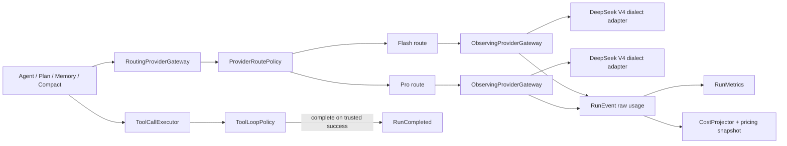

# P2 成本与效率技术实现方案与反方评审

> 状态：设计评审稿
>
> 日期：2026-07-22
>
> 依据：`TODO.md` P2、OPS-0B 正式基线、当前 Provider/Context/Tool/Memory 代码事实
>
> 原则：任何优化都不得以降低完成率、证据可信度、安全门禁或可恢复性为代价

## 1. 结论

P2 不按原五项直接并行展开，改为数据驱动的七段实施：

1. **P2-0：DeepSeek V4 兼容、真实 usage 与成本基线**；
2. **P2-1：结构化终结工具，消除无价值的第二次 Provider 调用**；
3. **P2-2：Provider 原生 Prompt Cache 可观测与稳定前缀**；
4. **P2-3：确定性多模型路由，不包含失败 fallback**；
5. **P2-4：受信 MCP 并发与 Incident 内只读缓存**；
6. **P2-5：自适应分层 compact**；
7. **P2-6/P2-7：Bash session 和 Memory 生命周期，达到进入条件后再实现**。

P2-0 是进入 P2 的硬门禁。当前 `OpenAIProvider` 丢弃真实 `usage`，所有 OPS-0B
运行的 token 指标为 0；同时默认模型仍为即将废弃的 `deepseek-chat`。在这两个问题修复前，
无法证明 Prompt Cache、模型路由或 compact 的真实成本收益。

### 1.1 实施状态（2026-07-22）

- P2-0A～0C 已完成：V4 方言/推理控制、真实 usage、事件投影、版本化价格快照和
  baseline v2 已落地；默认模型迁移为 `deepseek-v4-flash`，旧 alias 仅保留兼容告警。
- P2-1 已完成代码与 OPS 接入：只有可信本地、独占、成功且确定性已知的终结工具可结束循环；
  MCP 工具和混合批次不能触发提前终结。
- P2-2 已完成：system/skill/tool/schema 顺序稳定，Provider 事件记录 prompt fingerprint、缓存
  token 和 usage 来源。
- P2-0D 尚未执行：需要真实凭据并产生外部调用成本的 R10 6×20 正式基线不在本次离线实施中运行。
- P2-5 自适应分层 compact 已完成离线实现和 26-turn 安全回归，但尚未冻结真实模型成本收益；
  P2-3、P2-4、P2-6、P2-7 仍保持关闭。

## 2. 代码与基线事实

### 2.1 OPS-0B 数据

对 `ops-fixtures/reports/ops-0b-20260722-r9-formal` 下 120 个 run summary/event 聚合：

| 指标 | 结果 |
| --- | ---: |
| 请求 / 可评估 / 通过 | 120 / 118 / 118 |
| 平均运行时间 | 33.8 秒 |
| P95 | 56.6 秒 |
| Provider 耗时占比 | 73.7% |
| 平均 Provider 调用 | 7.4 次/run |
| 平均 Tool 调用 | 21.2 次/run |
| Tool 输出总量 | 4.9 MiB |
| 有真实 token 的 run | 0 |
| compact 次数 | 0 |

最新 R10 冒烟通过“确定性预采证 + 模型只提交 Diagnosis”将 4 个样本降到平均约 10 秒、
2 次 Provider 调用和 1 次 Tool 调用。但它只覆盖 `SELF_RECOVERED` 与
`CONNECTION_EXHAUSTION` 各 2 次，不能替代 6 类 × 20 次正式基线。

### 2.2 当前代码缺口

- `OpenAIResponse` 不包含 `usage`，`OpenAIProvider.generate(ModelRequest)` 固定返回
  `TokenUsage.EMPTY`。
- `TokenUsage` 只有 prompt/completion/total，无法表达 cache hit、cache miss、reasoning
  和数据来源。
- `OpenAIRequest` 没有 `thinking`、`reasoning_effort`；`ThinkingMode.OFF` 只控制 Engine
  的 TWO_STAGE，不控制 Provider 原生 thinking。
- `ProviderCallStartedPayload.providerCallId` 当前不能可靠区分同 run 的多次调用；完成事件
  不记录实际模型、路由、cache usage 或 reasoning usage。
- `PromptAssembly` 遍历普通 `Map`；`DefaultSkillRuntime` 使用 `ConcurrentHashMap`，
  Skill 顺序可能漂移，破坏完全一致前缀。
- `ToolCallExecutor` 已支持只读并行，但 `McpToolAdapter` 将 MCP 工具固定为 `SERIAL`。
- `AgentEngine` 在工具成功后固定回到下一轮 Provider；`submit_diagnosis` 成功后仍需一次
  只返回确认文本的调用。
- Memory 仅以派生文件名定位；同文件同内容跳过，同文件不同内容直接覆盖并计 conflict，
  没有语义键、版本、来源、访问时间或衰减。

## 3. 目标、非目标与硬门禁

### 3.1 目标

- 每个 Provider 调用具有真实或明确标记为估算/不可用的 usage。
- 能按 run、phase、case 和 model 投影 token、cache hit、reasoning、延迟和估算费用。
- OPS 确定性提交路径在一次 Provider 调用内结束。
- 路由决策可解释、可回放、可关闭，不产生隐式重试。
- 仅在有基线收益时启用并发、缓存、compact、Bash 复用和 Memory 生命周期策略。

### 3.2 非目标

- 不建设中心化网关、计费平台或多租户调度器。
- 不实现本地 LLM KV cache；DeepSeek Prompt Cache 由 Provider 托管。
- 不把 Provider fallback 混入多模型路由；fallback 仍属于 P1-A 延后项。
- 不跨 Incident 缓存 Ops 证据。
- 不让 Provider 层理解 Diagnosis、OPS、代码任务或风险等级。
- 不为降低成本缩短必要证据、跳过独立验证或放宽 Side Effect Gate。

### 3.3 硬门禁

任一满足即不得默认启用优化：

- benchmark 的 PASS 变 FAIL；
- evaluator coverage 低于基线，或出现不可解释的不可评估样本；
- 安全、审批、结果未知、取消、deadline、预算或 RunCompleted invariant 退化；
- 实际 usage 覆盖率不足但报告仍宣称成本改善；
- 新旧事件回放不一致；
- route、cache 或 shell session 在 run/workspace/Incident 之间泄漏状态。

## 4. 目标架构



模块所有权：

| 模块 | 新职责 | 明确不负责 |
| --- | --- | --- |
| `clawkit-provider` | DeepSeek V4 方言、thinking 参数、usage/reasoning 解析 | 按业务或 RunPhase 路由 |
| `clawkit-engine` | route policy、终结工具编排、Provider 唯一观测入口 | 价格硬编码、OPS taxonomy |
| `clawkit-observability` | 原始 usage/route/cache 事件和投影 | 修改路由决策 |
| `clawkit-evaluation` | pricing snapshot、成本投影、回归门禁 | 在线扣费或凭据管理 |
| `clawkit-context` | 稳定前缀、分层 compact | Provider 价格和业务诊断 |
| `clawkit-tools` | 显式 loop policy、shell session 契约 | 按工具名结束 run |
| `clawkit-memory` | 语义身份、版本、来源和检索衰减 | 静默删除用户记忆 |

## 5. P2-0：V4 兼容、usage 与成本基线

### 5.1 Provider 方言和原生 reasoning

Engine 的 `ThinkingMode` 保持原义并改进文档，Provider 原生 reasoning 使用独立枚举：

```java
public enum ProviderReasoningMode {
    DISABLED,
    ENABLED_HIGH,
    ENABLED_MAX,
    PROVIDER_DEFAULT
}

public record ModelParameters(
    Double temperature,
    Integer maxTokens,
    Boolean stream,
    ProviderReasoningMode reasoningMode
) { ... }
```

保留三参数兼容构造器，并与 clawkit 默认值一致使用 `DISABLED`；需要跟随供应商默认
thinking 行为时必须显式选择 `PROVIDER_DEFAULT`，避免 V4 的默认 thinking 改变现有 `OFF` 行为。

`LLMConfig` 增加显式 `ProviderDialect`：

```java
GENERIC_OPENAI_COMPAT,
DEEPSEEK_V4
```

禁止根据 URL 或模型名在请求中静默注入私有字段。只有 `DEEPSEEK_V4` 才发送：

```json
{
  "thinking": {"type": "disabled"}
}
```

启用 thinking 时解析并保存 `reasoning_content`。发生 tool call 时，下一轮必须按 DeepSeek
协议带回对应 reasoning；非工具轮默认不持久化 reasoning。`ModelResponse` 增加可空
`reasoningContent`，旧构造器默认 `null`。

默认模型迁移为 `deepseek-v4-flash`；`deepseek-chat`、`deepseek-reasoner` 在启动时给出
带截止日期的明确错误或迁移提示，不静默改写用户显式配置。

官方依据：

- <https://api-docs.deepseek.com/>：旧 alias 的 2026-07-24 废弃时间；
- <https://api-docs.deepseek.com/guides/thinking_mode/>：thinking 默认开启以及工具轮
  `reasoning_content` 回传要求。

### 5.2 usage 契约

```java
public enum UsageSource { ACTUAL, ESTIMATED, UNAVAILABLE }

public record TokenUsage(
    int promptTokens,
    int completionTokens,
    int totalTokens,
    int promptCacheHitTokens,
    int promptCacheMissTokens,
    int reasoningTokens,
    UsageSource source
) { ... }
```

约束：

- 所有数值非负；
- `ACTUAL` 且 Provider 返回 cache 拆分时，
  `promptTokens == promptCacheHitTokens + promptCacheMissTokens`；
- reasoning 是 completion 的明细，不重复加入 total；
- cache hit 仍计入上下文/token budget，只在费用投影中使用不同单价；
- Provider 未返回 usage 时可用 tokenizer 估算 prompt 和已知输出，但必须标记
  `ESTIMATED`；不能用 0 冒充真实值。

非流式从顶层 `usage` 解析；流式从 terminal chunk 解析。SSE `[DONE]` 前未收到 usage 时，
返回 `ESTIMATED/UNAVAILABLE`，并发 warning，不能静默丢失。

官方字段依据：
<https://api-docs.deepseek.com/api/create-chat-completion/>。

### 5.3 事件与投影

`ProviderCallStartedPayload` 兼容追加：

```text
providerCallId       每次调用唯一，不再复用 runId
routeId
routeReasonCode
providerDialect
requestedModel
reasoningMode
promptFingerprint
```

`ProviderCallCompletedPayload` 兼容追加：

```text
actualModel
promptCacheHitTokens
promptCacheMissTokens
reasoningTokens
usageSource
```

旧字段 `inputTokens/outputTokens/tokensEstimated` 保留一个 schema 周期；
`tokensEstimated = usageSource != ACTUAL`。旧 JSON 缺少新字段时按 `UNAVAILABLE` 读取。

`RunMetrics.ProviderMetrics` 增加 cache/reasoning totals、actual/estimated/unavailable call count，
并校验：

- completed event 数与 calls 一致；
- actual + estimated + unavailable == successful calls；
- cache hit + miss 不超过 input；
- 同 run 的 providerCallId 唯一。

### 5.4 费用投影

事件只保存原始 usage，不保存会随时间变化的美元结论。`clawkit-evaluation` 增加：

```java
record ModelPrice(
    String provider, String model, String currency,
    BigDecimal cacheHitInputPerMillion,
    BigDecimal cacheMissInputPerMillion,
    BigDecimal outputPerMillion
) {}

record PricingSnapshot(String version, Instant effectiveAt,
                       Map<ModelKey, ModelPrice> prices) {}
```

`CostProjector` 使用 run event + pricing snapshot 生成 benchmark artifact。Baseline 保存
`pricingSnapshotVersion/hash`。价格 hash 不同的报告只能比较原始 token，费用 verdict 标记
`INCOMPARABLE`，不得把价格变化宣称为代码优化。

### 5.5 P2-0 验收

- OpenAI/DeepSeek 非流式和流式 fixture 覆盖 actual/cache/reasoning usage；
- 旧 Provider fixture 仍可读，source 明确为 estimated/unavailable；
- OPS 成功 Provider 调用 actual usage coverage = 100%；
- `deepseek-v4-flash + DISABLED` 文本、工具调用、多轮工具调用通过；
- thinking tool-call 回传 reasoning 的协议测试通过；
- 旧事件回放、summary/live projection 一致；
- 形成新的 R10 6×20 正式基线，再进入 P2-1。

## 6. P2-1：结构化终结工具

### 6.1 契约

不能按 `submit_diagnosis` 名称写特例，也不能让工具输出字符串控制 Agent loop。
在 tools 公共契约增加：

```java
public enum ToolLoopPolicy {
    CONTINUE,
    COMPLETE_RUN_ON_SUCCESS
}

public record ToolControlPolicy(ToolLoopPolicy loopPolicy) {
    public static final ToolControlPolicy DEFAULT = ...;
}
```

`ToolMetadata` 组合 `ToolControlPolicy`，旧构造器默认 `CONTINUE`。只有 builtin 或应用组合根
显式注册的 trusted local tool 可以使用 `COMPLETE_RUN_ON_SUCCESS`；MCP adapter 永远映射为
`CONTINUE`，不读取 `_meta` 或 annotations 中的同名字段。

### 6.2 执行语义

1. batch preflight 发现终结工具时，它必须是本批唯一调用；否则整批不执行，返回
   `TERMINAL_TOOL_MUST_BE_EXCLUSIVE`；
2. 正常经过 metadata、PermissionPolicy、Side Effect Gate、attempt journal 和 ToolCompleted；
3. 仅 `status == SUCCESS` 且 `effectCertainty != EFFECT_UNKNOWN/PARTIAL_EFFECT` 时生成
   `ToolLoopDecision.COMPLETE`；
4. Tool 失败、拒绝、取消、超时、结果未知或部分执行时继续由现有恢复策略处理；
5. `AgentEngine` 写入 assistant tool-call 和 tool result，持久化 session，随后发
   `RunCompleted(COMPLETED)`，返回 tool output，不再调用 Provider；
6. 不合成一条虚假的 assistant 文本消息。

`ToolExecutionBatchResult` 增加：

```java
ToolLoopDecision loopDecision; // CONTINUE / COMPLETE
String finalOutput;
```

`DiagnosisSubmissionTool` 覆盖 metadata，声明 trusted local + complete on success。最终输出应为
结构化、脱敏且可直接展示的确认结果，不能返回模型自由文本。

### 6.3 验收

- 单终结工具成功：1 Provider、1 Tool、1 RunCompleted；
- 终结工具校验失败：不完成 run，可继续纠错；
- 终结工具与其他工具同批：零工具实际执行，结构化拒绝；
- untrusted/trusted MCP 均不能终结 run；
- cancelled/unknown/partial 不产生 COMPLETED；
- OPS 6×20 的 evaluator、证据引用和 RunEvent invariant 不退化。

## 7. P2-2：Prompt Cache 与稳定前缀

DeepSeek cache 默认开启。本阶段不实现本地 cache，只做可观测和 cache-friendly prompt：

1. `SkillCatalog.toPrompt()` 按 skill name 排序；
2. active skills 按 name 排序，不直接遍历 `ConcurrentHashMap.values()`；
3. tool definitions 按稳定 name 排序，JSON Schema 使用 canonical key order；
4. system/workspace/tool schema 放在前，run/turn/时间戳/Incident 等易变内容放在后；
5. 计算稳定前缀的 SHA-256 `promptFingerprint`，只记录 hash、字节数和估算 token，
   不记录原始 prompt；
6. 变更 system prompt、tool schema、skill 或 memory index 时 fingerprint 必须变化；
7. 不通过伪造空格、注释或重复上下文追求命中率。

DeepSeek 只有从第 0 token 开始的完整前缀可命中，且是 best effort：
<https://api-docs.deepseek.com/guides/kv_cache/>。

验收指标：

- 相同 fixture 的 fingerprint 100% 稳定；
- prompt 内容变化时无 hash 假相同；
- 第二轮请求实际 cache hit tokens > 0 的比例和 hit ratio 可报告；
- cache miss 上升但 completion/latency 改善时只报告事实，不强制判失败；
- fingerprint 中不出现 prompt、凭据或证据正文。

## 8. P2-3：确定性多模型路由

### 8.1 边界

`clawkit-provider` 不知道 RunPhase。`clawkit-engine` 新增：

```java
public interface ProviderRoutePolicy {
    ProviderRouteDecision select(ModelRequest request, RunScope scope,
                                 Set<ProviderRoute> available);
}

public record ProviderRouteDecision(
    String routeId,
    String reasonCode,
    ProviderReasoningMode reasoningMode
) {}
```

`RoutingProviderGateway` 持有 `Map<routeId, ProviderGateway>`。每个 delegate 是独立的
`ObservingProviderGateway`，保证每次实际调用只产生一组 started/completed 事件。

初始策略只按配置的 `RunPhase -> routeId` 静态映射：

```text
MEMORY_EXTRACT, COMPACT       -> flash/non-thinking
REACT, TWO_STAGE_EXECUTE     -> configured default
TWO_STAGE_PLAN, PLAN_REVIEWER -> configured quality route
PLAN_WORKER, SUB_AGENT       -> configured worker route
```

默认所有 phase 仍走 Flash/non-thinking。只有 A/B benchmark 证明某 phase 的 Pro 收益后才改变
默认映射。

### 8.2 明确禁止

- 不根据自由文本关键词猜任务难度；
- 不根据模型输出的自报 confidence 自动升级；
- 不把 429/timeout/schema 错误后改模型称为“路由”；那是 fallback；
- 不在同一次逻辑调用中并发请求多个模型后择优；
- 不让 route 绕过全局 token/provider-call/deadline budget；
- 不把价格写死进 ProviderRoutePolicy。

### 8.3 A/B 方法

- 相同 6×20 Case、固定 fixture seed、隐藏 ground truth；
- Flash 与候选策略交错运行，避免 cache warm-up 和时段偏差；
- 同时比较完成率、evaluator coverage、root cause、Provider calls、实际 token、费用和 P95；
- PASS/安全为硬门禁，费用和延迟只在质量等价时决定胜负；
- routing table、prompt fingerprint、pricing hash、模型实际返回名进入报告。

## 9. P2-4：MCP 并发与 Incident 内缓存

MCP 标准 annotations 没有并发安全字段，而且 annotations 只是 hints。不能把
`readOnlyHint=true` 自动映射为 `PARALLEL_SAFE`。标准依据：
<https://modelcontextprotocol.io/specification/2025-06-18/schema>。

增加本地配置覆盖：

```yaml
mcp:
  servers:
    ops:
      trusted: true
      concurrency:
        mode: limited
        max_in_flight: 4
        tools: [container_status, service_status, db_activity]
```

约束：

- 仅 `trusted=true` 且本地 allowlist 中的只读工具可并发；
- 未配置、冲突、open-world 或副作用工具保持 SERIAL；
- 同一 MCP transport 的并发能力先由 fixture 验证；协议不支持时退回串行；
- 取消时归并全部 Future 终态，不留下 missing result；
- 输出按原 tool-call 顺序回注，不按完成顺序改变模型上下文。

Incident 内缓存键：

```text
incidentId + capabilityProfile + toolName + canonicalArguments + evidenceWindow
```

缓存值必须保留 observedAt、validUntil、collectionStatus 和 rawReference。过期、采集失败、
结果未知、open-world、写工具一律不缓存；新 Incident 一律 miss。记录 hit/miss/bypass reason，
但 cache hit 仍生成可审计的 ToolCompleted，并标明来源。

R10 已消除大部分动态重复采证，因此本阶段只有在新正式基线重新出现显著重复调用时才进入实现。

## 10. P2-5：自适应分层 compact

PA-3 required anchor 的 snapshot、verify、reinsert、re-budget 和 fail-closed 已进入生产路径；
26-turn 离线组件场景可稳定触发 L2/L3。由于当前 OPS 正式基线 compact=0，本实现只证明安全与
控制流正确，真实模型成本、完成率和 P95 收益仍需独立长任务基线确认。

决策输入：

```text
projectedPromptTokens
+ reservedOutputTokens
+ requiredAnchorTokens
+ safetyMargin
vs min(modelContextWindow, runTokenBudgetRemaining)
```

分层：

1. **L0 无动作**：在 target 内；
2. **L1 确定性清理**：去重 runtime fragment、mask 已消费的大输出、驱逐可重建 ephemeral；
3. **L2 抽取式 compact**：保留 required anchors、最近 turn 和结构化状态；
4. **L3 生成式 summary**：使用配置的 cheap route，随后 verify/reinsert/re-budget；
5. **L4 结构化失败**：required 状态补回后仍超硬限制，不调用主任务 Provider。

触发阈值由 benchmark profile 配置，不把 55%/75% 等经验数字写死。生成式 compact 必须证明：

- 节省的后续 cache-miss token 成本大于 compact 调用成本；
- required anchor 无丢失；
- 完成率不下降；
- cache 已大量命中时不会为了“减少 token”反而增加费用和延迟。

## 11. P2-6：可重置 Bash session

进入条件：独立 microbenchmark 证明 shell 启动占 BashTool P50 的显著比例，且真实任务有足够高的
短命令频率。OPS-0B 未使用 Bash，不能作为排期依据。

候选实现 `ShellSessionPool`：

- key 为 OS/shell/workspace/permission profile，不跨 workspace；
- 每 session 单 in-flight，禁止命令交错；
- 每条命令在 subshell 中运行，父 shell 只负责协议；
- nonce frame 标记 stdout/stderr 边界和 exit code；
- timeout、取消、输出协议失步、后台进程残留后立即 kill + discard；
- 每次恢复 cwd、环境白名单、umask、shell options；
- 最多执行 N 次或 idle TTL 后主动重建；
- feature flag 默认关闭，Windows PowerShell 和 POSIX shell 分别验收。

如果 subshell + process-group 隔离后收益不足 20%，否决 session 复用，保留当前
`DefaultProcessRunner`。不能以保留 cwd、环境变量、函数、alias 或后台进程来换取性能。

## 12. P2-7：Memory 去重、冲突与衰减

进入条件：真实 workload 能给出重复率、冲突率、召回 token 和误召回样本。Memory 关闭的
OPS-0B 不提供这些证据。

`MemoryEntry` v2 建议增加：

```text
memoryId                 稳定 UUID
semanticKey              scope + subject + predicate 的规范化 hash
revision
provenance               source run/message/user
createdAt / updatedAt / lastAccessedAt
confidence
status                   ACTIVE / SUPERSEDED / CONFLICTED / TOMBSTONED
pinned
contentHash
```

规则：

- content hash 相同：增加 provenance/access，不创建重复正文；
- semanticKey 相同、内容可合并：创建新 revision，旧版 SUPERSEDED；
- semanticKey 相同但互斥：两者标记 CONFLICTED，不静默覆盖；
- 衰减只影响检索排序，不自动删除；
- pinned、用户显式记忆、安全/权限边界不衰减；
- 当前事实和历史事实分开评分，时间不能把旧事实伪装成当前事实；
- v1 文件惰性迁移，原 Markdown 可读，迁移失败不覆盖原文件。

检索评分可以组合 relevance、confidence、recency、access 和 conflict penalty，但权重必须由
fixture 校准并进入版本化 profile，不能散落常量。

## 13. Benchmark 与验收矩阵

### 13.1 必须新增的 case

| Case | 关键断言 |
| --- | --- |
| V4 non-thinking tool call | 请求显式 disabled，响应不要求 reasoning 回传 |
| V4 thinking tool call | reasoning_content 完整回传，下一轮无 400 |
| usage actual/cache | hit + miss == prompt，reasoning 不重复计费 |
| streaming terminal usage | final chunk usage 被记录，只有一个 terminal event |
| terminal tool success | 1 Provider、1 Tool、COMPLETED |
| terminal tool invalid | 不完成，可纠错 |
| terminal tool mixed batch | 零实际工具执行 |
| untrusted MCP terminal spoof | 始终 CONTINUE |
| route replay | 同输入/phase/config 得到同 route/reason |
| pricing drift | price hash 不同，cost INCOMPARABLE |
| stable prompt | 多次构建 fingerprint 相同 |
| MCP bounded parallel | 顺序回注、取消归并、max_in_flight |
| cache isolation | 跨 Incident 必 miss |
| adaptive compact | anchor 子集、超限 fail-closed |
| shell protocol desync | session 丢弃，无后续污染 |
| memory conflict | 保留双方，不静默覆盖 |

### 13.2 正式门禁

- Reactor 全量测试、ArchUnit、`git diff --check`；
- runtime benchmark 无硬门禁退化；
- OPS R10 6×20：120/120 有明确 evaluator 结果，PASS 不低于冻结基线；
- Provider actual usage coverage = 100%；
- 事件 live/replay、summary、benchmark artifact 一致；
- 成本改善同时报告 token、price snapshot、模型和 cache ratio，不能只报美元；
- P95 使用正式重复样本，不用 4-run smoke 宣称收敛。

## 14. PR 切片、依赖与回滚

| PR | 内容 | 依赖 | 默认开关 |
| --- | --- | --- | --- |
| P2-0A | DeepSeek V4 dialect、reasoning request/response、alias 迁移 | 无 | 新默认生效，旧 alias 兼容告警 |
| P2-0B | TokenUsage v2、非流式/流式 usage | 0A | 生效 |
| P2-0C | 事件/投影/pricing snapshot/baseline v2 | 0B | 生效 |
| P2-0D | R10 6×20 冻结基线 | 0C | N/A |
| P2-1A | ToolControlPolicy + batch decision | 0D（效果判定） | 仅显式声明的可信工具开启 |
| P2-1B | AgentEngine 终结 + OPS 接入 | 1A | 仅 OPS 提交工具开启 |
| P2-2 | 稳定排序、fingerprint、cache metrics | 0C | fingerprint 开启 |
| P2-3A | RoutingProviderGateway + 静态 route table | 0D | 单 route |
| P2-3B | Flash/Pro A/B 与默认策略 | 3A | 仍 Flash，评审后切换 |
| P2-4 | trusted MCP bounded concurrency/cache | 0D | 关闭 |
| P2-5 | adaptive compact | PA-3；长任务基线用于收益判定 | 分层策略生效，收益声明关闭 |
| P2-6 | ShellSessionPool 实验 | microbenchmark 进入条件 | 关闭 |
| P2-7 | MemoryEntry v2 与检索 profile | memory dataset | 关闭 |

每个 PR 只迁移一条真实路径；旧构造器最多保留一个 schema 周期。回滚优先使用 feature flag：

- route 回滚到单 Flash；
- terminal completion 回滚到 CONTINUE；
- MCP concurrency/cache 回滚为 SERIAL/no-cache；
- adaptive compact 回滚到现有 pipeline；
- shell session 回滚到 `DefaultProcessRunner`；
- memory v2 回滚读取 v1，禁止反向覆盖已生成 revision。

P2-0A 的模型 alias 迁移不应回滚到已被上游废弃的 alias；只能回滚代码并由用户显式指定仍可用
模型。

## 15. 反方评审

### 15.1 评审结论

**有条件通过。** P2-0、P2-1 和 P2-2 可以进入实现；P2-3 只允许单 route 契约和 A/B，
不得直接默认 Pro；P2-4 至 P2-7 均需满足各自进入条件。

### 15.2 主要反对意见与处理

| 反对意见 | 严重度 | 判断 | 方案修订 |
| --- | --- | --- | --- |
| 没有真实 token 就讨论成本，所有 ROI 都不可证伪 | 致命 | 接受 | P2-0 成为硬前置，usage coverage 不足禁止成本 verdict |
| 默认模型两天后失效，P2 可能在错误基线上开发 | 致命 | 接受 | V4 alias/thinking 兼容提到 P2-0A 最前 |
| V4 默认 thinking，现有 OFF 实际失效且工具轮缺 reasoning 回传 | 致命 | 接受 | 分离 Engine ThinkingMode 与 ProviderReasoningMode，引入方言适配 |
| 本地实现 Prompt Cache 重复造轮子，还会扩大敏感数据面 | 致命 | 接受 | 明确不做本地 KV cache，只稳定前缀并读取 Provider usage |
| 把模型路由写进 provider 会让底层理解 OPS/任务语义 | 高 | 接受 | 路由放 `engine.ProviderGateway`，provider 只解析协议 |
| 输出错误后自动切 Pro 是隐藏 fallback，会放大调用和预算 | 高 | 接受 | 路由只做调用前静态决策；失败切换留在 P1-A |
| `submit_diagnosis` 名称特判污染通用 runtime | 高 | 接受 | 增加通用 trusted ToolControlPolicy，禁止名称判断 |
| 任意 MCP 都能声明 terminal 将允许恶意 server 提前结束 run | 致命 | 接受 | MCP 永远 CONTINUE，terminal 只由本地组合根授予 |
| terminal 与其他工具并发时可能先结束、后产生副作用 | 致命 | 接受 | terminal 必须独占 batch；混批整批不执行 |
| terminal tool 成功但副作用结果未知时仍标 COMPLETED | 致命 | 接受 | unknown/partial/cancel/timeout 明确不能终结 |
| readOnlyHint 不等于并发安全，MCP server/transport 可能串行 | 高 | 接受 | 仅 trusted 本地 allowlist + bounded concurrency + fixture |
| R10 只有 4 次 smoke，70% 改善可能是样本偏差 | 高 | 接受 | 先跑 6×20，禁止以 smoke 冻结基线 |
| 把美元写入事件会因价格变化造成历史事实漂移 | 高 | 接受 | 事件只记 usage；费用由版本化 pricing snapshot 投影 |
| cache hit token 被当作 0 会破坏 context/token budget | 高 | 接受 | cache hit 只改变费用，不改变 total/context budget |
| 1M context + 高 cache hit 下，生成式 compact 可能更贵更慢 | 高 | 接受 | compact 延后，并加入边际成本与 anchor benchmark 门禁 |
| Bash session 无法真正 reset，可能泄漏 cwd/env/trap/background job | 致命 | 接受 | subshell 隔离、失步即销毁；收益不足 20% 直接否决 |
| Memory 衰减会静默遗忘用户明确事实 | 高 | 接受 | 衰减只改排序；pinned/用户/安全事实不衰减，不自动删除 |
| 一次改完 usage、router、terminal、compact 会形成不可回滚大爆炸 | 高 | 接受 | 拆成 12 个小 PR，每项独立开关和回滚路径 |
| 新事件字段会让历史 JSON 无法回放 | 高 | 接受 | 兼容追加、默认值、旧 fixture 和 live/replay 等价测试 |

### 15.3 被否决的替代方案

1. **直接并行实现 TODO 原五项**：否决。缺真实 usage、compact/Bash/Memory workload，无法排序。
2. **在 `ProviderFactory` 按 prompt 文本选择模型**：否决。不可解释、不可回放且污染 Provider 层。
3. **失败或低 confidence 自动升级 Pro**：否决进入 P2 路由；这是 fallback/重试策略。
4. **使用 `readOnlyHint` 自动并行全部 MCP**：否决。标准明确 annotations 只是 hints。
5. **以工具名或输出字符串触发 run 完成**：否决。容易冲突、注入且无法审计。
6. **把缓存后的证据跨 Incident 复用**：否决。有效期、时间窗和事故隔离不成立。
7. **Memory 冲突时保留最新并删除旧值**：否决。会把错误新信息升级为事实。

## 16. 禁止事项

- 禁止以降低 benchmark 次数、放宽 scorer 或忽略不可评估样本换取通过；
- 禁止把 `tokens=0` 当免费调用；
- 禁止把 cache hit 视为不占上下文；
- 禁止 route/fallback 形成乘法重试；
- 禁止 terminal tool 绕过 ToolCallExecutor、权限、Side Effect Gate 或事件；
- 禁止依据 untrusted MCP annotations 开启并发、缓存或终结；
- 禁止为了 prompt fingerprint 落盘原始 prompt；
- 禁止为 shell 性能保留跨命令可见的未声明状态；
- 禁止 Memory 衰减自动删除 pinned、用户或安全边界记忆。

## 17. 实施前决策点

进入编码前只需确认三项产品/架构选择：

1. 默认 V4 route 是否固定 `deepseek-v4-flash + reasoning disabled`；本方案建议是；
2. terminal completion 是否先仅向 OPS 组合根开放；本方案建议是；
3. pricing snapshot 是否随 evaluation 版本维护而不进入用户主配置；本方案建议是。

其余实现细节已有明确默认，不阻塞 P2-0 开始。
