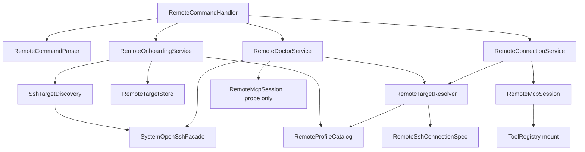

# PRODUCT-1 服务器接入体验：技术实现方案与反方评审

> 决策日期：2026-07-30
>
> 状态：已实现并封板；本文保留为技术方案与反方评审记录，当前状态以 [TODO.md](../TODO.md) 为准
>
> 产品目标见 [product-direction.md](product-direction.md)，稳定工程约束见 [DESIGN.md](../DESIGN.md)，当前状态见 [TODO.md](../TODO.md)
> 本方案只覆盖 PRODUCT-1，不实现 Quick Check、Incident、Repair、持续调度或自动修复

## 1. 结论

PRODUCT-1 的目标不是实现 SSH 管理平台，而是把下面两种状态可靠地连接起来：

```text
用户已经可以通过 OpenSSH 连接自己的服务器
  -> Clawkit 确认目标、身份、主机指纹和远端能力
  -> 建立受限只读 MCP 会话
  -> 后续 Quick Check 和 Ops Loop 可以安全使用
```

首个成功路径固定为：

```text
/remote add --from-ssh <alias>
  -> 预览目标和只读能力
  -> 用户确认登记
  -> /remote doctor
  -> /remote connect
  -> READY
```

实现原则：

- 使用系统 OpenSSH，不引入 Java SSH 协议栈；
- 保存 SSH alias，不缓存展开后的 host、key path 和 known_hosts 路径；
- `ssh -G` 只用于选中目标后的确定性检查，不用来重新实现 OpenSSH；
- 用户选择人类可读的能力包，严格 hash 由内置 manifest 提供；
- doctor 不调用模型、不调用业务工具、不挂载 ToolRegistry；
- 新 host key 不自动接受，变化的 host key 硬阻断；
- 远端安装只提供可审查、可验证、可撤销的显式步骤，不静默执行 sudo；
- REMOTE-0 的 attestation、generation-bound mount、ToolExecution 链和 legacy YAML 继续复用。

## 2. 范围与非范围

### 2.1 本期支持

- 本地 Windows、macOS、Linux；
- 系统 OpenSSH 客户端；
- 默认用户 SSH config 中的明确 `Host` alias；
- `Include` 中的明确 alias；
- SSH Agent、多个 IdentityFile、SSH certificate；
- `ProxyJump`；
- 单活动目标；
- 远端 Linux + Docker Compose；
- 已部署的 opsro forced-command MCP；
- `APP_DOWN_V1` 与 `POSTGRES_DIAGNOSIS_V1` 两个只读 profile；
- 原有显式 endpoint YAML 作为高级兼容入口。

### 2.2 本期明确不支持

- 任意 IP/hostname 由模型直接发起连接；
- SSH shell、SFTP、SCP、端口转发；
- 密码和 keyboard-interactive 认证；
- 在 Clawkit 内输入或保存私钥口令；
- 自定义 `ProxyCommand`、`KnownHostsCommand`、`Match exec`；
- 自动接受或自动替换 host key；
- 自动生成、托管或轮换用户私钥；
- Clawkit 静默执行 sudo、修改 sshd 或安装系统包；
- 多活动目标、多主机并发、团队共享；
- opsfix 写能力；
- 普通 Linux 进程型服务。

最后一项是当前事实边界：现有远端实现主要依赖 Docker backend。产品文案不能在 PRODUCT-1 阶段宣称已经支持普通进程服务。

## 3. 当前实现事实

### 3.1 可继续复用

- `RemoteMcpSession` 已完成 SSH/MCP 生命周期与严格 attestation；
- `RemoteTargetDescriptor` 已固定 server、protocol、probe、profile、toolSetHash 和 contractHash；
- `RemoteConnectionService` 已完成单活动目标、状态机、generation 和原子 mount；
- `TargetBoundToolAdapter` 已完成 target/generation 绑定与远端输出脱敏；
- `FileRemoteTargetStore` 已有原子持久化；
- `RemoteIntentRouter` 只允许已登记 target；
- `Remote0CliE2ETest` 已覆盖真实 ToolRegistry -> ToolExecution 链。

### 3.2 必须改变

当前 `RemoteEndpointConfig` 把 OpenSSH 配置拆成 host、port、user、identityFile 和 known_hosts，再重新拼装命令。这会丢失 Include、ProxyJump、Agent、certificate、HostKeyAlias 等行为。

当前 `RemoteTargetConfig` 要求普通用户填写 endpoint 和完整 attestation hash。

当前 `RemoteCommandHandler` 使用手写字符串切分，并把 generation、hash 和完整工具列表放进默认状态。

当前 `StdioTransport` 会把子进程 stderr 原样写入日志；SSH stderr 可能包含主机名、用户名和本地密钥路径。

当前 `DefaultProcessRunner` 的环境白名单不包含 `SSH_AUTH_SOCK` 和 Windows `USERPROFILE`，不能直接用于 Agent/SSH doctor。

当前 setup 脚本属于 Fixture/交付脚本：需要 root、手动上传文件并修改 sudoers/sshd，不是产品级安装入口。

## 4. 目标架构



职责边界：

| 组件 | 模块 | 职责 |
| --- | --- | --- |
| `RemoteCommandParser` | cli | 解析确定性 `/remote` 子命令，不执行行为 |
| `RemoteOnboardingService` | cli | 发现、预览、确认、登记目标 |
| `SshTargetDiscovery` | cli | 静态读取明确 Host alias，不建立网络连接 |
| `SystemOpenSshFacade` | cli/tools | 执行有界 `ssh -V/-G`、`ssh-add -l` 等本地探针 |
| `RemoteDoctorService` | cli | 编排分阶段检查，生成结构化报告 |
| `RemoteProfileCatalog` | cli | 提供版本化只读 profile manifest |
| `RemoteTargetResolver` | cli | 把持久 registration + manifest 解析为 tools 层运行时类型 |
| `RemoteSshConnectionSpec` | tools | 为 explicit endpoint 和 OpenSSH alias 提供统一 SSH 启动契约 |
| `RemoteMcpSession` | tools | 保持现有 MCP handshake、attestation 和调用语义 |

不新增 Maven 模块，不让 `clawkit-tools` 依赖 CLI 或 Ops。

## 5. 数据契约

### 5.1 持久目标

新增 schema v2：

```yaml
schemaVersion: 2
targetId: test-server
connection:
  type: openssh-alias
  alias: test-server
  remoteUser: opsro
profileManifestId: app-down-readonly-v1
```

持久化字段只包含：

- `targetId`
- `connection.type`
- `connection.alias`
- 固定受限身份 `remoteUser`
- `profileManifestId`

不得包含：

- 私钥内容或口令；
- identity path；
- 展开后的 host/IP；
- known_hosts 内容；
- SSH Agent socket；
- toolSetHash/contractHash；
- doctor 原始 stderr。

建议领域类型：

```java
public record RemoteTargetRegistration(
    int schemaVersion,
    String targetId,
    RemoteConnectionReference connection,
    String profileManifestId
) {}

public sealed interface RemoteConnectionReference
    permits OpenSshAliasReference, LegacyExplicitEndpointReference {}

public record OpenSshAliasReference(
    String alias,
    String remoteUser
) implements RemoteConnectionReference {}
```

`remoteUser` 不由模型设置。内置 opsro manifest 默认要求 `opsro`；命令行不能改成 root。

### 5.2 运行时 SSH 契约

在 `clawkit-tools` 新增窄接口：

```java
public interface RemoteSshConnectionSpec {
    List<String> sshArgs();
    String safeRef();
    Duration connectTimeout();
    Duration requestTimeout();
    int maxOutputBytes();
}
```

- 原 `RemoteEndpointConfig` 实现该接口，作为 legacy explicit 模式；
- 新增 `OpenSshAliasConnectionSpec`；
- `RemoteMcpSession` 字段和构造器改为消费接口；
- 保留接收 `RemoteEndpointConfig` 的兼容构造器或让现有调用通过接口自然编译；
- 不复制第二套 MCP session。

### 5.3 Profile manifest

```java
public record RemoteProfileManifest(
    int schemaVersion,
    String manifestId,
    String displayName,
    String serverName,
    String protocolVersion,
    String probeVersion,
    String capabilityProfile,
    String expectedToolSetHash,
    String expectedToolContractHash,
    RemoteAccessMode accessMode,
    String requiredRemoteUser
) {}
```

首版 catalog 只包含：

- `APP_DOWN_V1`
- `POSTGRES_DIAGNOSIS_V1`

不得包含 `FIX_ORDER_API_V1`。

Catalog 放在 `clawkit-cli` 的 classpath resource 或不可变常量中；CLI 生产代码不依赖 `clawkit-ops-mcp`。增加 test-scope contract test，直接使用 `OpsMcpServer` 计算结果核对 catalog，防止服务端 schema 漂移后客户端常量未更新。

## 6. OpenSSH 调用规则

### 6.1 连接事实

连接时保留 alias：

```text
ssh <Clawkit强制安全参数> -l opsro <alias>
```

不能执行：

```text
ssh -i <展开key> -p <展开port> <展开user>@<展开host>
```

原因是后一种方式丢失 OpenSSH 的实际配置语义。

Legacy explicit endpoint 则采用相反策略：既然 host、port、identity 和
known_hosts 都由目标契约显式给出，就必须加 `-F none`，完全禁止读取用户级和
系统级 SSH config，避免一个看似普通的 hostname 命中 `ProxyCommand`、`Match
exec` 或其他本地配置。OpenSSH 官方手册明确说明 `-F none` 表示不读取任何配置
文件，`-G` 会在求值 `Host` 和 `Match` 后输出最终配置：
[ssh(1)](https://man.openbsd.org/ssh)。

### 6.2 强制安全覆盖

所有连接模式共用一个 `RemoteSshSafetyPolicy`，至少强制：

- `BatchMode=yes`
- `PasswordAuthentication=no`
- `KbdInteractiveAuthentication=no`
- `PreferredAuthentications=publickey`
- `StrictHostKeyChecking=yes`
- `RequestTTY=no` / `-T`
- `ClearAllForwardings=yes`
- `ForwardAgent=no`
- `ForwardX11=no`
- `PermitLocalCommand=no`
- `ControlMaster=no`
- `ControlPath=none`
- `ControlPersist=no`
- `Tunnel=no`
- `AddKeysToAgent=no`
- 有界 ConnectTimeout、ServerAliveInterval、ServerAliveCountMax

参数必须位于 destination 之前，并用行为测试断言最终 argv。不得使用 shell 字符串拼接。

Alias 需要通过窄字符校验：

```text
[A-Za-z0-9][A-Za-z0-9._:-]{0,127}
```

拒绝前导 `-`、空白、控制字符和换行，避免被解释为 ssh option。

### 6.3 Agent 与环境

Alias 模式不强制：

- `-i`
- `IdentitiesOnly=yes`

否则会破坏 Agent、certificate 和多 IdentityFile。

SSH 子进程环境改为显式白名单，至少保留：

- `PATH`
- `HOME`
- `USERPROFILE`
- `HOMEDRIVE`
- `HOMEPATH`
- `SYSTEMROOT`
- `COMSPEC`
- `SSH_AUTH_SOCK`
- `SSH_AGENT_PID`
- `LANG`
- `LC_ALL`
- `TEMP/TMP/TMPDIR`

不把应用 Token、模型 Key、Webhook 或任意 `.env` 变量传给 SSH/ProxyJump 子进程。

自定义 `${ENV}` SSH 配置只有变量在安全白名单中才受支持；doctor 应把其他变量导致的解析问题报告为 `SSH_CONFIG_UNSUPPORTED`。

### 6.4 本地命令型 SSH 配置

首版允许 `ProxyJump`，拒绝：

- `ProxyCommand`
- `KnownHostsCommand`
- `LocalCommand`
- `RemoteCommand`
- `Match exec`

理由：

- 这些选项可能在 Clawkit 连接或 `ssh -G` 时执行本地/远端命令；
- 用户登记一次目标后，后续自然语言连接可能间接再次触发命令；
- PRODUCT-1 的授权范围只是连接预定义远端能力，不等于授权任意本地命令。

Alias 模式在执行任何 `ssh -G` 或真实 SSH 前，必须先静态审计用户级、系统级和
全部 `Include` 形成的配置图。首版采取保守策略：配置图任一可读取文件出现上述
命令型指令，或 Include 无法完整展开，就不调用 ssh，直接 fail closed。该限制也
覆盖 ProxyJump 可能引用的跳板 alias。这样会拒绝一部分本可安全求值的复杂配置，
但不会为了“智能判断 Match 是否生效”而重新实现 OpenSSH 解释器。

Legacy explicit 模式不做这套推断，统一使用 `-F none` 隔离配置。

OpenSSH 明确定义 `ProxyCommand` 可执行任意 shell 命令，`KnownHostsCommand`
会在连接期间执行，`Match exec` 会执行命令来决定条件是否成立：
[ssh_config(5)](https://man.openbsd.org/ssh_config)。

发现这些配置时 doctor 提示用户创建一个只使用
HostName/User/IdentityFile/ProxyJump 的专用、独立 config；首版不提供“我确认
仍然执行”的旁路。

## 7. SSH alias 发现

### 7.1 静态发现

`SshTargetDiscovery`：

1. 定位默认用户 SSH config；
2. 同时定位平台默认的系统级 client config；
3. 递归处理 `Include`，设置最大深度和文件数；
4. 只读取普通文件；
5. 排除符号链接循环；
6. 先扫描命令型指令；命中或无法完整扫描则将 alias 集合标记为不安全；
7. 提取不含 wildcard 和 negation 的明确 Host token；
8. 去重但保留来源文件和行号；
9. 不执行网络请求；
10. 不执行 `ssh -G`；
11. 不把 HostName、User、IdentityFile 放入模型上下文。

列表展示 alias，不默认展示真实 IP。

### 7.2 选中后解析

用户显式选择 alias，且配置图静态安全预检通过后，才运行：

```text
ssh <相同安全覆盖> -G -l opsro <alias>
```

只解析 allowlist 字段：

- hostname
- port
- user
- proxyjump
- hostkeyalias
- userknownhostsfile 是否存在
- identityfile 数量
- identityagent 是否启用
- 被禁止配置是否存在

原始 `ssh -G` 输出：

- 只保留在有界内存中；
- 不写日志；
- 不进入 RunEvent、Session、Memory 或模型；
- 对外只返回结构化、安全摘要。

`ssh -G` 不是静态安全预检的替代品，因为它会求值 `Match`；顺序必须固定为：

```text
静态扫描配置图
  -> 发现命令型指令/扫描不完整：拒绝，且不启动 ssh
  -> 通过：对用户选中的 alias 执行 ssh -G
  -> allowlist 解析与二次检查
  -> 用户确认
```

### 7.3 交互

```text
/remote add
发现 3 个 SSH 目标：
  1. test-server
  2. staging
  3. db-lab

请选择目标：
```

非交互入口：

```text
/remote add --from-ssh test-server
/remote add --from-ssh test-server --as order-api-test
```

`targetId` 默认来自 alias 的规范化结果；发生冲突时必须明确要求 `--as`，不能静默覆盖。

## 8. Host key 策略

### 8.1 运行时

始终使用：

```text
StrictHostKeyChecking=yes
```

不使用：

- `no`
- `off`
- `accept-new`
- 自动 `ssh-keyscan >> known_hosts`

### 8.2 Doctor 判定

静态检查只能判断 known_hosts 是否存在候选记录；最终结论以真实 SSH 握手为准。

结果必须区分：

| 状态 | 行为 |
| --- | --- |
| `TRUSTED` | 继续 |
| `UNKNOWN` | 阻止；要求用户通过普通 SSH 或云控制台核对 fingerprint |
| `CHANGED` | 硬阻断；不提供一键删除旧记录 |
| `UNVERIFIABLE` | 阻止；展示安全检查步骤 |

`ssh-keyscan` 只能用于展示“远端当前声称的 key”，不能作为真实性证明，也不能自动写文件。

## 9. Doctor 设计

### 9.1 契约

```java
public record RemoteDoctorReport(
    String targetId,
    DoctorOverallStatus status,
    List<RemoteDoctorCheck> checks,
    Instant startedAt,
    Instant completedAt
) {}

public record RemoteDoctorCheck(
    DoctorStage stage,
    DoctorCheckStatus status,
    String code,
    String summary,
    String nextAction,
    Map<String, String> safeDetails,
    Duration duration
) {}
```

状态：

- `PASS`
- `WARN`
- `FAIL`
- `SKIPPED`

Doctor stage：

1. `OPENSSH`
2. `SSH_CONFIG`
3. `SSH_SAFETY`
4. `HOST_IDENTITY`
5. `SSH_AGENT`
6. `SSH_TRANSPORT`
7. `REMOTE_MCP`
8. `ATTESTATION`
9. `CLEANUP`

### 9.2 行为

- 不调用 LLM；
- 不调用 `tools/call`；
- 不向 ToolRegistry mount；
- 可以建立临时 `RemoteMcpSession` 完成 initialize 和 tools/list；
- 必须 try-with-resources 关闭 session；
- 前置失败后，依赖该前置的检查标记 `SKIPPED`；
- Agent 检查只是提示，实际 SSH 握手才是认证事实；
- 不因 `ssh-add -l` 有 identity 就宣称目标认证一定成功；
- 重复运行不得改变 target、known_hosts、Agent 或远端状态。

### 9.3 输出

默认：

```text
[test-server · read-only]
✓ OpenSSH        可用
✓ SSH config     test-server -> example.com:22
✓ Host identity 已信任
✓ Authentication 公钥认证成功
✓ Remote service clawkit-ops-mcp
✓ Capability     Linux 服务基础检查
✓ Contract       5 个只读工具，合同匹配

READY：可以连接 test-server
```

失败：

```text
[test-server · disconnected]
✗ Authentication  公钥认证失败

影响：Clawkit 尚未连接，也没有挂载远程工具。
下一步：
1. 先运行 ssh test-server，确认原有 SSH 配置；
2. 如果密钥有口令，把密钥加入 ssh-agent；
3. 修复后重新运行 /remote doctor test-server。

详情：RMT-005
```

高级入口：

```text
/remote doctor test-server --verbose
/remote doctor test-server --json
```

JSON 输出保持稳定 schema；存在 FAIL 时命令语义为失败。REPL 内不退出应用，未来非交互 CLI 应返回非零 exit code。

## 10. SSH 错误与日志

### 10.1 错误分类

保留 RMT-001～015，补充或细化：

| code | 含义 |
| --- | --- |
| `RMT-004` | host key unknown/rejected/changed，reason 放 safeDetails |
| `RMT-005` | SSH public-key authentication failed |
| `RMT-006` | DNS/TCP/SSH transport unreachable |
| `RMT-007` | MCP lifecycle/protocol failure |
| `RMT-016` | SSH config unsupported or unsafe |
| `RMT-017` | SSH Agent unavailable/no identity |
| `RMT-018` | remote component unavailable |
| `RMT-019` | profile manifest not found/unsupported |

错误分类以阶段、exit code 和有限 stderr pattern 综合判断。不能匹配时返回保守的 `SSH_FAILED`/`REMOTE_MCP_FAILED`，不得猜测为“远端未安装”。

### 10.2 stderr

修改 `StdioTransport` 的诊断边界：

- 允许注入 `TransportDiagnosticSanitizer` 或等价窄接口；
- 默认构造器保持兼容；
- SSH transport 必须在日志写入前脱敏；
- 外部 getter 只返回脱敏、有界诊断；
- 原始 stderr 只允许在进程生命周期内用于分类，不落盘、不进模型；
- 不在 INFO 日志打印每一行 SSH stderr；正常连接只记摘要。

脱敏至少处理：

- Windows/Unix 用户目录；
- identity/key/certificate path；
- username@hostname；
- IP 和内部 hostname 的展示策略；
- `SSH_AUTH_SOCK`；
- ProxyJump 链；
- 可能出现在错误中的环境变量值。

## 11. CLI 命令

目标命令：

```text
/remote add
/remote add --from-ssh <alias> [--as <targetId>]
/remote add <targetId> --config <legacyYaml>
/remote list
/remote status
/remote inspect [targetId]
/remote doctor <targetId> [--verbose|--json]
/remote connect <targetId>
/remote disconnect
/remote remove <targetId>
```

兼容：

- `/remote show` 可以暂时作为 `inspect` alias；
- 原 `/remote add <id> --config <file>` 保留；
- 自然语言连接只选择已登记 target。

不要继续用 `split("\\s+", 3)` + `replace("--config", "")`。新增确定性 parser，复用现有 JLine/Picocli 能力，并通过接口注入交互选择器，测试不得直接依赖真实 System.in。

默认 `status` 只展示：

- 当前 target；
- state；
- read-only/write scope；
- 能力摘要；
- 最近错误及下一步。

`inspect` 才展示：

- serverName；
- protocol/probe/profile；
- generation；
- toolSetHash/contractHash；
- 工具名；
- 连接与 attestation latency；
- 安全覆盖和 SSH config 来源摘要。

## 12. Store 与迁移

### 12.1 兼容策略

- schema v1 继续读取和连接；
- 新向导只写 schema v2；
- 一个 store 可以同时存在 v1/v2 target；
- 不在启动时自动重写用户文件；
- 提供显式迁移命令之前，不删除 v1 字段；
- v1 和 v2 都使用同一 `RemoteConnectionService`、`RemoteMcpSession` 和安全覆盖。

### 12.2 Store API

增加直接登记领域对象的方法：

```java
void add(RemoteTargetRegistration registration, boolean replace);
```

原 `add(targetId, configFile, replace)` 保留为 legacy adapter。向导不得为了调用旧 API 创建临时 YAML。

持久化继续：

- sibling temp file；
- atomic replace；
- 单个坏 target 不阻断其他 target；
- 错误日志不打印完整 entry。

## 13. 远端安装与撤销

PRODUCT-1 的主要验收基于“远端已经准备好”。安装工作单独放在最后一个切片。

安装引导应提供：

```text
prepare / dry-run
  -> 展示将创建的用户、文件、sudoers 和 sshd 变化
  -> 用户自行确认并在管理员终端执行
  -> verify
  -> doctor
  -> revoke
```

约束：

- 不在 `/remote add` 中自动执行 sudo；
- 不在模型工具中暴露 setup/revoke；
- 安装包有版本和 SHA-256；
- setup、verify、revoke 幂等；
- 始终要求保留第二管理员通道；
- 修改前备份，配置校验失败自动回滚；
- 不自动修改全局 `PermitUserEnvironment`；其安全默认值无需为了 opsro 重写全局配置；
- `authorized_keys restrict,command=...` 与 sshd Match 双层限制继续保留；
- opsro 可以复用用户明确选择的公钥；opsfix 继续使用独立写身份和独立密钥；
- setup 只支持文档声明的 Linux/Docker 环境。

现有 `ops-fixtures/remote` 脚本继续服务 E2E。产品安装资产在完成审计后再进入 release packaging，不能让正式 CLI 运行时依赖 fixture 目录。

## 14. 分阶段实施

### PR-1：运行时 SSH alias 基础

修改：

- 新增 `RemoteSshConnectionSpec`
- `RemoteEndpointConfig` 实现接口
- 新增 `OpenSshAliasConnectionSpec`
- 新增共享 `RemoteSshSafetyPolicy`
- `RemoteMcpSession` 改用接口
- SSH transport stderr 脱敏
- SSH 子进程环境白名单补全 Agent/Windows 变量

门禁：

- 现有 REMOTE-0 E2E 不变；
- exact argv 测试；
- alias 注入负例；
- legacy exact argv 含 `-F none`；
- Agent 环境保留；
- 禁止转发/TTY/密码的机械断言；
- stderr 不泄露本地路径。

### PR-2：Target v2 与 profile catalog

修改：

- `RemoteTargetRegistration`
- v1/v2 persistence DTO
- `RemoteProfileManifest/Catalog`
- `RemoteTargetResolver`
- Store 直接 add API
- catalog 与 OpsMcpServer cross-contract test

门禁：

- v1 文件继续读取；
- v2 不包含 key path/hash；
- FIX profile 不可选择；
- manifest 漂移 fail closed；
- mixed v1/v2 store 原子读写。

### PR-3：OpenSSH 发现与添加向导

修改：

- `SystemOpenSshFacade`
- `SshTargetDiscovery`
- `RemoteCommandParser`
- `RemoteOnboardingService`
- `/remote add --from-ssh`
- 交互选择

门禁：

- Include、重复、注释、引号、Windows path；
- wildcard/negation 不列出；
- Include 循环与深度限制；
- 用户级/系统级/Include 配置图的命令型指令拒绝；
- 命中 `Match exec` 时证明未启动 `ssh -G`；
- ProxyJump 引用的 alias 不能绕过静态审计；
- 发现阶段零网络、零命令执行；
- 明确确认前不写 store。

### PR-4：Doctor、status 与 inspect

修改：

- `RemoteDoctorService`
- doctor DTO/renderer
- SSH error classifier
- `/remote doctor`
- 简化 status/list
- 新增 inspect

门禁：

- doctor 零 tool call、零 mount；
- 每种失败有 FAIL/SKIPPED 顺序和 nextAction；
- unknown/changed host key 区分；
- auth/network/MCP/attestation 区分；
- 失败后进程、session、mount、active target 全部清理；
- JSON schema 稳定。

### PR-5：安装引导与产品 E2E

修改：

- 用户文档；
- versioned setup/verify/revoke release assets；
- doctor 安装缺失提示；
- Windows/Linux 本地 smoke；
- 首次连接产品 E2E。

门禁：

- 无静默 sudo；
- setup 完整命令可审查；
- verify/revoke 通过；
- 从已有 SSH alias 到首次 READY 的操作记录和耗时达标。

每个 PR 必须独立编译、测试和可回滚。不得把五个切片一次性提交。

## 15. 测试矩阵

### 15.1 Unit

- alias/targetId 校验；
- SSH argv 与安全覆盖；
- profile catalog；
- v1/v2 schema；
- ssh -G allowlist parser；
- alias discovery；
- stderr 分类与脱敏；
- doctor 状态归并；
- status/inspect renderer。

### 15.2 Component

- fake `ProcessRunner` 驱动 OpenSSH facade；
- fake MCP transport 驱动 doctor；
- Store mixed schema 与原子写；
- RemoteTargetResolver 生成正确 descriptor/spec；
- Doctor 不调用 ToolRegistry.mount；
- 向导确认/取消/冲突处理。

### 15.3 Integration

- 临时 SSH config 覆盖 Include、ProxyJump、Agent、certificate；
- 本地测试 sshd 覆盖 known/unknown/changed key；
- 认证失败、连接拒绝、超时、远端进程早退；
- 错误 hash/profile/tool annotation；
- connect/disconnect 后 generation 与 registry；
- CLI 从 parser 到 service 的真实链路。

### 15.4 真实 E2E

- Windows 本地 OpenSSH + Linux 远端；
- Linux 本地 OpenSSH + Linux 远端；
- 已准备 APP_DOWN_V1；
- 已准备 POSTGRES_DIAGNOSIS_V1；
- SSH Agent 中的带口令密钥；
- ProxyJump；
- doctor -> connect -> 两个只读 ToolExecution -> disconnect；
- 无残留 SSH 进程、mount、active target；
- profile 不被 E2E 留在错误状态。

普通 CI 不连接真实网络；真实 E2E 继续使用 group 隔离。

## 16. 产品验收

- 已准备服务器从 `/remote add` 到 READY 不超过 3 分钟；
- 主路径不手写 YAML、host、port、key path、known_hosts 或 hash；
- 不超过 3 个主要用户动作；
- 所有远程输出显示 target；
- 用户默认不看到 generation/hash；
- 已知错误 100% 有原因、影响和下一步；
- unknown host key 不自动接受；
- changed host key 硬阻断；
- Agent/ProxyJump 可用；
- 旧 YAML/E2E 不退化；
- 连接失败退出后无资源残留；
- 无私钥、口令、Agent socket、原始 SSH config 或 stderr 泄露；
- 安装缺失时用户知道下一步，但 Clawkit 未执行 sudo。

## 17. 反方评审

以下从“方案为什么不应该通过”的角度审查。

### 17.1 反对意见：复用 SSH config 等于允许执行任意本地命令

问题成立。`ProxyCommand`、`KnownHostsCommand`、`LocalCommand` 和 `Match exec` 都可能执行命令。用户登记 target 后，模型可以通过自然语言连接已登记目标，间接再次触发这些命令。

修正：

- 首版只支持 ProxyJump；
- 静态发现不运行 ssh；
- 任何 `ssh -G` 前先静态审计用户级、系统级和 Include 配置图；
- 图中任一命令型指令或无法读取的 Include 都 fail closed；
- legacy explicit endpoint 使用 `-F none`；
- `PermitLocalCommand=no` 和清除 forwarding；
- registration 是确定性、显式用户动作；
- SSH 环境只传安全白名单。

结论：修正后可接受。

### 17.2 反对意见：`ssh -G` 不是纯解析器

问题成立。Match 条件可能触发 `exec`，而且展开结果可能包含本地路径和命令。

修正：

- 不在枚举阶段批量执行 `ssh -G`；
- 对用户选中的 alias 且静态审计通过后才运行；
- 静态扫描发现 `Match exec` 时不启动 ssh；
- 原始输出只在有界内存解析，不写日志/模型。

结论：修正后可接受，但需要专门负例测试。

### 17.3 反对意见：命令行安全覆盖未必真的覆盖配置

问题部分成立。OpenSSH 多数单值配置采用 first value wins，命令行优先；但 IdentityFile 和 forwarding 等存在累积语义。

修正：

- 用 `ClearAllForwardings=yes` 明确清除累计 forwarding；
- 禁止 Agent/X11/Tunnel/LocalCommand/TTY；
- exact argv + 临时 ssh config 行为测试；
- legacy 和 alias 模式必须共用一套 safety policy。

结论：只有机械测试证明后才能合入。

### 17.4 反对意见：Agent 检查会产生虚假成功

问题成立。`ssh-add -l` 只能证明 Agent 可达和存在 identity，不能证明该 identity 被目标接受。

修正：

- Agent stage 只输出 readiness；
- Authentication PASS 只能来自真实 SSH 握手；
- 无 Agent 但无口令 identity 可用时允许真实连接成功；
- 不根据 Agent 状态跳过握手。

结论：修正后可接受。

### 17.5 反对意见：内置 manifest 只是把用户手写 hash 变成开发者手写 hash

问题成立。若没有服务端交叉验证，catalog 很快漂移。

修正：

- CLI production 不依赖 ops-mcp；
- test scope contract test 直接比较 `OpsMcpServer` 计算结果；
- manifest 变化必须与 server schema 同一提交；
- 未知 manifest/profile fail closed；
- 不从远端首次响应自动学习 hash。

结论：必须把 cross-contract test 设为合入门禁。

### 17.6 反对意见：Doctor 可能被误当成无副作用操作

问题部分成立。它会启动 SSH 和远端 forced-command MCP 进程，虽然不应改变业务状态。

修正：

- doctor 定义为控制面只读，不定义为“零进程”；
- 只允许 initialize、initialized、tools/list、ping；
- 禁止 tools/call 和 ToolRegistry mount；
- 每次 probe 都关闭 transport；
- 服务端仍只暴露只读 profile。

结论：修正后符合产品边界。

### 17.7 反对意见：基于 stderr 文本分类不可靠

问题成立。SSH exit code 255 不能细分所有失败，stderr 文本也不是稳定协议。

修正：

- 先用 doctor stage 缩小范围；
- pattern 只识别少量稳定已知错误；
- 未识别时返回保守通用错误；
- 不因模糊文本宣称“远端未安装”；
- `--verbose` 只显示脱敏诊断。

结论：可接受，但不能承诺 100% 精准根因。

### 17.8 反对意见：现有 StdioTransport 会泄露 SSH 细节

问题成立，并且是 P0 阻断项。当前 stderr 会逐行 INFO 落日志。

修正：

- PR-1 先建立 diagnostic sanitizer；
- SSH stderr 写日志前脱敏；
- raw stderr 不对外暴露；
- 日志泄露测试必须覆盖 Windows/Unix key path、host、Agent socket。

结论：该修复必须早于 alias 正式路径。

### 17.9 反对意见：ProcessRunner 环境白名单会让 Agent 失效

问题成立。当前默认白名单缺少 `SSH_AUTH_SOCK` 和 `USERPROFILE`；而 StdioTransport 又继承过多环境，两条路径不一致。

修正：

- 定义唯一 SSH 环境白名单；
- doctor 和正式连接共用；
- 补 Agent/Windows 变量；
- 排除 Provider/API secret；
- 用 fake env 和真实 Agent E2E 验证。

结论：必须在 PR-1 解决。

### 17.10 反对意见：自动识别 profile 可能扩大权限

问题成立。即使两个 profile 都只读，POSTGRES profile 也暴露更多数据库证据。

修正：

- 默认选择最小 APP_DOWN 只读包；
- 多 profile 时向用户展示人类可读能力范围；
- 不能根据远端实际返回自动升级到更宽 profile；
- profile 变化需要显式确定性操作；
- FIX profile 不进入 PRODUCT-1 catalog。

结论：修正后可接受。

### 17.11 反对意见：安装器会把产品重新推向大型运维平台

问题成立。远端安装涉及 root、sudoers、sshd、Java、Docker 和回滚，远比“连接向导”风险高。

修正：

- 首个验收以已准备远端为前提；
- 安装引导放 PR-5；
- 只生成和展示操作计划；
- 用户在自己的管理员终端执行；
- 不把 setup 暴露给模型。

结论：安装自动化不得阻塞 PRODUCT-1A/B，也不得反向扩大范围。

### 17.12 反对意见：方案仍然太大

问题成立。若把 SSH 抽象、Store v2、向导、doctor、安装器一次提交，回归面过大。

修正：

- 固定五个 PR；
- PR-1 只做兼容 transport；
- PR-2 只做数据与 manifest；
- PR-3 才接用户入口；
- PR-4 做 doctor/UI；
- PR-5 独立处理安装和真实 E2E；
- 每步保留 legacy path。

结论：按切片执行后规模可控。

## 18. 反方评审后的硬门禁

以下任一项不满足，PRODUCT-1 不得判定完成：

1. Alias 连接仍被展开重建为 host/key 命令；
2. Legacy explicit endpoint 未使用 `-F none` 隔离 SSH config；
3. 在静态安全审计前执行 `ssh -G`，或支持/静默执行
   `ProxyCommand`、`KnownHostsCommand`、`Match exec`；
4. SSH stderr 原样进入日志；
5. SSH 子进程继承模型/API Token 等无关环境；
6. Agent 状态被当成目标认证成功；
7. 新 host key 被自动接受；
8. profile/hash 从远端首次响应自动学习；
9. doctor 调用了业务工具或挂载 ToolRegistry；
10. `/remote add` 自动执行 sudo；
11. legacy REMOTE-0 E2E 失效；
12. 失败后仍有 SSH 进程、mount 或 active target；
13. 把普通进程服务、写能力、多主机或自动修复写进本期完成范围。

## 19. 完成判定

PRODUCT-1 只有在以下证据同时存在时才能从 `[ ]` 改为 `[x]`：

- PR-1～PR-5 的代码路径全部进入真实 CLI；
- Unit/Component/Integration 全部通过；
- legacy REMOTE-0 E2E 通过；
- Windows/Linux 真实 OpenSSH E2E 通过；
- APP_DOWN 与 POSTGRES 两个只读 manifest 均通过 attestation；
- unknown/changed host key、Agent、ProxyJump、profile drift 负例通过；
- secret scan 和 `git diff --check` 通过；
- 从已有 alias 到首次 READY 的实际记录满足 3 分钟和 3 个主要操作；
- README、DESIGN、TODO 与本方案同步；
- 没有用测试数量替代用户体验验收。
