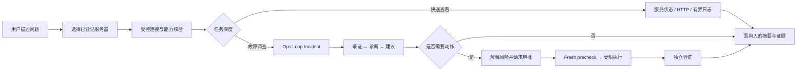
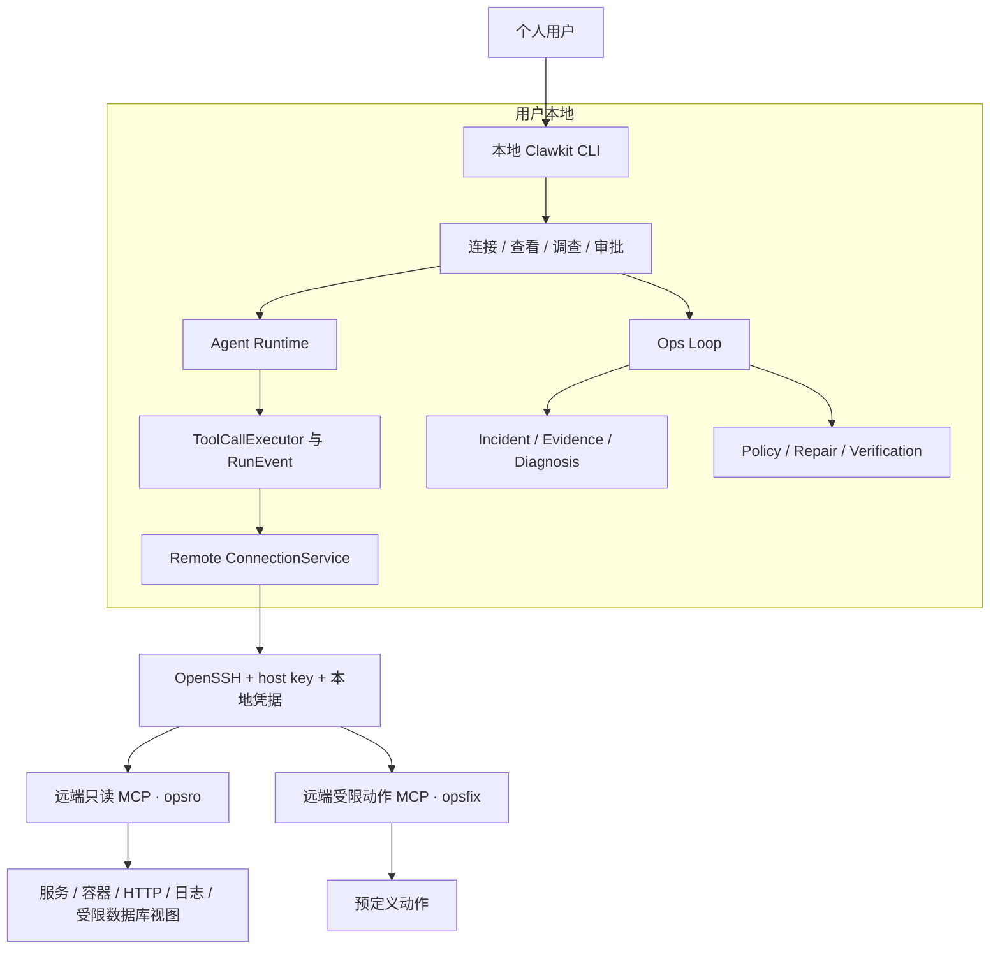

# Clawkit 产品方向：本地优先的个人 AI 运维助手

> 决策日期：2026-07-29
>
> 状态：产品方向基线
>
> 适用范围：产品定位、用户旅程、近期路线和体验验收
> 工程边界见 [DESIGN.md](../DESIGN.md)，实施状态见 [TODO.md](../TODO.md)，Ops 领域设计见 [ops-loop.md](ops-loop.md)

## 1. 最终方向

Clawkit 不再以“做一个功能很多的 Agent Runtime”作为面向用户的产品叙事，也不把自己做成通用 SSH 管理器或大型 SRE 平台。

面向用户的一句话定义是：

> **Clawkit 是运行在用户本地的个人 AI 运维助手：连接用户已经拥有的服务器，帮助理解服务为什么异常；需要采取动作时先解释、再审批，最后重新验证是否真的恢复。**

更口语化的产品承诺是：

> **连接你的服务器，告诉你哪里出了问题；需要操作时先说清楚，得到同意后再动手，并确认问题真的解决。**

现有 Java Agent Runtime 是产品底座，不是用户首先需要理解的产品。远程连接是入口，Ops Loop 是从“查看信息”走向“解决问题”的核心价值，两者必须组成同一条用户旅程。

## 2. 目标用户

首要用户不是大型企业 SRE 团队，而是：

- 独立开发者、学生开发者和小团队中的服务负责人；
- 拥有 1～5 台 Linux 云服务器；
- 会使用基本 SSH、Docker Compose 和日志命令，但没有完整监控或 SRE 平台；
- 遇到故障时需要在 SSH、日志、容器状态和 HTTP 检查之间来回切换；
- 希望 AI 帮助排查，但不愿把任意 Shell、sudo 或数据库写权限交给模型。

首个重点环境：

- 本地运行 Windows/macOS/Linux CLI；
- 远端 Linux；
- 用户已有 OpenSSH 配置和密钥；
- 服务主要由 Docker Compose 或普通进程运行；
- Clawkit 远端组件只开放预定义、可审计的只读能力；
- 写能力继续使用独立身份和固定动作。

团队共享、多租户、Kubernetes 和完整云资源管理不是当前目标。

## 3. 用户真正需要完成的五件事

### 3.1 接入

用户希望告诉 Clawkit“这是我的服务器”，而不是理解 SSH 进程参数、MCP 协议和工具合同哈希。

期望结果：

- 可以从现有 `~/.ssh/config` 选择目标；
- 不重复输入 host、port、user 和 key path；
- 复用 SSH Agent 和系统 `known_hosts`；
- 能明确知道连接的是哪台服务器；
- 缺少远端组件或权限时，直接看到下一步怎么办。

### 3.2 查看

用户希望快速问：

```text
连接 test-server
看看 order-api 是否正常
总结最近十分钟的错误
```

这是一次轻量查看，不一定需要创建 Incident。结果应包含当前状态、简短结论、证据时间和下一步建议。

### 3.3 调查

当用户说“为什么接口一直 500”或轻量查看发现明显异常时，Clawkit 应进入完整调查：

```text
问题描述
  → 采集服务、容器、HTTP、日志和业务证据
  → 区分事实、推测、缺失和过期证据
  → 给出结论、反证和不确定性
  → 保存可继续跟踪的 Incident
```

用户不需要先创建 Incident，也不需要记住 incidentId。Incident 是系统保存调查上下文和状态的内部产品对象。

### 3.4 处置

如果命中经过审核的固定方案，Clawkit 可以提出动作，但默认不直接执行：

```text
发现：order-api 已停止，业务接口不可用
建议：重启 order-api
影响：仅重启该服务，不操作数据库
执行前：重新检查现场，状态变化则自动取消
执行后：重新检查进程、HTTP 和业务指标

是否批准？
```

默认只展示用户做决定所需的信息。snapshot hash、attemptId、policyHash 等审计细节放在 `details` 中。

### 3.5 持续关注

当手动调查体验稳定后，Ops Loop 可以继续发展为持续评估：

```text
A0 Observe
  → A1 Recommend
  → A2 Ask
  → A3 Shadow
  → A4 Limited Auto
```

自动发现不等于自动修复。持续观察可以先运行，任何写动作仍保持人工审批；自治只按具体动作、目标和环境晋级。

## 4. 一个产品，而不是两组功能



这里的职责是：

| 产品层 | 用户价值 | 内部实现 |
| --- | --- | --- |
| 目标与连接 | “让我找到并安全连接自己的服务器” | RemoteTarget、OpenSSH、MCP attestation |
| 快速查看 | “让我立即知道现在是否正常” | 预定义只读工具、ToolCallExecutor、证据引用 |
| 深度调查 | “帮我解释为什么异常” | Incident、Evidence、Diagnosis |
| 审批处置 | “告诉我准备做什么，等我同意再做” | Policy Gate、ApprovalGrant、opsfix |
| 结果确认 | “不要只说命令成功，要确认业务恢复” | fresh precheck、IndependentVerifier |
| 持续评估 | “逐步减少重复排查，但不突然扩大权限” | Observe、Shadow、版本化策略和降级 |

Remote 不与 Ops Loop 竞争。Remote 提供可信入口，Ops Loop 提供问题解决能力。

## 5. 产品交互原则

### 5.1 默认讲结果，按需展示机制

默认状态：

```text
已连接 test-server
权限：只读
可检查：服务、容器、端口、HTTP、日志
```

详细状态：

```text
/remote inspect test-server
```

再展示 server identity、profile、protocol、toolSetHash、contractHash、generation 和完整工具名。

### 5.2 复用用户已经维护的 SSH 配置

普通用户路径不要求手写远程 YAML。目标入口优先设计为：

```text
/remote add
发现以下 SSH 目标：
  1. test-server
  2. staging
请选择：
```

或：

```text
/remote add --from-ssh test-server
```

Clawkit 先静态审计 SSH config，确认不存在命令型配置后，再使用
`ssh -G <alias>` 读取 OpenSSH 展开后的 host、user、port、identity 和跳板配置。
Target Store 只保存产品所需的逻辑名称、SSH alias 和能力 manifest ID，不复制私钥
内容，也不另存一份可能过期的 host key 信任状态。

### 5.3 安全信息不能转嫁给用户手工维护

`toolSetHash` 和 `contractHash` 必须继续严格核验，但普通用户不应自行计算和填写。

近期方案：

- 内置受支持 profile manifest，由 Clawkit 版本提供预期 server/protocol/tool contract；
- Target 只选择 profile 名称；
- 远端返回与内置 manifest 不一致时 fail closed；
- 自定义 profile 继续作为高级导入路径，不进入首次使用流程。

主机身份继续复用 OpenSSH `known_hosts`。未知或变化的 host key 不静默接受；`/remote doctor` 应显示 fingerprint、当前信任状态和安全处理步骤。

### 5.4 始终显示当前目标

连接成功后，CLI 提示区或每次远程结果都应显示短目标标识：

```text
[test-server · read-only]
```

任何审批必须再次显示目标、服务、动作和影响范围，避免用户忘记当前上下文。

### 5.5 错误必须给出下一步

不只输出：

```text
RMT-006 AUTHENTICATION_FAILED
```

而应输出：

```text
无法连接 test-server：SSH 身份验证失败。

可以尝试：
1. 先运行 ssh test-server，确认本机 SSH 配置可用；
2. 如果密钥有口令，请先加入 ssh-agent；
3. 运行 /remote doctor test-server 查看诊断详情。
```

结构化错误码继续保留在详情和审计中。

### 5.6 自然语言与确定性命令分工

- 自然语言负责“查看什么、调查什么、解释什么”；
- 确定性命令负责新增/删除目标、信任变更、连接生命周期和能力配置；
- 模型不能创建任意 IP 连接，也不能扩大远端能力；
- 已登记目标上的只读工具可以由模型按用户任务调用；
- 写动作永远经过固定动作合同和审批。

## 6. 建议的核心交互

下面是产品目标，不代表当前版本已经全部实现。

### 6.1 首次准备

```text
> /remote add --from-ssh test-server

SSH 配置：可用
主机身份：已在 known_hosts 中
远端 Clawkit 能力：未安装

下一步：
在服务器上以管理员身份执行受审查的安装脚本，
然后运行 /remote doctor test-server。
```

Clawkit 不替用户静默执行 sudo。远端安装脚本应可审查、可验证、可撤销。

### 6.2 连接

```text
> 连接 test-server

已连接 test-server
权限：只读
可检查：服务、容器、端口、HTTP、日志
```

### 6.3 快速查看

```text
> 看一下 order-api 最近十分钟是否正常

[test-server · read-only]
order-api 正在运行，但业务接口持续返回 500。
最近十分钟出现 37 次数据库连接超时。

建议：进入深度调查，检查数据库连接和锁等待。
```

### 6.4 深度调查

```text
> 调查一下为什么 order-api 一直 500

调查完成：数据库存在持续锁等待。
影响：订单创建成功率下降，查询仍可用。
结论可信度：高
反证：容器、端口和 CPU 状态正常。

建议动作：暂不自动处理数据库会话，升级人工。
```

### 6.5 审批修复

```text
> 修复 order-api

建议重启 order-api。
原因：服务已停止，HTTP 不可达，数据库正常。
影响范围：只重启 order-api。
执行前会重新检查；执行后会独立验证。

[批准] [拒绝] [查看证据]
```

## 7. 技术调研结论

### 7.1 SSH 目标管理

[VS Code Remote SSH](https://code.visualstudio.com/docs/remote/ssh) 的关键体验不是重新发明 SSH，而是复用用户现有连接方式、提供添加向导、记住常用主机、展示当前连接目标，并把详细连接日志放到故障排查入口。

[OpenSSH ssh_config](https://man.openbsd.org/ssh_config) 已支持 Host alias、Include、IdentityFile、IdentityAgent、ProxyJump、UserKnownHostsFile 和严格主机校验；[ssh(1)](https://man.openbsd.org/ssh) 的 `-G` 可以输出 Host/Match 展开后的最终配置。

产品决策：

- 不再把手写 endpoint YAML 作为普通用户主路径；
- 优先复用 OpenSSH alias、Agent 和 known_hosts；
- 不实现自己的私钥保管和口令输入系统；
- 远端 forced-command、禁 PTY、禁 forwarding 等安全覆盖继续由 Clawkit 强制追加，不能被 SSH config 放宽。

### 7.2 命名目标与当前上下文

[Docker Context](https://docs.docker.com/engine/manage-resources/contexts/) 使用命名 context、当前 context 标记、`ls/use/inspect` 分层展示目标。

产品决策：

- 保留逻辑 `targetId`；
- 同时只允许一个活动目标；
- list 中清楚标记当前目标；
- 默认 status 简洁，inspect 展示合同和调试细节；
- 当前不实现多目标并行连接池。

### 7.3 远端 MCP 的位置

[MCP transport specification](https://modelcontextprotocol.io/specification/draft/basic/transports) 定义 stdio 和 Streamable HTTP，也允许保持 JSON-RPC 语义的自定义双向 transport。

当前“SSH forced-command + newline JSON-RPC + stdio MCP”可以继续作为 Clawkit 的受控远程 transport，但它不是要求所有 MCP 用户都采用的通用部署模式。

产品决策：

- 用户只看到“远程能力已连接”，不需要理解 MCP 部署细节；
- SSH transport 隐藏在 ConnectionService 后；
- 当前不为追求“标准远程 MCP”改成公网 HTTP 服务；
- 如果未来需要长期守护、多客户端或非 SSH 环境，再单独评估 Streamable HTTP、认证和网络暴露成本。

### 7.4 Ops 调查方法

[Google SRE 的故障排查方法](https://sre.google/sre-book/effective-troubleshooting/)强调从问题报告开始，查看 telemetry 和日志，提出假设，用支持或反对证据检验，再进行受控处置。

产品决策：

- 用户输入首先被理解为症状和影响，不要求用户先猜根因；
- 输出必须区分事实、假设、反证、缺失证据和当前状态；
- “查看日志”是调查步骤，不是最终产品结果；
- 证据不足时明确返回无法判断，而不是为了给答案而猜测。

### 7.5 审批、自治和验证

[Azure SRE Agent 的缓解流程](https://learn.microsoft.com/en-us/azure/sre-agent/execute-mitigations)采用“诊断 → 动作 → 权限检查 → 审批或执行 → 验证”，并按只读、审核和自治模式逐步扩大信任。

这验证了 Clawkit 已有方向的产品价值，但 Clawkit 不照搬其广泛 Azure CLI 权限：

- Clawkit 保持本地优先和云厂商无关；
- 只开放预定义 MCP 能力，不提供任意远端 CLI；
- 自治按具体 Action/target/environment 晋级；
- 独立 Verification 是成功声明的必要条件。

## 8. 产品架构



架构重点：

- Runtime 继续保持通用；
- 产品入口集中在 CLI 的用户旅程；
- ConnectionService 不理解 Incident；
- Ops Loop 消费可信的连接与工具；
- 用户不需要理解模块边界，但每个安全边界仍可审计。

## 9. 当前产品差距

| 用户任务 | 当前状态 | 主要摩擦 |
| --- | --- | --- |
| 添加服务器 | 已有 YAML 导入 | 要理解并填写过多内部字段 |
| 使用 SSH 凭据 | file/env 引用 | 未优先复用 SSH config 和 Agent |
| 首次检查 | 可以连接和挂载工具 | 缺少 doctor、远端安装引导和完整快速开始 |
| 查看连接 | 可以 status/show/tools | 默认输出偏实现细节，缺少简洁状态 |
| 自然语言连接 | 已有窄格式路由 | 只覆盖连接管理，缺少完整用户任务入口 |
| 查看日志 | 工具链已通 | 用户仍需知道要调用哪些证据 |
| 深度调查 | Ops Loop 已实现 | 尚未成为普通 CLI 中顺手的产品入口 |
| 审批修复 | MVP-3 已实现 | 展示仍偏工程验收流程，需面向决策重排信息 |
| 历史与持续关注 | 有 Run/Incident 事实 | 缺少面向个人用户的最近问题和待处理视图 |

## 10. 近期路线

### PRODUCT-0：方向冻结与体验基线

本文件即为方向基线。完成后停止继续增加工具和自治范围，先从空环境走通用户旅程。

验收：

- 产品一句话、目标用户和非目标一致；
- README、项目纲领、设计和 TODO 使用同一产品定位；
- 明确 Remote 是入口、Ops Loop 是问题解决核心。

### PRODUCT-1：服务器接入体验

目标：让已有 SSH 的用户不手写 YAML 和 hash。

技术实现、迁移、测试门禁与反方评审见 [product-1-implementation-plan.md](product-1-implementation-plan.md)。

范围：

- 从 OpenSSH config 列出并导入 alias；
- 静态安全审计通过后，使用 `ssh -G` 获取展开配置；
- 支持 SSH Agent；
- `/remote doctor <target>`；
- 简化 list/status，新增 inspect 展示高级字段；
- 提供远端组件的安装、验证和撤销引导；
- 保留高级 YAML 导入作为兼容路径。

验收：

- 已准备远端组件时，三分钟内完成首次连接；
- 普通路径不手写 host、key path、known_hosts、tool hash；
- 失败信息包含安全、可执行的下一步；
- 连接目标在后续所有远程结果中可见。

### PRODUCT-2：查看与 Ops 调查统一入口

目标：让用户从一句问题进入快速查看或深度调查。

范围：

- 定义 Quick Check 与 Investigation 两种用户任务；
- 普通查看不强制创建 Incident；
- 明确诊断请求或发现异常时进入现有 `RemoteDiscoveryWorkflow`；
- CLI 默认输出“状态、影响、结论、证据、下一步”；
- 提供最近调查、继续调查和查看证据入口；
- 不重写现有 Incident/Repair 状态机。

验收：

- 一句“检查 test-server 上的 order-api”能产生带真实证据的摘要；
- 一句“调查为什么 order-api 返回 500”能生成持久 Incident；
- 用户不需要输入 incidentId 才能继续最近调查；
- 证据不足时不调用或不强迫模型给出确定根因。

### PRODUCT-3：审批体验与真实使用

目标：让当前 MVP-3 从“工程闭环”变成用户能放心做决定的产品体验。

范围：

- 审批摘要按“发现、建议、原因、影响、执行前保护、执行后验证”展示；
- 工程 ID 和哈希移入 details；
- 最近动作、结果未知和待人工处理状态有统一入口；
- 连续个人使用至少一周，记录所有阻塞和误解点。

验收：

- 用户可在三十秒内理解一次审批；
- 拒绝、取消、自恢复和状态漂移均有明确中文结果；
- 所有执行动作都有独立验证或明确人工接管状态；
- 先修复真实使用摩擦，再决定是否进入持续调度或 Shadow。

### 后续：持续评估，不立即扩大写权限

完成 PRODUCT-1～3 后：

1. 用真实使用数据补充耗时、成本和人工决策字段；
2. 先推进 Observe-only 的持续检查和 Incident 去重；
3. 再为唯一固定动作收集 Shadow 数据；
4. 最后单独评审 Fixture/Canary Limited Auto。

## 11. 产品指标

工程指标继续保留，但产品阶段增加：

| 指标 | 近期目标 |
| --- | --- |
| 首次连接耗时 | 已准备服务器 ≤ 3 分钟 |
| 首次有效结果 | 从启动到得到服务检查结果 ≤ 5 分钟 |
| 普通路径配置 | 不手写 YAML、hash、私钥路径 |
| 连接命令数 | 添加、连接、首次检查合计不超过 3 个用户动作 |
| 远程错误可恢复性 | 已知错误 100% 给出下一步 |
| 目标可见性 | 远程结果和审批 100% 显示 target |
| 调查入口 | 一句自然语言可以开始 Quick Check 或 Investigation |
| 审批可理解性 | 30 秒内能看懂动作、原因、影响和保护措施 |
| 修复可信度 | 写动作 100% 进入 Verification 或人工接管 |
| 真实使用 | 至少连续使用 7 天并记录摩擦 |

测试数量、类数量和工具数量不再作为产品进度指标。

## 12. 明确不做

- 通用 SSH 终端、SFTP 或任意命令执行；
- 重新实现 OpenSSH 配置、Agent 和密钥保管；
- 自动扫描云账号或局域网主机；
- 多主机并行运维和连接池；
- Kubernetes、Prometheus、Grafana、ELK 的替代品；
- Web 控制台、多租户、团队 RBAC 和共享凭据中心；
- 任意 Docker、SQL、sudo 或云 CLI；
- 没有独立验证的成功声明；
- 在没有真实使用数据前增加更多修复动作；
- 为了展示“AI 自治”直接开放生产 AUTO。

## 13. 以后如何决定是否加功能

每个新需求先回答：

1. 它是否让用户更容易接入自己的服务器？
2. 它是否让用户更快理解当前问题？
3. 它是否让用户更安全地采取行动？
4. 它是否让用户更相信最终结果？
5. 它是否来自真实使用摩擦，而不是为了展示技术数量？

如果前四项都是否，或者第五项只是“看起来完整”，默认不进入近期路线。
