# Clawkit 项目全览与深度学习指南

> 面向项目作者的中文学习材料与秋招准备手册
>
> 代码快照：2026-07-30 当前工作区
>
> 项目阶段：通用 Agent Runtime 主链、OPS MVP-3 审批修复闭环和 REMOTE-0 已完成工程验收。当前进入产品化阶段：先改善服务器接入和日常查看体验，再把它与现有 OPS 调查、审批和验证流程连成一条用户旅程；持续评估与分级自治保留为后续方向
>
> 目标读者：具备苍穹外卖级别的 Java/Spring Boot 项目经验，了解 Docker 和常见 Agent 概念，希望应聘 Java 后端并兼顾 Agent 方向

---

## 目录

1. [先用一句话理解项目](#1-先用一句话理解项目)
2. [从全局看系统](#2-从全局看系统)
3. [一次普通 Agent 任务是怎么跑的](#3-一次普通-agent-任务是怎么跑的)
4. [上下文、Session、Memory 为什么不能混在一起](#4-上下文sessionmemory-为什么不能混在一起)
5. [为什么写操作需要单独的可靠性内核](#5-为什么写操作需要单独的可靠性内核)
6. [观测和评测：为什么不能只看最终输出](#6-观测和评测为什么不能只看最终输出)
7. [OPS Loop 是如何一步步长出来的](#7-ops-loop-是如何一步步长出来的)
8. [远程 SSH：从接入体验到底层安全边界](#8-远程-ssh从接入体验到底层安全边界)
9. [MVP-3 审批修复闭环](#9-mvp-3-审批修复闭环)
10. [当前代码阅读地图](#10-当前代码阅读地图)
11. [秋招项目故事怎么讲](#11-秋招项目故事怎么讲)
12. [高频面试问题与回答思路](#12-高频面试问题与回答思路)
13. [AI 协作下怎样真正拥有这个项目](#13-ai-协作下怎样真正拥有这个项目)
14. [个人学习计划](#14-个人学习计划)
15. [当前路线图该怎么理解](#15-当前路线图该怎么理解)
16. [文档随代码更新的方法](#16-文档随代码更新的方法)
17. [最后需要真正记住的十句话](#17-最后需要真正记住的十句话)

核心专题导航：

- Java 后端知识桥梁：第 2.4—2.6、5.7、5.8 节
- Agent 原理：第 3.1—3.8 节
- 工具权限与安全：第 3.8、5、8 章
- OPS 完整闭环：第 7—9 章
- 测试、面试与学习：第 6、10—14 章

## 0. 这份文档怎么用

这不是一份 API 手册，也不是把仓库里的类名重新排列一遍。它想回答的是：

1. 这个项目为什么存在？
2. 一个 Agent 从收到问题到返回结果，中间究竟发生了什么？
3. 为什么普通的“调用工具”不足以支撑远程运维修复？
4. 权限、审批、执行记录、结果确认和独立验证之间是什么关系？
5. 项目如何用测试和证据证明自己，而不是让执行者自称成功？
6. 秋招面试时，如何把这些设计讲成一个可信、完整、有取舍的故事？

建议按下面三轮阅读：

- **第一轮：建立地图。** 读第 1、2、7、11 章，先知道系统由哪些部分组成。
- **第二轮：吃透主链。** 读第 3、4、5、6、8 章，结合代码逐步跟踪。
- **第三轮：准备表达。** 读第 9、10、12—14 章，练习脱离文档讲清设计。

不需要一开始就记住所有类名。先理解“问题—约束—方案—证据”的因果链，再把类名挂到这条链上。

本文刻意把注意力放在稳定的设计逻辑上，而不是某个类当前有多少字段、某条命令用了什么参数。阅读时可以按下面的优先级判断内容是否值得记忆：

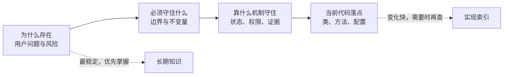
```mermaid
flowchart LR
    WHY["为什么存在\n用户问题与风险"] --> CONTRACT["必须守住什么\n边界与不变量"]
    CONTRACT --> MECHANISM["靠什么机制守住\n状态、权限、证据"]
    MECHANISM --> CODE["当前代码落点\n类、方法、配置"]

    WHY -.->|"最稳定，优先掌握"| STABLE["长期知识"]
    CODE -.->|"变化快，需要时再查"| LOOKUP["实现索引"]
```

后文出现类名，是为了帮助你从概念找到代码，而不是要求背诵实现。

### 0.1 这份文档假设你已经会什么

默认你已经：

- 能看懂 Controller、Service、Mapper、DTO 等常规分层；
- 写过 Spring Boot 接口、数据库增删改查和简单异常处理；
- 知道线程、线程池、锁、CAS、volatile 等八股概念；
- 使用过 Docker Compose，知道容器、镜像、端口映射；
- 知道大模型可以通过 Tool Calling 请求外部工具。

本文不会从 Java 语法或 Spring 注解开始，而是重点补齐下面的跨度：

```text
会写确定性的 CRUD 业务
→ 理解非确定性的模型输出
→ 管理长时间、多轮、可取消的任务
→ 处理跨进程和远程部分失败
→ 用状态机和持久化事实控制真实副作用
```

### 0.2 学完以后应该达到什么程度

不要求你默写所有实现。完成学习后，你应该能够：

1. 从 Java 后端视角解释每个模块为什么存在；
2. 画出一次 Agent run 和一次 OPS repair 的完整流程；
3. 根据日志判断失败发生在模型、工具、网络、执行还是验证阶段；
4. 解释项目中使用的锁、CAS、append-only journal 和资源管理；
5. 面对追问时说出替代方案为什么不够；
6. 明确哪些能力已实现、哪些只是路线图；
7. 在 AI 协助开发的前提下，对关键设计和验收结论负责。

### 0.3 内容比例

本文按大约 1:1 组织两条主线：

| Java 后端主线 | Agent 主线 |
| --- | --- |
| Maven 多模块和依赖方向 | Tool Calling 与 ReAct |
| record、enum、接口和构造器注入 | Provider 适配与 MCP |
| 并发、锁、CAS、虚拟线程 | 工具权限与上下文 |
| 文件 Journal、CRC、原子写 | Session、Memory 与 Compact |
| 进程、网络和资源生命周期 | Incident、Evidence 与 Diagnosis |
| JUnit、Fake、集成测试和 E2E | Policy Gate、Repair 与 Verification |

OPS Loop 是两条主线的交汇点：Agent 提供推理和工具使用方式，Java 后端提供确定性的状态、权限、持久化和失败恢复。

---

## 1. 先用一句话理解项目

从产品角度看，Clawkit 是一个运行在用户本地的个人 AI 运维助手：它连接用户已经拥有的服务器，帮助理解服务为什么异常；需要采取动作时先解释、再审批，最后重新验证是否真的恢复。

从实现角度看，它建立在 Java 21 编写的本地 Agent Runtime 上。Runtime 让模型能够使用文件、命令、MCP 等工具，同时通过权限、预算、执行记录、失败恢复和独立验证，控制模型产生的真实副作用。前者回答“用户为什么使用它”，后者回答“这件事为什么能够安全、可靠地实现”。

产品的完整主线是：

```text
导入已有 SSH 目标
→ 快速查看服务状态
→ 发现异常或主动开始调查
→ 采集只读证据
→ 形成诊断
→ 确定性策略判断是否允许修复
→ 人工审批
→ 执行前重新采证
→ 通过受限账号执行唯一允许的动作
→ 使用新的只读会话独立验证
```

这句话里最重要的不是“模型诊断”，而是后半段：

> 模型可以提出建议，但不能单独决定写操作；执行结果也不能由执行者自己证明。

### 1.1 项目要解决的根本矛盾

传统聊天模型只产生文本。Agent 会调用工具，而工具可能：

- 读取文件；
- 修改代码；
- 执行命令；
- 访问远程服务器；
- 重启服务；
- 改变真实业务状态。

模型越有能力，错误的代价就越大。于是出现一个根本矛盾：

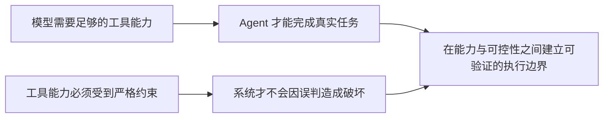
```mermaid
flowchart LR
    A["模型需要足够的工具能力"] --> C["Agent 才能完成真实任务"]
    B["工具能力必须受到严格约束"] --> D["系统才不会因误判造成破坏"]
    C --> E["Clawkit 的目标"]
    D --> E
    E["在能力与可控性之间建立可验证的执行边界"]
```

Clawkit 的价值不是让模型“更聪明”，而是让模型的行动：

- 有入口；
- 有边界；
- 有记录；
- 有失败语义；
- 有恢复路径；
- 有独立验收。

### 1.2 为什么选择运维作为示范场景

运维场景天然包含项目最想验证的问题：

- 证据可能缺失、过期或相互冲突；
- 网络和远程进程可能在任意时刻中断；
- “请求失败”不等于“动作没发生”；
- 重复执行一次重启、配置写入或数据库操作可能扩大故障；
- 服务进程重新运行不等于业务真正恢复；
- 权限边界既要在客户端控制，也要在远端主机控制。

因此，OPS Loop 既是对通用 Runtime 安全性和可靠性的压力测试，也是当前产品真正解决问题的核心引擎。REMOTE-0 提供可信连接和预定义工具入口，OPS Loop 负责把零散状态组织成 Incident、Evidence、Diagnosis、Action、Approval 和 Verification。二者不是两个产品，也不是谁替代谁。

下一步不是继续横向增加远程工具，而是缩短同一条用户旅程：复用已有 OpenSSH 配置完成接入；日常问题先做 Quick Check；用户明确要求深入排查或系统发现严重异常时，再进入 OPS Loop。Clawkit 仍不扩成通用 SSH 管理平台。

---

## 2. 从全局看系统

### 2.1 总体架构

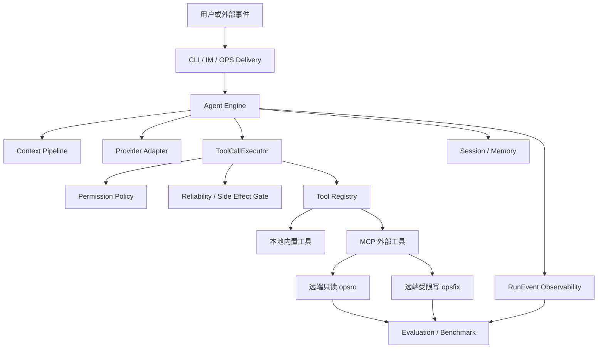
```mermaid
flowchart TB
    U["用户或外部事件"] --> I["CLI / IM / OPS Delivery"]
    I --> E["Agent Engine"]

    E --> C["Context Pipeline"]
    E --> P["Provider Adapter"]
    E --> T["ToolCallExecutor"]
    E --> M["Session / Memory"]
    E --> O["RunEvent Observability"]

    T --> G["Permission Policy"]
    T --> R["Reliability / Side Effect Gate"]
    T --> TR["Tool Registry"]

    TR --> L["本地内置工具"]
    TR --> MCP["MCP 外部工具"]

    MCP --> OPSRO["远端只读 opsro"]
    MCP --> OPSFIX["远端受限写 opsfix"]

    O --> EV["Evaluation / Benchmark"]
    OPSRO --> EV
    OPSFIX --> EV
```

可以把系统理解成五层：

| 层 | 解决的问题 |
| --- | --- |
| 输入层 | 用户或外部事件如何进入系统 |
| Agent 编排层 | 什么时候问模型、什么时候调用工具、何时结束 |
| 工具与权限层 | 哪些工具可见、能否执行、是否需要审批 |
| 可靠性与事实层 | 写操作如何记录、失败如何分类、崩溃后如何恢复 |
| 垂类应用层 | 运维场景中的 Incident、Evidence、Diagnosis、Repair |

如果再从 Runtime 内部看，可以把它分成三个相互配合、但不能混写的平面：

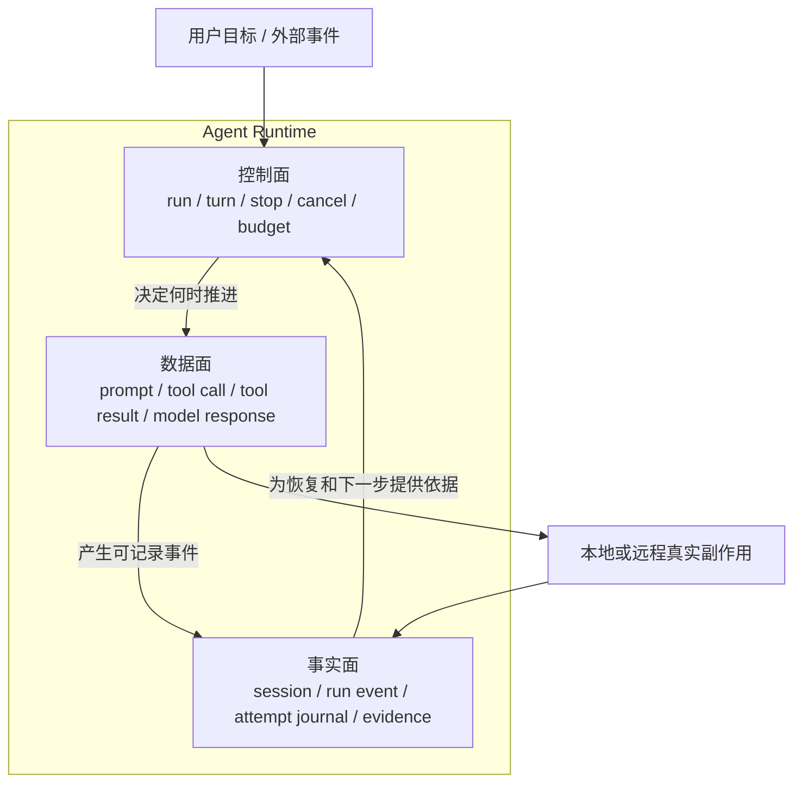
```mermaid
flowchart TB
    INPUT["用户目标 / 外部事件"] --> CONTROL

    subgraph RUNTIME["Agent Runtime"]
        CONTROL["控制面\nrun / turn / stop / cancel / budget"]
        DATA["数据面\nprompt / tool call / tool result / model response"]
        FACT["事实面\nsession / run event / attempt journal / evidence"]

        CONTROL -->|"决定何时推进"| DATA
        DATA -->|"产生可记录事件"| FACT
        FACT -->|"为恢复和下一步提供依据"| CONTROL
    end

    DATA --> EFFECT["本地或远程真实副作用"]
    EFFECT --> FACT
```

- **控制面**回答“任务还能不能继续、该进入哪一阶段、何时必须停”。
- **数据面**承载模型输入输出和工具参数，但其中内容默认不可信。
- **事实面**保存可追踪、可恢复、可复验的状态，不能只存在于模型上下文里。

Agent 底座的核心价值，就是让这三个平面形成闭环：模型负责提出下一步候选，Runtime 负责决定候选是否能成为真实动作，事实记录负责证明实际发生了什么。

### 2.2 Maven 模块为什么要这样拆

项目是 Maven 多模块工程。模块拆分不是为了显得复杂，而是为了隔离不同的变化。

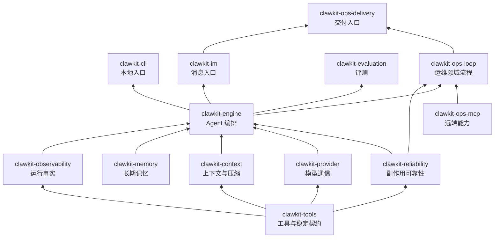
```mermaid
flowchart BT
    TOOLS["clawkit-tools\n工具与稳定契约"]
    REL["clawkit-reliability\n副作用可靠性"]
    PROVIDER["clawkit-provider\n模型通信"]
    CONTEXT["clawkit-context\n上下文与压缩"]
    MEMORY["clawkit-memory\n长期记忆"]
    OBS["clawkit-observability\n运行事实"]

    ENGINE["clawkit-engine\nAgent 编排"]
    CLI["clawkit-cli\n本地入口"]
    IM["clawkit-im\n消息入口"]
    EVAL["clawkit-evaluation\n评测"]

    OPSMCP["clawkit-ops-mcp\n远端能力"]
    OPSLOOP["clawkit-ops-loop\n运维领域流程"]
    DELIVERY["clawkit-ops-delivery\n交付入口"]

    TOOLS --> REL
    TOOLS --> PROVIDER
    TOOLS --> CONTEXT
    TOOLS --> OBS

    REL --> ENGINE
    PROVIDER --> ENGINE
    CONTEXT --> ENGINE
    MEMORY --> ENGINE
    OBS --> ENGINE

    ENGINE --> CLI
    ENGINE --> IM
    ENGINE --> EVAL

    OPSMCP --> OPSLOOP
    ENGINE --> OPSLOOP
    REL --> OPSLOOP
    OPSLOOP --> DELIVERY
    IM --> DELIVERY
```

这里的箭头表示“被上层依赖”。几个关键原则：

- `tools` 提供最稳定的工具和动作契约，不知道 Agent 怎么循环。
- `reliability` 只依赖工具契约，不理解具体运维业务。
- `engine` 负责编排，但不直接解析某个模型厂商的 JSON。
- `cli` 只负责组装和交互，不拥有核心安全规则。
- OPS 领域能力放在 `extensions`，避免把 SSH、Docker、Incident 写进通用引擎。

### 2.3 各模块的通俗解释

| 模块 | 可以把它想成 |
| --- | --- |
| `clawkit-tools` | 工具插座和统一安检口 |
| `clawkit-provider` | 不同模型厂商的翻译器 |
| `clawkit-context` | 给模型准备材料的编辑部 |
| `clawkit-memory` | 跨任务保存的笔记本 |
| `clawkit-observability` | 不参与决策的行车记录仪 |
| `clawkit-reliability` | 写操作的保险箱、流水账和事故恢复员 |
| `clawkit-engine` | 控制整个任务推进的导演 |
| `clawkit-cli` | 用户看到的命令行窗口 |
| `clawkit-evaluation` | 用固定题目和规则验收系统的考场 |
| `clawkit-ops-mcp` | 远端只暴露白名单运维能力的服务 |
| `clawkit-ops-loop` | 把采证、诊断、修复、复验串起来的领域层 |
| `clawkit-ops-delivery` | 真正运行远程诊断和修复的入口 |

### 2.4 从苍穹外卖的分层迁移过来

你熟悉的 Spring Boot 项目大致是：

```text
HTTP 请求
→ Controller
→ Service
→ Mapper
→ MySQL
→ HTTP 响应
```

Clawkit 不是 Web CRUD 项目，但很多职责可以类比：

| 常规 Java 后端 | Clawkit 中的对应角色 | 主要差别 |
| --- | --- | --- |
| Controller | CLI、IM、Delivery Main | 输入不一定是 HTTP，请求可能运行很久 |
| Service | AgentEngine、Workflow、Orchestrator | 流程不是一次确定性函数调用，而是多轮决策 |
| DTO/VO | record、enum、sealed interface | 还要表达失败、时效、风险和中间状态 |
| Mapper/Repository | SessionStore、MemoryStore、AttemptStore | 不只存业务数据，还保存恢复所需的控制状态 |
| Interceptor | PermissionPolicy、SafetyInterceptor、SideEffectGate | 不只做登录校验，还阻断危险副作用 |
| 全局异常处理 | 结构化错误、FailureClass、EffectCertainty | 异常发生后还要判断副作用是否已经产生 |
| Spring 容器 | ApplicationBootstrap | 项目选择显式组装依赖，便于看清唯一实例和边界 |
| 定时任务 | 未来 OPS-3A | 目前持续调度尚未实现 |

最大的认知变化不是目录结构，而是**执行的不确定性**：

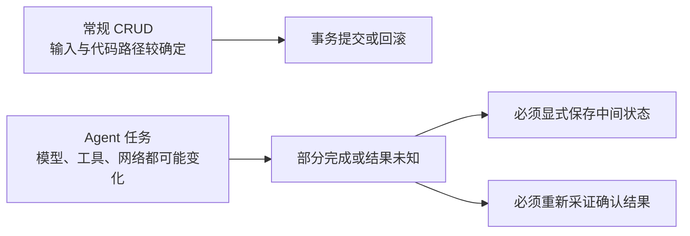
```mermaid
flowchart LR
    CRUD["常规 CRUD\n输入与代码路径较确定"] --> DB["事务提交或回滚"]
    AGENT["Agent 任务\n模型、工具、网络都可能变化"] --> PARTIAL["部分完成或结果未知"]
    PARTIAL --> STATE["必须显式保存中间状态"]
    PARTIAL --> VERIFY["必须重新采证确认结果"]
```

在 CRUD 项目里，抛异常通常意味着这次方法失败；在远程写操作里，抛异常可能发生在服务端已经完成动作之后。正是这个差别，催生了后面的 Attempt 状态机和独立验证。

### 2.5 为什么项目没有把 Spring Boot 当成核心框架

项目并不是反对 Spring，而是 Runtime 核心目前更需要：

- 清楚的对象生命周期；
- 显式依赖关系；
- 可在单元测试中替换时钟、文件 Store、Provider 和 Transport；
- CLI 与本地进程的轻量启动；
- 避免安全关键组件被重复装配。

因此使用构造器注入和 `ApplicationBootstrap` 手动组装。这样阅读代码时，可以直接追踪：

```text
谁创建 AgentEngine
→ 谁把 ToolRegistry 注入进去
→ 谁装配 SideEffectGate
→ 谁提供 RunRecorder
```

未来如果加入 Web API，完全可以在输入层使用 Spring Boot，但不应把 Controller、Spring Bean 或 HTTP DTO 渗透到 Runtime 核心。

### 2.6 项目里最值得学习的 Java 建模方式

#### record：表达不可变数据合同

项目大量使用 record 表达：

- Evidence；
- Diagnosis；
- ToolExecutionResult；
- ApprovalGrant；
- VerificationResult。

它们更接近“值”，而不是带复杂行为的 Service。record 自动提供构造器、访问器、`equals/hashCode`，适合跨模块传递。

但 record 不代表不需要校验。项目会在 compact constructor 中检查：

```text
字段非空
时间顺序合法
集合 defensive copy
枚举状态匹配
默认 schemaVersion
```

#### enum：让有限状态无法随便拼字符串

`AttemptState`、`PermissionMode`、`FailureClass` 等都属于有限集合。使用 enum 的优势：

- 编译器可以检查 switch 是否覆盖；
- 避免 `"VERIFYING"` 拼写错误；
- 可以把合法迁移等行为放进枚举；
- JSON 序列化仍然清晰。

#### sealed interface：表达有限但形态不同的结果

例如审批结果可能是：

```text
Approve
ApproveAllSameType
Reject
ModifyParams
```

它们共享一个上层概念，但字段不同。sealed interface 配合模式匹配，比 `type + Map<String,Object>` 更安全。

#### 接口与实现分离

接口真正有价值的场景是存在变化点：

- `LLMProvider`：不同模型厂商；
- `MemoryStore`：不同存储实现；
- `RunRecorder`：文件记录、组合记录、空记录；
- `McpTransport`：stdio、HTTP/SSE；
- `OpsBackend`：Docker、PostgreSQL 诊断。

如果一个类永远只有一种实现，也没有测试替换需要，不必为了“面向接口编程”机械增加接口。

#### 构造器注入

时钟、Transport、Store、Provider 从构造器传入，使测试能够：

- 使用固定 Clock 测过期边界；
- 使用 Fake Provider；
- 使用临时目录 Store；
- 模拟网络错误；
- 验证资源是否关闭。

这和 Spring 的依赖注入思想相同，只是这里由代码显式完成。

---

## 3. 一次普通 Agent 任务是怎么跑的

### 3.1 先纠正一个认识：模型不会直接执行工具

Tool Calling 的本质是：模型返回一段结构化请求，由宿主程序决定是否执行。

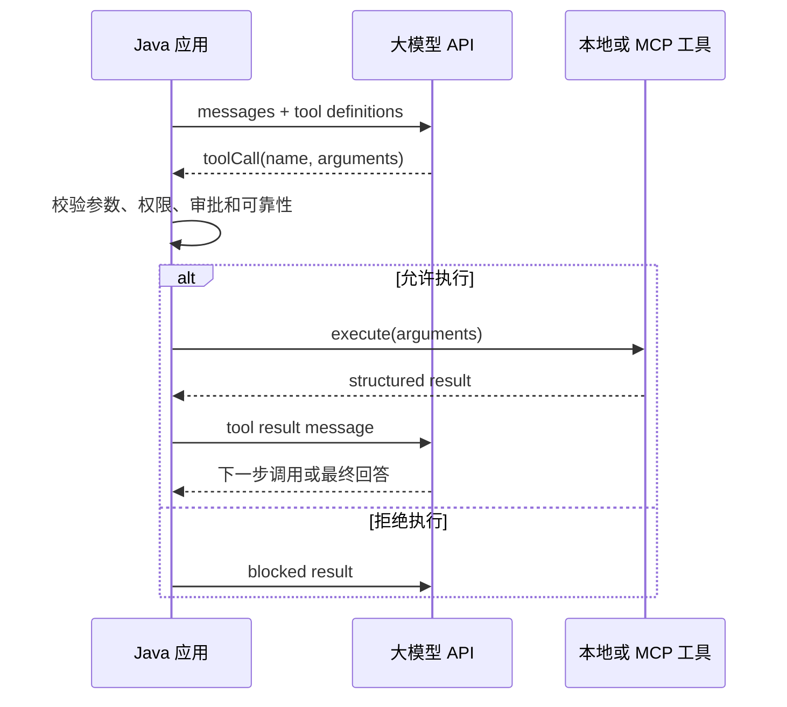
```mermaid
sequenceDiagram
    participant App as Java 应用
    participant LLM as 大模型 API
    participant Tool as 本地或 MCP 工具

    App->>LLM: messages + tool definitions
    LLM-->>App: toolCall(name, arguments)
    App->>App: 校验参数、权限、审批和可靠性
    alt 允许执行
        App->>Tool: execute(arguments)
        Tool-->>App: structured result
        App->>LLM: tool result message
        LLM-->>App: 下一步调用或最终回答
    else 拒绝执行
        App->>LLM: blocked result
    end
```

因此模型没有以下能力：

- 直接调用 Java 方法；
- 直接连接 SSH；
- 直接修改文件；
- 自己决定绕过审批。

真正拥有能力的是宿主程序。模型只是生成候选的工具名和参数。这也是为什么工具参数必须按“不可信输入”处理：它和前端提交的 JSON 一样，需要 schema 校验、权限校验和边界检查。

### 3.2 ReAct 循环

ReAct 可以直译成“思考—行动—观察”。模型不是一次性输出最终答案，而是反复：

1. 阅读当前上下文；
2. 决定是否调用工具；
3. 系统执行工具；
4. 将工具结果放回上下文；
5. 模型继续判断；
6. 直到不再调用工具。

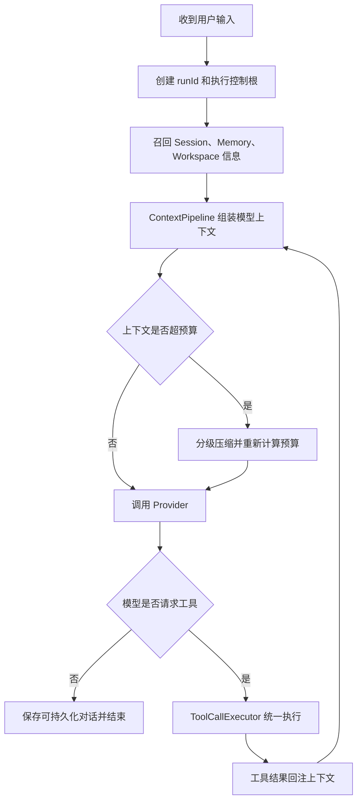
```mermaid
flowchart TD
    A["收到用户输入"] --> B["创建 runId 和执行控制根"]
    B --> C["召回 Session、Memory、Workspace 信息"]
    C --> D["ContextPipeline 组装模型上下文"]
    D --> E{"上下文是否超预算"}
    E -->|"是"| F["分级压缩并重新计算预算"]
    E -->|"否"| G["调用 Provider"]
    F --> G
    G --> H{"模型是否请求工具"}
    H -->|"否"| I["保存可持久化对话并结束"]
    H -->|"是"| J["ToolCallExecutor 统一执行"]
    J --> K["工具结果回注上下文"]
    K --> D
```

对应的主要入口是：

- [`AgentEngine.run`](../clawkit-engine/src/main/java/com/clawkit/engine/impl/AgentEngine.java)
- [`ToolCallExecutor.executeBatch`](../clawkit-engine/src/main/java/com/clawkit/engine/impl/ToolCallExecutor.java)
- [`DefaultContextPipeline`](../clawkit-context/src/main/java/com/clawkit/context/impl/DefaultContextPipeline.java)

#### 3.2.1 Run、Turn 和 Tool Call 是三个不同层级

把 Agent 理解成“模型和工具反复聊天”还不够。Runtime 至少要管理三个嵌套层级：

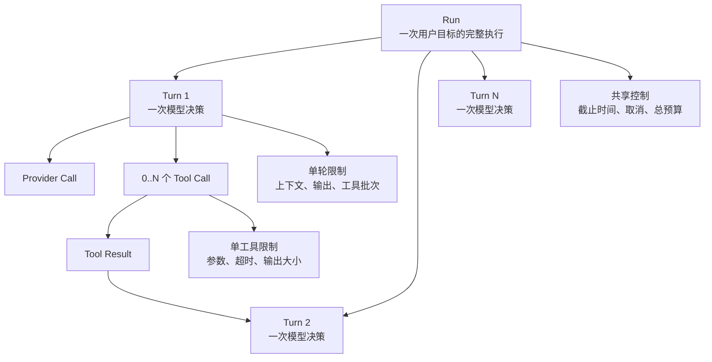
```mermaid
flowchart TB
    RUN["Run\n一次用户目标的完整执行"] --> T1["Turn 1\n一次模型决策"]
    RUN --> T2["Turn 2\n一次模型决策"]
    RUN --> TN["Turn N\n一次模型决策"]

    T1 --> P1["Provider Call"]
    T1 --> C1["0..N 个 Tool Call"]
    C1 --> R1["Tool Result"]
    R1 --> T2

    RUN --> CTRL["共享控制\n截止时间、取消、总预算"]
    T1 --> LIMIT["单轮限制\n上下文、输出、工具批次"]
    C1 --> TLIMIT["单工具限制\n参数、超时、输出大小"]
```

- **Run** 绑定用户目标、`runId`、总预算、取消树和最终结果。
- **Turn** 是模型的一次决策机会；一次 Run 可能包含多个 Turn。
- **Tool Call** 是候选动作；同一 Turn 可以没有工具、调用一个工具，或在规则允许时并行调用多个只读工具。

这样分层后，系统才能准确回答：是整个任务超时，还是某次模型请求失败；是某个工具被拒绝，还是 Run 已经没有预算继续。

#### 3.2.2 模型循环外还有一圈确定性外壳

ReAct 只描述了模型“思考—行动—观察”的认知循环，不能直接充当生产执行模型。Clawkit 在它外面增加了一圈确定性控制：

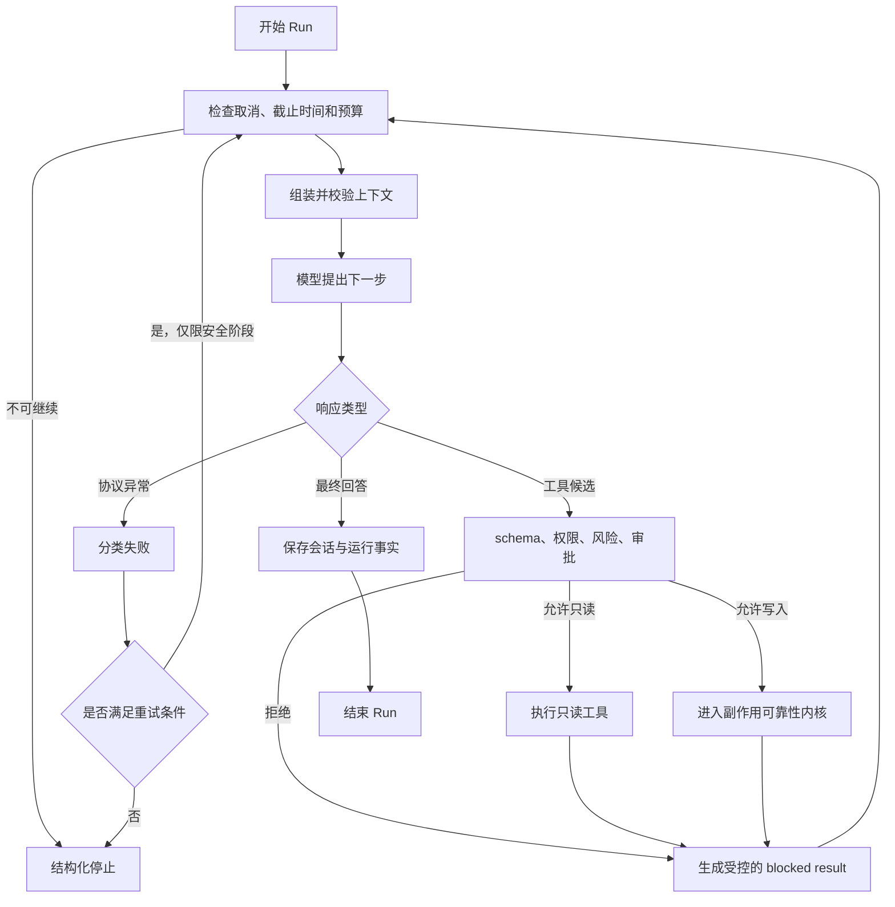
```mermaid
flowchart TD
    START["开始 Run"] --> CHECK["检查取消、截止时间和预算"]
    CHECK -->|"不可继续"| HALT["结构化停止"]
    CHECK --> CTX["组装并校验上下文"]
    CTX --> MODEL["模型提出下一步"]
    MODEL --> DECIDE{"响应类型"}

    DECIDE -->|"最终回答"| SAVE["保存会话与运行事实"]
    DECIDE -->|"工具候选"| VALIDATE["schema、权限、风险、审批"]
    DECIDE -->|"协议异常"| FAIL["分类失败"]

    VALIDATE -->|"拒绝"| OBSERVE["生成受控的 blocked result"]
    VALIDATE -->|"允许只读"| READ["执行只读工具"]
    VALIDATE -->|"允许写入"| SIDE["进入副作用可靠性内核"]

    READ --> OBSERVE
    SIDE --> OBSERVE
    OBSERVE --> CHECK
    FAIL --> POLICY{"是否满足重试条件"}
    POLICY -->|"是，仅限安全阶段"| CHECK
    POLICY -->|"否"| HALT
    SAVE --> END["结束 Run"]
```

外壳中的判断尽量由代码完成，而不是继续追问模型“你确定吗”。模型可以解释风险，但是否越权、预算是否耗尽、状态能否迁移，必须由确定性规则裁决。

#### 3.2.3 停止条件是 Agent 能力的一部分

一个可靠 Agent 不只要知道“怎样继续”，还要知道“什么时候必须停”。常见停止条件包括：

| 停止原因 | 用户应该看到什么 | 底层应该做什么 |
| --- | --- | --- |
| 已得到最终答案 | 清晰结论和证据引用 | 保存 Session，记录 Run 完成 |
| 需要用户补充信息 | 缺什么、为什么缺、怎样继续 | 保留可恢复状态，不猜参数 |
| 权限或策略拒绝 | 哪项能力被拒绝、可选安全路径 | 不执行工具，记录拒绝原因 |
| 截止时间到达 | 已完成部分和未完成部分 | 级联取消子任务与进程 |
| Token/工作预算耗尽 | 当前结论边界 | 停止继续调用模型或工具 |
| 出现结果未知的写动作 | 明确提示人工接管或重新采证 | 禁止自动重试，保持 sticky 状态 |
| 上下文无法安全压缩 | 说明无法继续而不是丢约束 | 结构化失败，保留原始事实 |

这也是 Agent Runtime 与普通聊天封装的差别：**停止不是异常兜底，而是受设计、可观察、可恢复的正常结果。**

#### 3.2.4 预算与取消必须沿调用树传播

Run 可能启动 Plan、SubAgent、Provider 请求、并行工具和外部进程。如果每一层只管理自己的 timeout，用户按下取消后，后台仍可能继续消耗 Token、占用线程或执行命令。

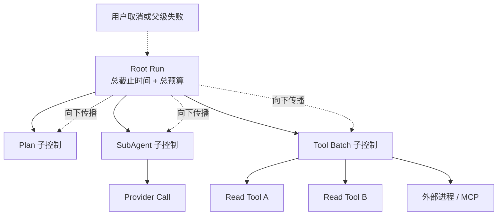
```mermaid
flowchart TB
    ROOT["Root Run\n总截止时间 + 总预算"] --> PLAN["Plan 子控制"]
    ROOT --> SUB["SubAgent 子控制"]
    ROOT --> TOOL["Tool Batch 子控制"]

    SUB --> P["Provider Call"]
    TOOL --> T1["Read Tool A"]
    TOOL --> T2["Read Tool B"]
    TOOL --> PROC["外部进程 / MCP"]

    CANCEL["用户取消或父级失败"] -.-> ROOT
    ROOT -.->|"向下传播"| PLAN
    ROOT -.->|"向下传播"| SUB
    ROOT -.->|"向下传播"| TOOL
```

子任务可以拥有更小的局部上限，但不能突破父任务的总预算；父级取消后，所有后代都应尽快停止。这里控制的是“继续工作的资格”，不代表已经派发的远程副作用一定能撤销，所以写操作仍需要第 5 章的独立可靠性语义。

### 3.3 为什么必须有“唯一工具入口”

假设系统有四种执行方式：

- 普通 ReAct；
- 先规划再执行；
- 子 Agent；
- MCP 工具。

如果每种方式各自执行工具，就会产生四套权限逻辑和四套错误处理。即使其中三条路径安全，只要有一条遗漏审批，模型就能绕过安全边界。

因此项目规定：

> 普通工具、MCP、Plan、SubAgent 和内部工具最终都必须进入 `ToolCallExecutor`。

统一入口负责：

1. 校验工具名和参数；
2. 冻结工具元数据；
3. 判断只读还是有副作用；
4. 计算权限；
5. 必要时请求审批；
6. 有副作用时进入 Side Effect Gate；
7. 执行工具；
8. 记录结构化结果；
9. 将结果安全地交回模型。

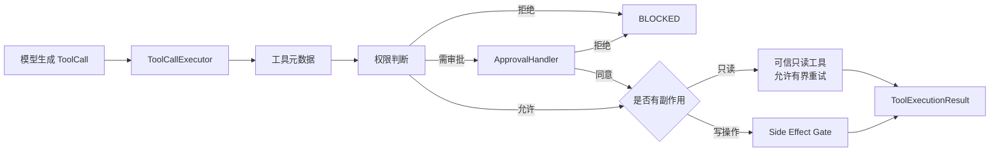
```mermaid
flowchart LR
    A["模型生成 ToolCall"] --> B["ToolCallExecutor"]
    B --> C["工具元数据"]
    C --> D["权限判断"]
    D -->|"拒绝"| X["BLOCKED"]
    D -->|"需审批"| E["ApprovalHandler"]
    E -->|"拒绝"| X
    E -->|"同意"| F{"是否有副作用"}
    D -->|"允许"| F
    F -->|"只读"| G["可信只读工具\n允许有界重试"]
    F -->|"写操作"| H["Side Effect Gate"]
    G --> I["ToolExecutionResult"]
    H --> I
```

### 3.4 ToolMetadata 为什么是安全事实源

每个工具要声明：

- 是否只读；
- 风险等级；
- 是否有破坏性；
- 是否必须审批；
- 有哪些副作用；
- 是否允许并行；
- 超时和输出限制。

权限系统读取这些元数据，而不是靠工具名字猜风险。

原因很简单：名字不可靠。一个叫 `status` 的工具也可能偷偷写入；一个远程 MCP 工具也可能缺少可信注解。因此未知工具使用保守默认值：

```text
非只读 + 高风险 + 可能破坏 + 需要审批
```

这叫 **fail closed**：系统不确定时选择拒绝，而不是猜测安全。

### 3.5 PLAN、ASK、AUTO 到底有什么区别

| 模式 | 行为 | 仍然不能绕过 |
| --- | --- | --- |
| `PLAN` | 只暴露和执行只读工具 | 工具元数据、路径限制 |
| `ASK` | 写操作执行前必须人工确认 | SafetyInterceptor、可靠性门禁 |
| `AUTO` | 允许自动执行策略允许的操作 | SafetyInterceptor、动作契约、审计 |

容易误解的一点是：

> `AUTO` 不是“模型想做什么就做什么”，而是“不再逐次弹窗，但仍必须通过全部底层安全条件”。

当前 OPS MVP-3 是人工审批闭环。测试参数 `--auto-approve` 仅用于 E2E，不等于 OPS-2B 的生产自动修复策略。

### 3.6 Provider Adapter 解决了什么

不同模型厂商的请求和响应并不完全相同：

- 字段名称不同；
- 流式协议不同；
- reasoning 内容不同；
- token usage 统计不同；
- 错误码和重试建议不同；
- finish reason 的表达不同。

如果 `AgentEngine` 直接处理 OpenAI 或 DeepSeek JSON，核心循环会被厂商协议污染。因此 `clawkit-provider` 把它们转换成统一的：

```text
ModelRequest
ModelResponse
ToolCall
TokenUsage
FinishReason
ProviderError
```

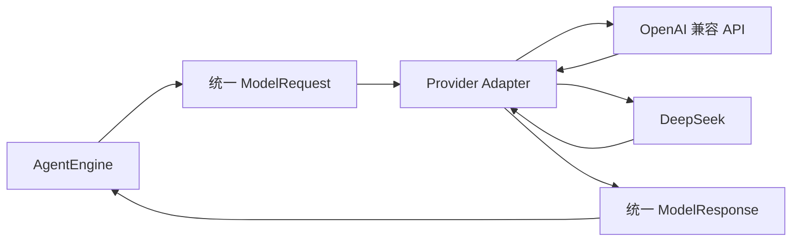
```mermaid
flowchart LR
    E["AgentEngine"] --> R["统一 ModelRequest"]
    R --> A["Provider Adapter"]
    A --> V1["OpenAI 兼容 API"]
    A --> V2["DeepSeek"]
    V1 --> A
    V2 --> A
    A --> S["统一 ModelResponse"]
    S --> E
```

Provider 层只负责通信和协议，不判断运维根因，也不执行工具。可重试的通常是模型推理请求中的限流、部分 5xx 或网络错误；副作用工具不能借用 Provider 的自动重试逻辑。

### 3.7 MCP 在系统中的位置

MCP 可以理解为“模型工具的标准化远程插座”。典型交互是：

```text
initialize
→ notifications/initialized
→ tools/list
→ tools/call
```

Clawkit 作为 MCP Client：

1. 启动或连接 MCP Server；
2. 协商协议和服务信息；
3. 获取工具定义；
4. 将工具适配进统一 Registry；
5. 调用工具并解析 JSON-RPC 响应。

MCP 解决了“如何接入工具”，但不自动解决“工具是否安全”。远端注解可能缺失或不可信，所以 MCP 工具仍必须经过：

- metadata provenance；
- 保守风险映射；
- PermissionPolicy；
- SideEffectGate；
- 领域级 profile 和参数白名单。

### 3.8 Agent、Workflow、Plan 和 SubAgent 的区别

| 方式 | 谁决定下一步 | 适合场景 | 风险 |
| --- | --- | --- | --- |
| ReAct Agent | 模型每轮动态决定 | 开放式探索、代码任务 | 路径不固定，必须统一门禁 |
| TWO_STAGE | 模型先规划，再进入工具阶段 | 需要先整理思路的任务 | 规划文本不能获得额外权限 |
| Plan-and-Execute | 结构化计划和执行器 | 步骤清晰、需要进度状态 | 不能创建第二套工具旁路 |
| SubAgent | 独立子 run | 可拆分或并行子任务 | 需要独立 runId、取消与预算 |
| OPS Workflow | Java 编排器决定关键阶段 | 高风险修复闭环 | 灵活性较低，但安全边界更清晰 |

MVP-3 采用的是混合方式：

- 模型参与诊断解释；
- Java Workflow 固定审批、Precheck、执行和 Verification 顺序；
- 确定性 Policy Gate 决定修复资格。

这是一项重要取舍：高风险流程不必追求“全 Agent 化”。越接近真实副作用，越应该把关键步骤固化成可测试 Workflow。

### 3.9 怎样判断一项能力应该放在底座还是领域层

一个常见设计风险，是看到 OPS 需要某项能力，就直接把 Incident、SSH 或 Docker 写进 `AgentEngine`。更稳妥的判断方式是看它是否跨场景成立：

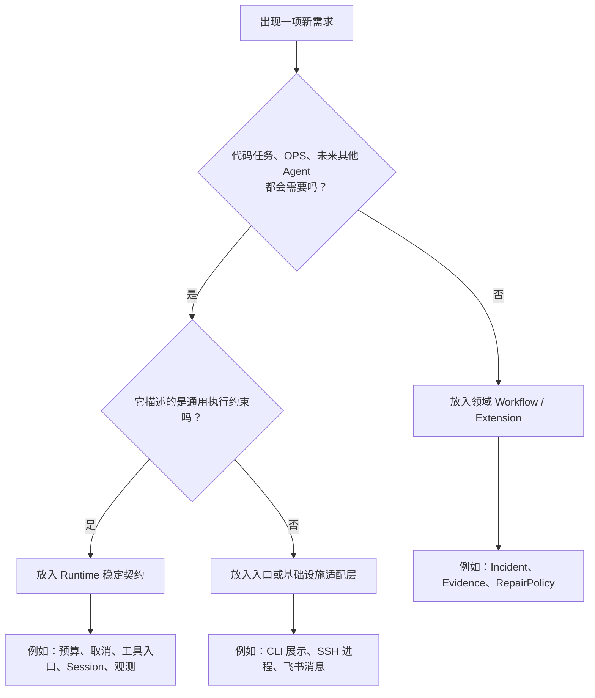
```mermaid
flowchart TD
    NEED["出现一项新需求"] --> Q1{"代码任务、OPS、未来其他 Agent\n都会需要吗？"}
    Q1 -->|"是"| Q2{"它描述的是通用执行约束吗？"}
    Q1 -->|"否"| DOMAIN["放入领域 Workflow / Extension"]
    Q2 -->|"是"| BASE["放入 Runtime 稳定契约"]
    Q2 -->|"否"| ADAPTER["放入入口或基础设施适配层"]

    BASE --> BEX["例如：预算、取消、工具入口、Session、观测"]
    DOMAIN --> DEX["例如：Incident、Evidence、RepairPolicy"]
    ADAPTER --> AEX["例如：CLI 展示、SSH 进程、飞书消息"]
```

可以用三个问题做快速检查：

1. 去掉“运维”二字，这个概念是否仍然成立？
2. 它是在定义通用不变量，还是在描述某个领域的业务状态？
3. 如果未来增加另一种入口或工具来源，核心契约是否仍能保持不变？

底座不是“所有重要代码的集合”，而是跨场景复用的最小稳定内核。领域层可以依赖底座，底座不能反向理解领域名词。

---

## 4. 上下文、Session、Memory 为什么不能混在一起

### 4.1 三者的生命周期不同

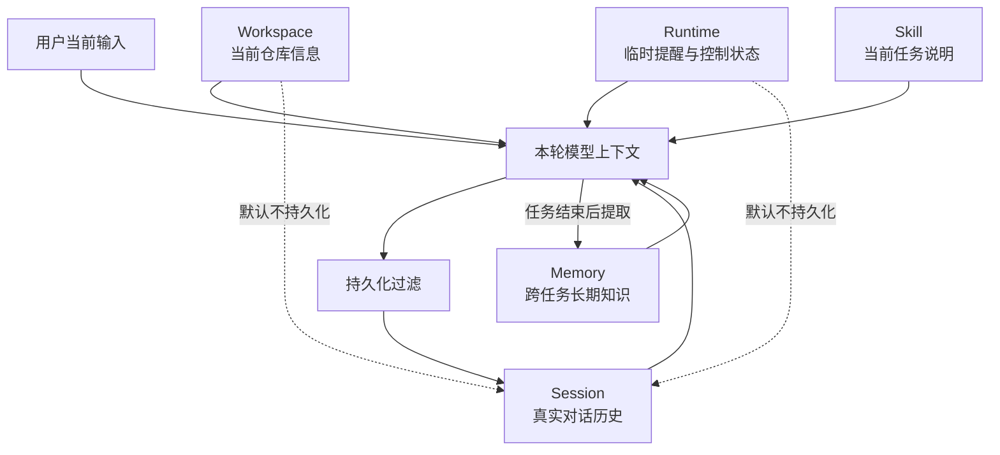
```mermaid
flowchart TB
    INPUT["用户当前输入"] --> MODEL["本轮模型上下文"]
    SESSION["Session\n真实对话历史"] --> MODEL
    MEMORY["Memory\n跨任务长期知识"] --> MODEL
    WORKSPACE["Workspace\n当前仓库信息"] --> MODEL
    RUNTIME["Runtime\n临时提醒与控制状态"] --> MODEL
    SKILL["Skill\n当前任务说明"] --> MODEL

    MODEL --> FILTER["持久化过滤"]
    FILTER --> SESSION
    MODEL -->|"任务结束后提取"| MEMORY
    RUNTIME -.->|"默认不持久化"| SESSION
    WORKSPACE -.->|"默认不持久化"| SESSION
```

- **上下文**：这一次请求真正发给模型的全部材料。
- **Session**：真实发生过的用户消息、模型回复、工具调用和工具结果。
- **Memory**：经过提取后，希望跨任务复用的长期信息。
- **Ephemeral Context**：死循环提醒、工作区快照、相关会话摘要等临时材料。

如果把临时提醒保存进 Session，下一次任务可能把旧的运行状态当成当前事实。如果把旧事故证据写进长期 Memory，新 Incident 可能误用过期状态。

因此项目强调：

> 模型上下文是临时视图，磁盘上的事实记录才是可追踪状态。

### 4.2 为什么需要上下文压缩

模型上下文有长度限制。简单删除旧消息会丢掉：

- 用户约束；
- 文件路径；
- 已发现错误；
- 未完成任务；
- 审批边界。

Clawkit 使用分级策略：

| 层级 | 做法 |
| --- | --- |
| L0 | 不处理 |
| L1 | 确定性删除低价值、可重建内容 |
| L2 | 抽取式压缩，尽量保留原文关键片段 |
| L3 | 调用模型生成摘要 |
| L4 | 无法安全压缩时结构化失败 |

关键约束叫 required anchor，可以理解为“绝不能压丢的钉子”。压缩前后会用快照和哈希检查这些约束是否还在。

这背后的设计思想是：

> 上下文压缩不是文案优化，而是一种可能改变后续决策的有损操作，因此必须可验证。

### 4.3 同一条信息为什么要有不同形态

“服务不可用”可能同时出现在对话、工具结果、Evidence、Incident 报告和长期 Memory 中，但它们不是同一份数据的随意复制：

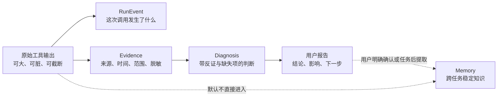
```mermaid
flowchart LR
    RAW["原始工具输出\n可大、可脏、可截断"] --> EVENT["RunEvent\n这次调用发生了什么"]
    RAW --> EVIDENCE["Evidence\n来源、时间、范围、脱敏"]
    EVIDENCE --> DIAGNOSIS["Diagnosis\n带反证与缺失项的判断"]
    DIAGNOSIS --> REPORT["用户报告\n结论、影响、下一步"]

    REPORT -.->|"用户明确确认或任务后提取"| MEMORY["Memory\n跨任务稳定知识"]
    RAW -.->|"默认不直接进入"| MEMORY
```

每次转换都在增加约束，同时丢弃不适合长期保留的内容：

- 原始输出用于追查，但可能包含噪声或敏感信息。
- RunEvent 记录运行事实，不负责证明业务结论。
- Evidence 把原始输出变成可引用、带时效的领域事实。
- Diagnosis 是对 Evidence 的解释，不应覆盖原始事实。
- Report 面向用户组织信息，不能反向充当底层状态。
- Memory 只保存跨任务仍成立的知识，不保存某次事故的瞬时状态。

因此“都存成一段聊天记录”看似简单，实际上会让时效、来源、恢复和审计全部失去边界。

---

## 5. 为什么写操作需要单独的可靠性内核

### 5.1 “请求失败”不等于“动作没发生”

考虑一次远程重启：

```text
客户端发出 restart_service
→ 远端已经重启成功
→ 网络在响应返回前断开
→ 客户端收到超时
```

如果系统把超时当成“没有执行”，然后自动重试，就可能重复产生副作用。

因此写操作的结果不能只用成功/失败两个值表达。项目使用 `EffectCertainty` 区分：

| 结果 | 含义 | 后续行为 |
| --- | --- | --- |
| `NOT_DISPATCHED` | 确认没有发出 | 可以安全结束 |
| `NO_EFFECT_CONFIRMED` | 确认没有副作用 | 可以受限重试 |
| `EFFECT_CONFIRMED` | 确认动作产生效果 | 进入独立验证 |
| `PARTIAL_EFFECT` | 只完成了一部分 | 核实并考虑补偿 |
| `EFFECT_UNKNOWN` | 不知道是否发生 | 禁止自动重试，重新采证 |

### 5.2 ActionDescriptor：先描述动作，再允许执行

每个写动作必须先生成不可变的动作描述：

- 动作代码；
- 规范化目标；
- 参数摘要；
- 风险与可逆性；
- 前置条件；
- 预期效果；
- 验证方式；
- 补偿策略；
- 影响范围；
- 幂等信息。

动作描述会形成 fingerprint。参数、目标或验证策略只要变化，指纹就变化，旧审批不能继续使用。

如果工具声明有副作用，却无法生成可信的 `ActionDescriptor`，系统直接拒绝。这避免出现：

```text
“先执行一下，执行完再补审计”
```

### 5.3 durable DISPATCH_INTENT：为什么必须先落盘

写操作最危险的窗口是“准备发送”和“已经发送”之间。

Clawkit 在真正调用工具前，先把 `DISPATCH_INTENT` 强制写入可靠性日志：

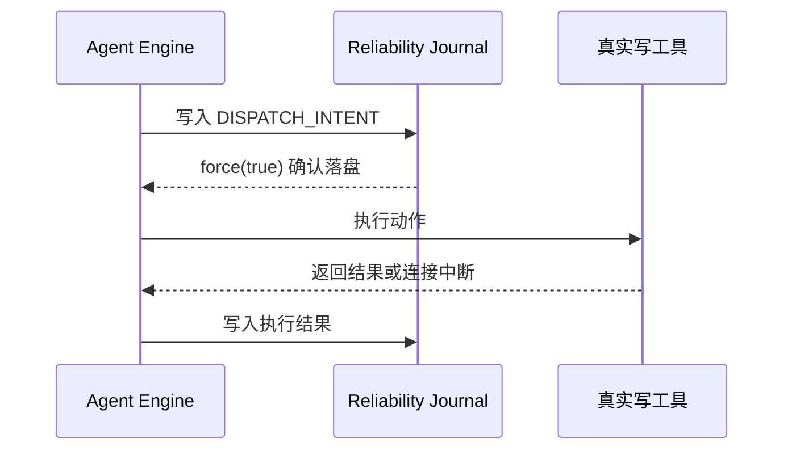
```mermaid
sequenceDiagram
    participant E as Agent Engine
    participant J as Reliability Journal
    participant T as 真实写工具

    E->>J: 写入 DISPATCH_INTENT
    J-->>E: force(true) 确认落盘
    E->>T: 执行动作
    T-->>E: 返回结果或连接中断
    E->>J: 写入执行结果
```

这样进程即使崩溃，重启后也能判断：

- 日志里没有 intent：确认没有派发；
- 有 intent 但没有结果：可能已经派发，进入 `OUTCOME_UNKNOWN`；
- 有执行结果但未验证：重新进入验证。

核心思想是：

> 宁可把一个实际没发出的动作当成“可能发出”，也不能把一个可能已经发出的动作当成“确定没发出”。

### 5.4 Attempt 状态机

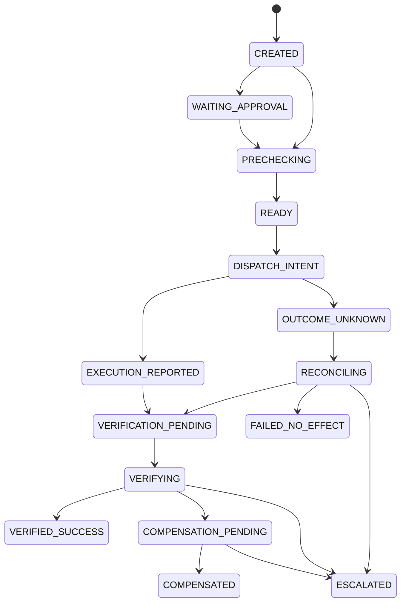
```mermaid
stateDiagram-v2
    [*] --> CREATED
    CREATED --> WAITING_APPROVAL
    CREATED --> PRECHECKING
    WAITING_APPROVAL --> PRECHECKING
    PRECHECKING --> READY
    READY --> DISPATCH_INTENT
    DISPATCH_INTENT --> EXECUTION_REPORTED
    DISPATCH_INTENT --> OUTCOME_UNKNOWN
    EXECUTION_REPORTED --> VERIFICATION_PENDING
    VERIFICATION_PENDING --> VERIFYING
    VERIFYING --> VERIFIED_SUCCESS
    VERIFYING --> COMPENSATION_PENDING
    VERIFYING --> ESCALATED
    OUTCOME_UNKNOWN --> RECONCILING
    RECONCILING --> VERIFICATION_PENDING
    RECONCILING --> FAILED_NO_EFFECT
    RECONCILING --> ESCALATED
    COMPENSATION_PENDING --> COMPENSATED
    COMPENSATION_PENDING --> ESCALATED
```

几个最重要的不变量：

1. 只有 `VERIFYING` 才能进入 `VERIFIED_SUCCESS`。
2. `OUTCOME_UNKNOWN` 不释放目标锁。
3. 同一目标不能同时执行两个写 Attempt。
4. `MANUAL_REQUIRED` 不能被程序自动标记成功。
5. 终态和人工接管不能被迟到响应反转。

### 5.5 为什么日志不是普通 JSON 文件

[`FileActionAttemptStore`](../clawkit-reliability/src/main/java/com/clawkit/reliability/attempt/FileActionAttemptStore.java) 使用：

- append-only journal；
- CRC 校验；
- `FileChannel.force(true)` 强制刷盘；
- 跨进程文件锁；
- 版本 CAS；
- 幂等键索引；
- 目标持有者索引。

这些机制分别解决：

| 风险 | 机制 |
| --- | --- |
| 写到一半进程崩溃 | append-only + CRC |
| 操作系统尚未把缓存写到磁盘 | `force(true)` |
| 两个 Java 进程同时操作 | 跨进程文件锁 |
| 迟到响应覆盖新状态 | version CAS |
| 模型换 toolCallId 重复动作 | 内容派生的 logicalActionId |
| 同一目标并发写 | target ownership |

### 5.6 启动恢复不是“重试”

[`RecoveryScanner`](../clawkit-reliability/src/main/java/com/clawkit/reliability/gate/RecoveryScanner.java) 在进程启动后扫描未完成 Attempt：

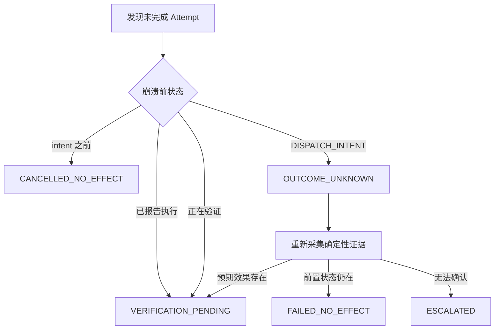
```mermaid
flowchart TD
    A["发现未完成 Attempt"] --> B{"崩溃前状态"}
    B -->|"intent 之前"| C["CANCELLED_NO_EFFECT"]
    B -->|"DISPATCH_INTENT"| D["OUTCOME_UNKNOWN"]
    B -->|"已报告执行"| E["VERIFICATION_PENDING"]
    B -->|"正在验证"| E
    D --> F["重新采集确定性证据"]
    F -->|"预期效果存在"| E
    F -->|"前置状态仍在"| G["FAILED_NO_EFFECT"]
    F -->|"无法确认"| H["ESCALATED"]
```

恢复扫描做的是“确认现状”，不是“把原动作再执行一次”。

### 5.7 把并发八股放回真实代码

项目中的并发不是为了炫技，主要解决四类问题：

#### 同一个对象被多个线程观察

`AgentEngine` 中的运行模式、取消状态和当前控制对象等使用 `volatile`。它保证一个线程修改后，其他线程能较快看到新值。

但 `volatile` 不保证复合操作原子性。例如：

```java
if (!busy) {
    busy = true;
}
```

两个线程仍可能同时通过判断。因此“是否正在执行任务”使用 `AtomicBoolean.compareAndSet`，把检查和修改合成一个原子动作。

#### 多个线程在同一 JVM 修改 Store

`FileActionAttemptStore` 使用 `ReentrantLock` 保护一次进程内事务。它解决同一 Java 进程中的线程竞争。

#### 两个 JVM 同时修改同一目录

`ReentrantLock` 只对当前 JVM 有效。两个 Clawkit 进程需要 `FileLock`，由操作系统协调跨进程互斥。

#### 多个读工具并行

`ToolCallExecutor` 只并行执行明确只读、允许并发的工具，并使用 Java 21 虚拟线程。写工具和高风险工具保持串行。

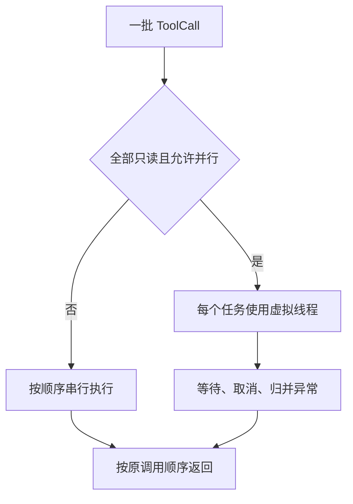
```mermaid
flowchart TB
    CALLS["一批 ToolCall"] --> CHECK{"全部只读且允许并行"}
    CHECK -->|"是"| VT["每个任务使用虚拟线程"]
    CHECK -->|"否"| SERIAL["按顺序串行执行"]
    VT --> JOIN["等待、取消、归并异常"]
    SERIAL --> RESULT["按原调用顺序返回"]
    JOIN --> RESULT
```

虚拟线程降低大量阻塞 I/O 任务的线程成本，但不会自动解决：

- 共享变量竞争；
- 任务取消；
- 超时；
- 异常归并；
- 执行顺序；
- 副作用安全。

#### CAS 在状态机中的作用

Attempt 每次迁移都携带 `expectedVersion`：

```text
读取 version=3
→ 准备从 VERIFYING 更新为 VERIFIED_SUCCESS
→ Store 发现当前已经是 version=4
→ 拒绝迟到更新
```

这就是乐观锁。它防止网络迟到响应或并发线程把人工升级后的新状态改回旧状态。

你需要能区分：

| 机制 | 范围 | 项目用途 |
| --- | --- | --- |
| `volatile` | 线程可见性 | 模式、取消和当前引用 |
| `AtomicBoolean` | 单变量原子更新 | busy、只完成一次 |
| `ReentrantLock` | 同 JVM 临界区 | Store 进程内事务 |
| `FileLock` | 跨 JVM/进程 | 同一 Journal 的互斥访问 |
| version CAS | 业务状态并发 | 拒绝迟到状态迁移 |
| target ownership | 领域互斥 | 同一目标禁止并发副作用 |

### 5.8 文件持久化、进程与资源管理

这是普通 CRUD 项目较少遇到、但 Runtime 很重要的一组知识。

#### append-only journal

不反复覆盖整个文件，而是追加每次状态变化。优势是：

- 崩溃时通常只损坏最后一行；
- 可以回放状态历史；
- 更容易定位某次迁移；
- 配合 CRC 判断记录是否完整。

#### CRC 与业务哈希不是一回事

- CRC 用来发现文件内容是否意外损坏；
- SHA-256 等哈希可用于指纹、快照和审批绑定；
- 二者都不是加密，也不能代替访问控制。

#### `force(true)` 与原子写

Java 写入完成不代表数据已经进入稳定磁盘。安全关键日志在返回“已持久化”之前调用 `FileChannel.force(true)`。

普通快照文件可以采用：

```text
写入临时文件
→ flush/close
→ 原子 rename 替换正式文件
```

这样读者不会看到只写了一半的 JSON。

#### stdout 和 stderr 为什么要同时读取

子进程的 stdout/stderr 都有缓冲区。如果程序只读 stdout，而 stderr 写满，子进程可能永远阻塞。`DefaultProcessRunner` 使用两个虚拟线程同时 drain，并在 timeout 后终止进程树。

#### try-with-resources

SSH Session、MCP Transport、FileChannel、AttemptStore 等资源必须在成功和异常路径都关闭。try-with-resources 的价值不只是少写 `finally`，而是把资源所有权写进代码结构：

```java
try (RemoteOpsSession session = ...;
     OpsFixSession fix = ...) {
    // 使用资源
}
```

面试时可以把这部分总结成：

> 项目不只考虑方法返回值，还考虑线程、进程、文件和网络连接在失败路径上的生命周期。

---

## 6. 观测和评测：为什么不能只看最终输出

### 6.1 RunEvent 是运行事实

模型最后说“任务完成”不等于任务真的完成。系统需要知道：

- 一共运行了多少轮；
- 调用了哪些模型；
- 调用了哪些工具；
- 工具是否失败或被拒绝；
- 是否发生审批；
- 是否触发压缩；
- 最终是完成、取消、超时还是预算耗尽。

Clawkit 把这些过程写成 `RunEvent`：

```text
.clawkit/runs/<run-id>/
  events.jsonl
  summary.json
```

- `events.jsonl` 是事实源；
- `summary.json` 是从事件聚合出的索引；
- 指标从事件投影，不再维护第二套相互矛盾的事实。

观测模块只记录，不反向决定 Agent 行为。这样避免“为了让报表好看而改变控制状态”。

### 6.2 为什么可靠性日志和 RunEvent 要分开

两类日志的重要性不同：

- RunEvent 写失败：可能损失观测信息，但不应改变工具的真实结果。
- Reliability Journal 写失败：无法证明写操作处于什么状态，必须阻断动作。

这是一条很有价值的工程原则：

> 不是所有日志都一样重要。参与安全决策的日志属于控制面状态，必须 fail closed。

### 6.3 三类 Benchmark 不能混为一谈

```mermaid
flowchart TB
    P["Pipeline Benchmark\n管线是否可靠"] --> C["Closed-loop Benchmark\n修复闭环是否可靠"]
    D["Diagnosis Benchmark\n模型是否会诊断"] --> C

    P --- P1["Fixture、采证、协议、报告、清理"]
    D --- D1["未知故障、缺失/冲突/过期证据"]
    C --- C1["审批、Precheck、执行、验证、补偿"]
```

| Benchmark | 能证明 | 不能证明 |
| --- | --- | --- |
| Pipeline | 工程管线能稳定运行 | 模型会处理未知故障 |
| Diagnosis | 模型在盲测中的判断能力 | 写操作一定安全 |
| Closed-loop | 完整修复流程满足安全门禁 | 可以直接用于生产自动修复 |

如果确定性代码把模型的错误答案改成正确答案，再把结果统计为“模型诊断成功”，就是口径污染。

因此报告必须分别给出：

- requested；
- completed；
- evaluable；
- passed；
- Provider 失败；
- 协议失败；
- Fixture 清理失败；
- 越权、假修复和重复副作用。

### 6.4 从 Java 后端视角理解测试分层

```mermaid
flowchart TB
    U["Unit\n纯函数、状态迁移、schema"] --> C["Component\nStore、Executor、Parser"]
    C --> I["Integration\n跨模块权限和持久化"]
    I --> E["E2E\n真实 SSH、MCP、Docker Fixture"]
    E --> B["Benchmark\n重复样本和统计结论"]
```

#### Unit Test

适合验证：

- `AttemptState` 合法迁移；
- Policy Gate 输入输出；
- Evidence 时效；
- Snapshot hash；
- 错误分类。

这些测试快速、确定，不需要网络。

#### Component Test

适合验证一个完整组件：

- ToolCallExecutor 是否拒绝未知写工具；
- FileActionAttemptStore 是否处理 CRC 损坏；
- McpClient 是否解析 JSON-RPC error；
- ContextPipeline 是否保留 required anchor。

通常使用临时目录、Fake Provider、Fake Transport 和可注入 Clock。

#### Integration Test

验证几个模块之间的合同，例如：

```text
模型生成写 ToolCall
→ 权限要求审批
→ SideEffectGate 记录 Attempt
→ 工具返回
→ RunEvent 完整
```

#### E2E

验证真正的外部边界：

- SSH forced-command；
- MCP initialize/tools/list/tools/call；
- Docker Compose；
- profile 切换与恢复；
- 业务 HTTP 和数据库状态。

E2E 通过不能代替 Unit Test，因为真实环境很难稳定制造每个崩溃窗口；Unit Test 通过也不能代替 E2E，因为 Mock 无法证明远端权限真的生效。

#### 阅读测试的正确方法

不要先看测试数量。优先找一个行为对应的三组用例：

1. 正常成功；
2. 明确失败；
3. 最危险的边界或并发窗口。

例如学习 `OUTCOME_UNKNOWN` 时，应找到：

- 远端明确成功；
- 派发前失败；
- durable intent 后进程被强杀或响应丢失。

测试名称应当像一句需求，而不是 `testMethod1`。当生产代码难懂时，测试往往是最接近“设计意图”的入口。

---

## 7. OPS Loop 是如何一步步长出来的

### 7.1 演进路线

```mermaid
timeline
    title OPS Loop 演进
    OPS-0A : 本地 App Down
           : 只读采证和报告
    OPS-0B : PostgreSQL 锁等待
           : 业务不变量和盲测
    OPS-1  : 远程 opsro
           : 受限只读诊断
    MVP-2  : 远程报告
           : 飞书单向通知
    MVP-3  : 人工审批修复
           : opsfix 与独立验证
    OPS-2B : Shadow 后有限 AUTO
    OPS-3A : 只读持续发现
    OPS-3B : 版本化 Playbook
```

这个顺序背后有明确因果：

1. 没有稳定 Fixture，就不知道故障是否真的存在。
2. 没有只读证据，就不能安全诊断。
3. 没有远端权限隔离，就不能连接真实主机。
4. 没有 P1-G 可靠性内核，就不能开放写操作。
5. 没有人工审批闭环，就不应该考虑自动修复。
6. 没有持续运行数据，就不应该晋级生产 AUTO。

#### 7.1.1 用户体验不是先创建 Incident

工程上需要 Incident、Evidence 和状态机，但用户的第一句话通常只是“帮我看看服务怎么了”。产品入口应该按问题深度逐级展开：

```mermaid
flowchart TD
    Q["用户：帮我看看 api-prod"] --> TARGET["确定目标并检查连接"]
    TARGET --> QUICK["Quick Check\n服务、容器、HTTP、近期错误"]
    QUICK --> RESULT{"结果怎样？"}

    RESULT -->|"正常"| OK["一句结论\n关键指标 + 证据时间"]
    RESULT -->|"轻微异常"| HINT["说明异常\n给出可执行的下一步"]
    RESULT -->|"严重、冲突或用户要求深入"| INVEST["进入 Investigation"]

    INVEST --> INCIDENT["创建或关联 Incident"]
    INCIDENT --> EVIDENCE["扩大只读采证"]
    EVIDENCE --> DIAGNOSIS["诊断、反证、缺失证据"]
    DIAGNOSIS --> ACTION{"存在审核过的动作？"}
    ACTION -->|"否"| ESC["建议人工处理"]
    ACTION -->|"是"| APPROVAL["解释风险并请求审批"]
```

上图描述的是产品化目标旅程：底层远程连接、只读调查和审批修复闭环已经分别具备工程基础，但 Quick Check、自然语言入口和渐进式结果展示仍需要在普通 CLI 中继续串联。

这条旅程有三个体验原则：

1. **先回答用户当前的问题。** Quick Check 正常时不强迫用户理解 Incident。
2. **逐步披露复杂度。** 只有进入深入调查，才展示证据冲突、根因候选和缺失项。
3. **每一步都能停。** 用户可以停在查看、调查、建议或审批，不会因进入 Agent 流程就被迫执行写操作。

#### 7.1.2 OPS Loop 实际上包含两个闭环

“发现并解释问题”和“审批后处置问题”风险不同，不应塞进一个模糊的大循环：

```mermaid
flowchart LR
    subgraph READ["只读认知闭环"]
        A["发现"] --> B["采证"]
        B --> C["诊断"]
        C --> D["报告"]
        D -->|"证据不足"| B
    end

    subgraph WRITE["受控处置闭环"]
        E["建议动作"] --> F["策略准入"]
        F --> G["人工审批"]
        G --> H["Fresh Precheck"]
        H --> I["受限执行"]
        I --> J["独立验证"]
        J -->|"失败或未知"| K["补偿 / 人工接管"]
    end

    D -->|"存在允许的处置候选"| E
    J -->|"产生新事实"| B
```

前一个闭环可以高频、自动、只读运行；后一个闭环必须低频、强约束、可审计。即使未来增加持续观察，也不等于自动获得写权限；“谁触发任务”和“任务能做什么”是两条独立轴。

### 7.2 Fixture：可重复的测试世界

当前主要业务 Fixture：

```mermaid
flowchart LR
    K6["k6 合成流量"] --> G["nginx gateway"]
    G --> API["order-api"]
    API --> PG["PostgreSQL"]
    CTRL["隐藏控制面"] -.->|"注入锁等待或故障"| API
    CTRL -.-> PG
```

它解决两个问题：

- **可重复注入故障**：每次实验知道故障是什么、何时开始。
- **可验证业务结果**：不能只看进程，要检查订单、金额、重复请求、成功率和延迟。

隐藏 Ground Truth 不能暴露给模型。Evaluator 只能在模型提交报告后读取答案，否则测试变成“把答案放在题目里”。

### 7.3 Incident、Evidence、Diagnosis 的关系

```mermaid
flowchart LR
    I["Incident\n一次事故的生命周期"] --> E["Evidence\n带来源和时效的事实"]
    E --> D["Diagnosis\n对事实的判断"]
    D --> S["RepairSuggestion\n不可直接执行的建议"]
    S --> G["Policy Gate\n确定性准入"]
```

#### Incident

Incident 负责表达一次事故的状态，而不是保存全部工具输出。当前只读状态包括：

```text
DISCOVERED
→ COLLECTING
→ EVIDENCE_READY
→ DIAGNOSED / INCONCLUSIVE
→ READ_ONLY_COMPLETE / ESCALATED
```

#### Evidence

每条 Evidence 不只是一个值，还包括：

- 来自哪个工具；
- 观察时间和采集时间；
- 作用范围；
- 是事实还是推测；
- 当前、历史还是过期；
- 是否采集成功；
- 有效期；
- 原始证据引用；
- 是否做过脱敏。

同样一句“服务没运行”，如果来自十分钟前的日志和来自刚刚的容器状态，决策价值完全不同。

#### Diagnosis

Diagnosis 不只是根因名称，还要包含：

- 置信度；
- 支持证据；
- 反证；
- 备选根因；
- 缺失证据；
- 当前仍故障还是已经恢复；
- 是否声称已恢复；
- 恢复应归因于谁。

这让系统可以表达 `INCONCLUSIVE`，而不是证据不足时强行猜一个答案。

### 7.4 模型与确定性代码如何分工

模型擅长：

- 阅读多种证据；
- 解释关联；
- 提出候选原因；
- 生成面向人的说明。

确定性代码擅长：

- 校验 schema；
- 检查证据是否存在、过期或冲突；
- 判断目标和动作是否在白名单；
- 执行状态迁移；
- 统计测试结果；
- 拒绝越权。

```mermaid
flowchart TD
    E["受限 Evidence"] --> M["模型解释与候选诊断"]
    E --> S["确定性 DiagnosticSignals"]
    M --> R["DiagnosisReconciler"]
    S --> R
    R --> G["RepairPolicyGate"]
    G -->|"允许进入审批"| A["Approval"]
    G -->|"证据不足或不合规"| X["拒绝或升级人工"]
```

当前 MVP-3 E2E 中，DeepSeek 可能返回 `INCONCLUSIVE`，随后由确定性证据协调器确认 `APP_DOWN`。因此正确表述是：

> 模型参与诊断解释，最终修复资格由确定性证据和 Policy Gate 决定。

不能表述成“模型自主诊断并修复了故障”。

### 7.5 用户看到的进度与底层状态如何对应

用户不需要看状态机枚举，但需要知道系统现在在做什么、是否安全、能否取消。可以把底层阶段翻译成稳定的体验语言：

| 用户看到的阶段 | 底层主要状态 | 用户最关心的问题 |
| --- | --- | --- |
| 正在连接 | 目标解析、SSH 建连、attestation | 连的是不是我选的服务器？ |
| 正在检查 | Quick Check / `COLLECTING` | 目前检查了哪些范围？ |
| 正在分析 | `EVIDENCE_READY` / Diagnosis | 结论依据是什么？还有什么不知道？ |
| 建议处置 | `PLAN_READY` / Policy Gate | 为什么是这个动作？影响多大？ |
| 等待确认 | `WAITING_APPROVAL` | 我批准的具体是什么？多久有效？ |
| 执行前复核 | `PRECHECKING` | 现场是否已经变化？ |
| 正在执行 | `EXECUTING` / Attempt | 动作是否已经派发？现在能否安全重试？ |
| 正在验证 | `VERIFYING` | 业务是否真的恢复？ |
| 需要接管 | `ESCALATED` / `OUTCOME_UNKNOWN` | 已知事实、未知部分和下一步是什么？ |

这张映射表比直接把内部枚举打印给用户更重要。好的 CLI 不是隐藏底层复杂度，而是把复杂度翻译成用户能做决定的信息。

---

## 8. 远程 SSH：从接入体验到底层安全边界

### 8.1 用户实际经历的不是“配置一条 Transport”

用户真正想做的是“看一下我的服务器”，而不是理解 endpoint、合同哈希和 MCP generation。理想接入流程应该复用用户已经配置好的 OpenSSH 能力：

```mermaid
flowchart LR
    DISCOVER["发现 ~/.ssh/config\n中的 Host 别名"] --> CHOOSE["用户选择目标"]
    CHOOSE --> RESOLVE["解析 ssh -G\n只读取非敏感连接信息"]
    RESOLVE --> TRUST{"主机身份是否已信任？"}
    TRUST -->|"首次或变化"| CONFIRM["明确展示 fingerprint\n由用户确认"]
    TRUST -->|"已信任"| CONNECT["连接测试"]
    CONFIRM --> CONNECT
    CONNECT --> CAP["能力握手与 attestation"]
    CAP --> READY["READY\n展示可用只读能力"]
    CAP -->|"不匹配"| DOCTOR["Doctor\n说明原因和下一步"]
```

体验上应坚持：

- 用户选择的是熟悉的 Host 别名，不是复制一长串 SSH 参数。
- 私钥继续由 OpenSSH 或 SSH Agent 管理，Clawkit 不重新保管。
- 首次 host key 信任必须显式确认，不能用“连接失败后自动接受”代替。
- 默认状态只展示“是否可用、可做什么、下一步是什么”；合同哈希、generation 和工具清单放在 `inspect` 或诊断视图。
- 失败提示面向恢复动作，例如“主机身份变化，需要人工核对”，而不只抛出底层异常。

### 8.2 SSH 在这里是受控传输层，不是模型工具

如果 Agent 能发送任意 SSH 命令，那么客户端提示词、代码校验和审批都不是最终安全边界。攻击者只要找到一条旁路，就可能：

- 读取私钥或配置；
- 执行任意 shell；
- 访问 Docker socket；
- 重启数据库；
- 上传文件；
- 建立端口转发。

因此远端能力采用“能力白名单”，而不是“命令黑名单”。

```mermaid
flowchart LR
    MODEL["模型"] --> CALL["结构化 Tool Call"]
    CALL --> LOCAL["本地 ToolCallExecutor\n权限、预算、审计"]
    LOCAL --> PROFILE["预期 Capability Profile"]
    PROFILE --> SSH["OpenSSH 传输"]
    SSH --> FORCED["远端 forced-command"]
    FORCED --> MCP["受限 MCP Server"]
    MCP --> BACKEND["固定后端动作"]

    MODEL -.->|"不可见"| KEY["私钥 / SSH Agent"]
    MODEL -.->|"不可获得"| SHELL["任意 shell / sudo / scp"]
```

关键点是：模型看见的是结构化能力，例如“读取服务状态”，不是 `ssh host "任意字符串"`。SSH 只负责把受限协议送到远端，不能成为新的工具旁路。

### 8.3 一次连接应被建模为临时能力挂载

远程工具不应在连接断开后继续留在全局 Registry 中，也不能因为重连就残留重复工具。更合适的生命周期是：

```mermaid
sequenceDiagram
    actor User as 用户
    participant CLI as 本地 CLI
    participant SSH as OpenSSH 进程
    participant MCP as 远端 MCP
    participant REG as ToolRegistry

    User->>CLI: 选择目标并发起查看
    CLI->>SSH: 使用已解析配置建立连接
    SSH->>MCP: forced-command 启动受限服务
    CLI->>MCP: initialize + tools/list + attestation
    MCP-->>CLI: 真实能力集合
    CLI->>REG: 原子挂载本次会话拥有的工具
    CLI-->>User: READY，可开始查看

    alt 用户退出、连接失败或超时
        CLI->>REG: 卸载该会话拥有的全部工具
        CLI->>MCP: close
        CLI->>SSH: 终止并回收进程与流
    end
```

这里的 owner/mount 思想解决的是资源所有权：谁挂载，谁负责完整卸载。连接成功只是中间状态；只有握手、能力核对和工具挂载全部完成，用户才应该看到 `READY`。

### 8.4 opsro 与 opsfix 分离

```mermaid
flowchart LR
    LOCAL["本地 Clawkit"]

    subgraph REMOTE["远端测试机"]
        SSHD["sshd Match / forced-command"]
        ROGW["opsro gateway"]
        FIXGW["opsfix gateway"]
        ROMCP["只读 MCP Server"]
        FIXMCP["修复 MCP Server"]
        DOCKER["Docker Compose"]
    end

    LOCAL -->|"只读独立密钥"| SSHD
    LOCAL -->|"修复独立密钥"| SSHD
    SSHD --> ROGW
    SSHD --> FIXGW
    ROGW --> ROMCP
    FIXGW --> FIXMCP
    ROMCP -->|"白名单查询"| DOCKER
    FIXMCP -->|"仅 restart_service order-api"| DOCKER
```

#### opsro

- 默认无写权限；
- 无通用 sudo；
- 无 Docker socket；
- 无终端和文件传输；
- 只能通过 forced-command 启动只读 MCP；
- 工具由 profile 固定。

#### opsfix

- 使用另一把 SSH 密钥；
- 无通用 shell；
- gateway 逐条校验 JSON-RPC；
- 只允许 `restart_service(serviceId=order-api)`；
- MCP 服务端再次校验；
- 实际 Docker 动作由受限后端完成。

这里用了两层拒绝：

```text
客户端校验
→ forced-command gateway 校验
→ MCP 服务端再次校验
→ 后端只实现固定动作
```

客户端不是最终信任边界。即使客户端被绕过，远端仍不能执行 `restart_service(postgres)` 或任意命令。

### 8.5 MCP attestation 是什么

建立会话后，本地不能只相信“连接成功”，还要核对：

- server name；
- capability profile；
- toolSetHash；
- `tools/list` 返回的真实工具集合；
- 工具注解和风险信息。

如果预期只读 profile，远端却暴露了写工具，系统应该立即断开。这和 HTTPS 证书检查的思想类似：不仅建立连接，还要确认连接的是预期能力。

### 8.6 把底层失败翻译成用户可恢复的错误

远程链路包含目标解析、网络、SSH 认证、host key、进程、MCP 握手和能力核对。把它们都显示成“连接失败”，用户无法判断下一步。

| 用户提示 | 底层分类 | 合理的下一步 |
| --- | --- | --- |
| 找不到目标 | Host 别名未解析或登记缺失 | 重新选择或检查 OpenSSH config |
| 无法到达服务器 | DNS、网络或端口超时 | 检查网络和安全组，不自动改配置 |
| 身份认证失败 | SSH Agent/密钥/账号问题 | 指向 OpenSSH 自检，不读取私钥 |
| 主机身份需要确认 | known_hosts 缺失 | 展示 fingerprint，等待用户决定 |
| 主机身份发生变化 | host key mismatch | 高风险阻断，要求人工核对 |
| 远端组件不可用 | forced-command 或 MCP 启动失败 | 给出安装/版本检查建议 |
| 能力与预期不符 | profile、toolSetHash 或工具集合不匹配 | 立即断开，不降级为任意 shell |
| 会话中途断开 | SSH/MCP transport EOF | 卸载工具，说明已完成与未完成部分 |

错误分类同时服务两端：用户获得清楚的恢复路径，底层则知道是否允许重试、是否需要重新建立信任，以及是否必须 fail closed。

---

## 9. MVP-3 审批修复闭环

### 9.1 完整时序

```mermaid
sequenceDiagram
    actor User as 人工审批者
    participant Main as Repair Main
    participant RO1 as opsro 诊断会话
    participant Gate as Policy Gate
    participant Store as Attempt Journal
    participant RO2 as fresh opsro
    participant Fix as opsfix
    participant RO3 as verification opsro

    Main->>RO1: 采集现场证据
    RO1-->>Main: Evidence Bundle
    Main->>Main: 模型诊断和确定性协调
    Main->>Gate: Diagnosis + Suggestion
    Gate-->>Main: ALLOWED
    Main->>User: 展示动作、目标、风险和快照
    User-->>Main: ApprovalGrant

    Main->>RO2: 审批后重新采证
    RO2-->>Main: Fresh Evidence
    Main->>Main: 检查前置条件和 snapshot
    Main->>Store: begin + precheck + DISPATCH_INTENT
    Store-->>Main: 已持久化

    Main->>Fix: restart_service order-api
    Fix-->>Main: 结构化执行结果
    Main->>Store: EXECUTION_REPORTED + VERIFYING

    Main->>RO3: 新会话独立验证
    RO3-->>Main: 新 Evidence Bundle
    Main->>Main: 服务、HTTP、日志、业务不变量
    Main->>Store: VERIFIED_SUCCESS
```

#### 9.1.1 用户批准的应该是一张“动作卡片”

审批体验不能只弹出 `Allow? [y/N]`。用户至少要在一个屏幕内理解：

```mermaid
flowchart LR
    WHY["发现了什么\n当前影响"] --> ACTION["建议做什么\n目标与参数"]
    ACTION --> RISK["可能影响什么\n风险与爆炸半径"]
    RISK --> GUARD["执行前保护\nfresh precheck、次数、超时"]
    GUARD --> VERIFY["执行后怎样验证\n失败由谁接管"]
    VERIFY --> DECISION{"批准 / 拒绝"}
```

动作卡片不需要展示所有内部字段，但必须让用户看清“哪次事故、哪台机器、哪个服务、什么动作、凭什么建议、怎样确认恢复”。高级详情可以展开查看 evidence ref、snapshot hash 和 policy 版本。

### 9.2 为什么审批必须绑定具体现场

如果审批只写“允许重启服务”，它可能被重放到：

- 另一个 Incident；
- 另一个服务；
- 参数已经变化的动作；
- 五分钟后的新现场；
- 原故障已经自愈的状态。

因此 `ApprovalGrant` 绑定：

- incidentId；
- canonicalTarget；
- action fingerprint；
- snapshotHash；
- approvedAt / expiresAt；
- 审批者。

审批不是永久权限，而是对“某次事故、某个目标、某个动作、某份现场快照”的短期授权。

### 9.3 fresh precheck 与 TOCTOU

TOCTOU 是“检查时”和“使用时”之间状态发生变化。

```text
12:00 诊断：order-api 已停止
12:01 人工阅读并批准
12:02 服务自行恢复
12:02 系统仍按旧证据重启
```

这会把已经恢复的服务再次中断。

解决办法：

1. 审批后创建新的 opsro 会话；
2. 重新采集必要证据；
3. 检查 Evidence 是否完整且当前；
4. 确认 APP_DOWN 前置条件仍成立；
5. 重新计算 snapshot hash；
6. 与审批时快照比较；
7. 任何漂移都取消写操作。

如果服务已经自愈，结果应是 `CANCELLED_NO_EFFECT`，远端写调用次数必须为 0。

### 9.4 为什么执行成功还不算成功

`docker compose restart` 返回 0，只能证明命令执行完成，不能证明：

- 容器持续运行；
- HTTP 接口正常；
- gateway 能访问 order-api；
- 没有新增错误；
- 业务指标没有恶化。

因此 `IndependentVerifier` 使用新的 opsro 会话和新的 verificationRunId，重新检查：

1. service status；
2. container status；
3. HTTP probe；
4. 原 APP_DOWN 症状是否消失；
5. 是否出现新错误；
6. 业务不变量。

执行会话不能把自己的输出直接当成验证证据。

### 9.5 终态设计决定用户是否敢再次使用

对用户来说，“失败”不是一个足够精确的结论。审批后的主要终态应能区分：

```mermaid
stateDiagram-v2
    [*] --> Approved
    Approved --> CancelledNoEffect: Precheck 发现现场漂移
    Approved --> Dispatched: durable intent 后派发
    Dispatched --> VerifiedSuccess: 新会话确认业务恢复
    Dispatched --> VerificationFailed: 动作完成但业务未恢复
    Dispatched --> OutcomeUnknown: 无法确认远端是否执行
    VerificationFailed --> Compensated: 预定义补偿成功
    VerificationFailed --> ManualRequired: 无安全补偿
    OutcomeUnknown --> ManualRequired: 重新采证仍无法确认
```

| 终态 | 可以告诉用户什么 | 绝对不能做什么 |
| --- | --- | --- |
| `CANCELLED_NO_EFFECT` | 现场已变化，未执行写操作 | 把它包装成修复成功 |
| `VERIFIED_SUCCESS` | 新证据证明目标已恢复 | 只凭命令返回码下结论 |
| `VERIFICATION_FAILED` | 动作已执行，但恢复条件未满足 | 自动重复原动作 |
| `OUTCOME_UNKNOWN` | 目前无法确认动作是否发生 | 乐观假设失败并重试 |
| `MANUAL_REQUIRED` | 已知事实、风险和接管步骤 | 留下模糊的“系统错误” |

用户信任来自准确表达边界：系统可以承认不知道，但不能把“不知道”伪装成“没发生”或“已恢复”。

---

## 10. 当前代码阅读地图

### 10.1 第一阶段：先看主循环

按顺序阅读：

1. [`README.md`](../README.md)：项目入口。
2. [`DESIGN.md`](../DESIGN.md)：长期设计边界。
3. [`AgentEngine`](../clawkit-engine/src/main/java/com/clawkit/engine/impl/AgentEngine.java)：一次任务如何循环。
4. [`ToolCallExecutor`](../clawkit-engine/src/main/java/com/clawkit/engine/impl/ToolCallExecutor.java)：工具统一入口。
5. [`ToolMetadata`](../clawkit-tools/src/main/java/com/clawkit/tools/ToolMetadata.java)：权限依据。
6. [`DefaultContextPipeline`](../clawkit-context/src/main/java/com/clawkit/context/impl/DefaultContextPipeline.java)：上下文如何生成。

阅读目标不是理解每行，而是能回答：

- 模型在哪里被调用？
- 工具在哪里被执行？
- PLAN 为什么看不到写工具？
- 工具结果如何回到下一轮？
- Session 保存的是什么？

### 10.2 第二阶段：可靠性

1. [`ActionDescriptor`](../clawkit-tools/src/main/java/com/clawkit/tools/action/ActionDescriptor.java)
2. [`AttemptState`](../clawkit-reliability/src/main/java/com/clawkit/reliability/attempt/AttemptState.java)
3. [`ActionAttemptCoordinator`](../clawkit-reliability/src/main/java/com/clawkit/reliability/attempt/ActionAttemptCoordinator.java)
4. [`FileActionAttemptStore`](../clawkit-reliability/src/main/java/com/clawkit/reliability/attempt/FileActionAttemptStore.java)
5. [`SideEffectGate`](../clawkit-reliability/src/main/java/com/clawkit/reliability/gate/SideEffectGate.java)
6. [`RecoveryScanner`](../clawkit-reliability/src/main/java/com/clawkit/reliability/gate/RecoveryScanner.java)

阅读时用一个问题贯穿：

> 如果远端已经执行，但客户端没有收到结果，系统会怎么做？

### 10.3 第三阶段：OPS 只读诊断

1. [`OpsCapabilityProfile`](../extensions/clawkit-ops-mcp/src/main/java/com/clawkit/ops/mcp/OpsCapabilityProfile.java)
2. [`OpsMcpServer`](../extensions/clawkit-ops-mcp/src/main/java/com/clawkit/ops/mcp/OpsMcpServer.java)
3. [`RemoteOpsSession`](../extensions/clawkit-ops-loop/src/main/java/com/clawkit/ops/loop/RemoteOpsSession.java)
4. [`RemoteDiscoveryCoordinator`](../extensions/clawkit-ops-loop/src/main/java/com/clawkit/ops/loop/RemoteDiscoveryCoordinator.java)
5. [`Evidence`](../extensions/clawkit-ops-loop/src/main/java/com/clawkit/ops/loop/Evidence.java)
6. [`DiagnosisReconciler`](../extensions/clawkit-ops-loop/src/main/java/com/clawkit/ops/loop/DiagnosisReconciler.java)
7. [`RemoteDiscoveryWorkflow`](../extensions/clawkit-ops-loop/src/main/java/com/clawkit/ops/loop/RemoteDiscoveryWorkflow.java)

目标是解释：

- 为什么不能开放自由 SQL 或自由 Docker 命令？
- Evidence 为什么需要 observedAt 和 validUntil？
- 证据不足时为什么不调用模型？
- 模型与确定性诊断如何分工？

### 10.4 第四阶段：MVP-3

1. [`RepairPolicyGate`](../extensions/clawkit-ops-loop/src/main/java/com/clawkit/ops/loop/repair/RepairPolicyGate.java)
2. [`ApprovalGrant`](../extensions/clawkit-ops-loop/src/main/java/com/clawkit/ops/loop/repair/ApprovalGrant.java)
3. [`SnapshotHasher`](../extensions/clawkit-ops-loop/src/main/java/com/clawkit/ops/loop/repair/SnapshotHasher.java)
4. [`RepairOrchestrator`](../extensions/clawkit-ops-loop/src/main/java/com/clawkit/ops/loop/repair/RepairOrchestrator.java)
5. [`OpsFixSession`](../extensions/clawkit-ops-loop/src/main/java/com/clawkit/ops/loop/repair/OpsFixSession.java)
6. [`IndependentVerifier`](../extensions/clawkit-ops-loop/src/main/java/com/clawkit/ops/loop/repair/IndependentVerifier.java)
7. [`RemoteIncidentRepairMain`](../extensions/clawkit-ops-delivery/src/main/java/com/clawkit/ops/delivery/RemoteIncidentRepairMain.java)
8. [`clawkit-ops-fix-gateway`](../ops-fixtures/remote/clawkit-ops-fix-gateway)

目标是能从头讲完一次 `VERIFIED_SUCCESS`，并指出每一步防止什么风险。

---

## 11. 秋招项目故事怎么讲

### 11.1 30 秒版本

> 我做了一个运行在本地的个人 AI 运维助手。用户复用已有 SSH 配置连接自己的服务器，助手通过预定义只读工具查看服务、容器、HTTP 和日志；发现异常后进入结构化调查。模型负责解释证据，确定性策略决定动作是否允许；修复必须人工审批，执行前重新采证，最后由新的只读会话验证服务是否真的恢复。底层用 Java 21 Agent Runtime 统一管理模型、工具、权限和运行记录，重点解决远程写操作的结果未知、重复副作用和执行者自证成功问题。

### 11.2 三分钟版本

按照这个顺序讲：

1. **背景**：普通 Agent 工具调用缺少真实副作用的可靠性语义。
2. **难点一**：所有工具必须走统一权限入口，不能让 Plan、MCP、SubAgent 产生旁路。
3. **难点二**：远程超时后不能判断动作没发生，因此设计 Attempt Journal、durable intent 和 `OUTCOME_UNKNOWN`。
4. **难点三**：执行命令成功不代表业务恢复，因此用新会话做独立验证。
5. **运维落地**：opsro 只读、opsfix 只允许重启 order-api，gateway 和服务端双重校验。
6. **验收**：用 Fixture、对抗 Case 和结构化 E2E 证据验证，而不是只看模型最终文本。
7. **产品化**：REMOTE-0 已证明安全连接可行，当前重点从“再加能力”转向接入、Quick Check、调查和审批体验。
8. **边界**：当前是面向个人和少量 Linux 服务的本地 CLI，写能力仍是测试环境中的固定动作，尚未宣称生产自动修复。

### 11.3 简历表述示例

可以写：

- 基于 Java 21 和 Maven 多模块架构实现本地 Agent Runtime，统一模型调用、上下文管理、工具执行、权限审批与 RunEvent 观测链路。
- 设计副作用动作状态机与持久化 Attempt Journal，通过 durable dispatch intent、目标互斥、结果未知锁定和启动恢复，阻止远程超时后的自动重复写。
- 实现 opsro/opsfix 双身份远程运维闭环，使用 forced-command、MCP capability attestation、动作白名单和服务端二次校验限制远端权限。
- 构建审批后 fresh precheck、快照绑定和独立 Verification，避免状态漂移及“命令成功但业务未恢复”的假修复。
- 使用可重建 Docker Fixture、业务不变量和结构化 E2E 产物验证诊断及修复管线。

不建议写：

- “实现了生产级自动运维平台”；
- “模型可自主解决未知线上事故”；
- “诊断准确率 100%”；
- “实现 exactly-once 远程写入”。

最后一条尤其重要。当前系统通过持久化、互斥和禁止未知结果重试降低重复风险，但通用分布式环境下很难仅靠客户端保证 exactly-once。

---

## 12. 高频面试问题与回答思路

### 12.1 为什么不用一个大模块写完？

因为模型协议、上下文策略、工具执行和运维业务的变化频率不同。模块化的目的不是增加抽象，而是防止具体 Provider、CLI 或 SSH 逻辑进入通用执行内核。

### 12.2 为什么工具风险不能按名字判断？

名字没有安全语义，远程工具还可能提供错误注解。风险必须来自可信元数据；未知来源使用保守默认值。

### 12.3 为什么有了人工审批还需要 fresh precheck？

审批期间现场可能变化。审批的是某个快照，不是永久允许某个动作。执行前重新采证可以避免对已经恢复或目标改变的服务执行旧计划。

### 12.4 为什么超时不能直接重试？

超时只说明客户端没收到结果，不说明服务端没执行。自动重试可能产生重复副作用，所以进入 `OUTCOME_UNKNOWN` 并重新采证。

### 12.5 durable intent 是否会把没执行的动作误判成已执行？

会把它标成“可能执行”，这是有意的保守策略。误判会导致人工确认成本，但不会冒险重复写。安全系统通常允许保守拒绝，不允许无证据乐观重试。

### 12.6 为什么验证必须是新会话？

复用执行会话可能继承旧缓存、旧日志窗口、模型上下文或执行者提供的状态。新会话和新 runId 可以降低自证和证据污染。

### 12.7 幂等键和目标互斥有什么区别？

- 幂等键：识别“是不是同一个逻辑动作”。
- 目标互斥：避免不同动作同时修改同一目标。

两者解决的问题不同，不能互相替代。

### 12.8 为什么 RunEvent 写失败不阻断任务，Journal 写失败却阻断？

RunEvent 主要用于观测；Journal 直接参与判断动作是否已派发。失去观测可以降级运行，失去控制面状态会造成重复副作用风险。

### 12.9 为什么模型返回 INCONCLUSIVE 仍能识别 APP_DOWN？

受限证据中存在可机械判断的容器停止状态。确定性协调器可以校准根因，模型负责解释。修复资格仍由 Policy Gate 决定，不能把这计作模型独立诊断成功。

### 12.10 项目目前最大的不足是什么？

可以坦诚回答：

- 工程闭环已经强于产品体验：首次接入仍偏配置驱动，用户不应手工理解 YAML、合同哈希和 generation；
- 远程查看与 OPS 调查在代码中已有复用基础，但用户入口和结果展示还没有完全连成一条自然流程；
- 远端组件的安装检查、错误恢复和下一步引导还不够像成熟产品；
- 主要验证环境仍是 Fixture，不是生产；
- 首个写动作只有重启 order-api；
- 自动修复策略尚未晋级；
- 模型未知故障诊断能力与工程管线通过率需要分开评估；
- 调度、Incident 去重和长期 Playbook 尚未实现。

能准确说出边界，比声称“什么都做完了”更像真正的项目负责人。

---

## 13. AI 协作下怎样真正拥有这个项目

AI 写了很多代码，不等于项目与你无关；但只有“能运行”也不等于你已经拥有它。

可以把掌握程度分成四层：

```mermaid
flowchart LR
    A["看过\n知道有这个类"] --> B["看懂\n能解释主流程"]
    B --> C["能验证\n知道证据和失败路径"]
    C --> D["能决策\n能比较方案并承担取舍"]
```

秋招至少要达到第三层，核心部分尽量达到第四层。

### 13.1 你必须亲自掌握的内容

- 项目解决的核心问题；
- 模块边界和完整主链；
- 权限模型；
- Attempt 状态机；
- `OUTCOME_UNKNOWN` 为什么不能重试；
- opsro/opsfix 为什么分离；
- fresh precheck 和独立验证；
- 测试结论能证明什么、不能证明什么；
- 当前未完成范围。

### 13.2 可以边用边查的内容

- 每个 DTO 的全部字段；
- Maven 插件的细节参数；
- 某个脚本的具体路径；
- Jackson、JLine、Picocli 的冷门 API；
- 所有测试类和错误码。

面试官通常不要求背仓库，但会追问核心决策。如果你能解释为什么这样设计，并能快速定位代码，就已经比“背类名”更有说服力。

### 13.3 每次接受 AI 改动前问五个问题

1. 它修改了哪条生产路径？
2. 它引入了什么新的状态或副作用？
3. 失败时系统会处于什么状态？
4. 哪个测试证明了这一点？
5. 报告里的数字是否来自真实证据？

如果这五个问题答不上来，先不要继续堆下一项功能。

### 13.4 面试中如何诚实表达

推荐表达：

> 项目使用 AI 辅助完成了大量编码和测试生成，我负责需求拆解、安全边界、验收门禁和多轮反向评审。为了避免只会运行不会解释，我又按主链、状态机和故障场景重新走读代码，并用结构化 E2E 证据核对结论。

不必假装每一行都由自己手写。真正值得展示的是：

- 能发现 AI 给出的 E2E 汇总存在假计数；
- 能区分功能通过和证据可信；
- 能主动停止盲目扩展 OPS-2B/OPS-3；
- 能把系统边界和残余风险说清楚。

### 13.5 判断自己是否真正掌握

随便抽一个核心流程，不看文档完成：

```text
画图
→ 说出输入输出
→ 说出三个失败点
→ 指出代码入口
→ 指出对应测试
→ 说明为什么没有选择更简单的方案
```

如果只能复述名词，说明还停留在第一层；如果能根据新故障推演状态变化，才说明真正理解。

---

## 14. 个人学习计划

### 第一阶段：能画图讲主链

完成标准：

- 不看代码画出第 2.1 节总体架构；
- 能讲清 `AgentEngine → Provider → ToolCallExecutor → Tool Result → 下一轮`；
- 能解释 PLAN、ASK、AUTO；
- 能区分 Context、Session、Memory。

练习：

1. 用自己的话重画一次 ReAct 图。
2. 找出模型调用和工具执行对应的两个方法。
3. 手动跟踪一次只读 `grep` 调用。

### 第二阶段：吃透副作用可靠性

完成标准：

- 能解释为什么超时不等于无副作用；
- 能画 Attempt 状态机；
- 能解释 durable intent、目标互斥、CAS 和 RecoveryScanner；
- 能说明 `VERIFIED_SUCCESS` 的唯一合法来源。

练习：

1. 假设进程分别在 intent 前、intent 后、执行结果后崩溃，写出恢复状态。
2. 阅读对应测试，而不是只读生产代码。
3. 为“网络断开但远端已执行”画时序图。

### 第三阶段：吃透 OPS

完成标准：

- 能解释 opsro/opsfix 为什么必须分离；
- 能解释 Evidence 时效；
- 能从 Incident 一直讲到 Verification；
- 能说明模型与确定性规则的边界。

练习：

1. 手画一次 MVP-3 完整链路。
2. 列出每个步骤防御的风险。
3. 用反例解释为什么缺少该步骤会出问题。

### 第四阶段：面试演练

完成标准：

- 30 秒说清项目定位；
- 3 分钟讲完核心难点；
- 10 分钟深入可靠性或 OPS；
- 面对“不就是调用大模型 API 吗”能给出结构化回答；
- 面对“为什么不直接自动修复”能说明晋级门槛。

建议每次只练一个主题，录音后检查：

- 是否堆了太多英文词；
- 是否先讲问题再讲类名；
- 是否给出具体失败场景；
- 是否把未来路线说成了已实现；
- 是否能说出验证证据。

### 四周执行安排

按每天 1.5—2 小时设计：

| 周次 | Java 后端主线 | Agent 主线 | 周末产出 |
| --- | --- | --- | --- |
| 第 1 周 | Maven 模块、构造器注入、record/enum、异常契约 | Tool Calling、ReAct、Provider、MCP | 手画总体架构和普通 run |
| 第 2 周 | volatile、AtomicBoolean、锁、CAS、虚拟线程 | 权限、ToolMetadata、Context/Session/Memory | 走读一次工具调用 |
| 第 3 周 | Journal、CRC、force、进程与资源生命周期 | Incident、Evidence、Diagnosis、Policy Gate | 推演三个崩溃窗口 |
| 第 4 周 | JUnit 分层、Fake、临时目录、E2E | MVP-3、独立验证、Benchmark 口径 | 完成 3 分钟讲解和模拟追问 |

每天不要贪多，采用下面的闭环：

```text
读一个小节
→ 画一张小图
→ 找到两个关键类
→ 看一个正常测试和一个失败测试
→ 不看文档复述五分钟
```

---

## 15. 当前路线图该怎么理解

路线图现在按用户旅程推进，而不是按模块数量推进。详细产品基线见 [product-direction.md](product-direction.md)。

### 15.1 PRODUCT-1：先让服务器接入变得自然

REMOTE-0 已经证明本地 CLI 可以通过严格合同连接远端、挂载预定义工具并在断开后清理资源。PRODUCT-1 随后把第一次使用路径接入了普通 CLI：

```text
发现已有 SSH Host
→ 选择目标并检查连接
→ 明确展示 host key 确认
→ 自动匹配受支持的远端能力清单
→ 给出 READY 或可执行的修复建议
```

普通用户不手写 YAML、密钥路径和工具合同哈希。实现上复用 OpenSSH config、SSH Agent、known_hosts 和 `ssh -G` 的解析结果；Clawkit 只保存目标别名与非秘密元数据。详细 hash、generation、profile 和工具清单进入 `inspect`，不占据默认 `status`。当前剩余工作不是继续扩展 SSH 抽象，而是用真实远端首次接入验证提示是否足够清楚。

### 15.2 PRODUCT-2：把 Quick Check 和 OPS 调查连起来

日常查看不应强制创建 Incident；深入调查也不应另造一套诊断链：

```text
“看看 api-prod 怎么样”
→ Quick Check：服务、容器、HTTP、近期错误
→ 正常：给出简短结论和证据时间
→ 严重异常或用户要求深入分析
→ 进入现有 RemoteDiscoveryWorkflow
→ Incident / Evidence / Diagnosis
```

REMOTE 负责“连到哪里、允许调用什么”，OPS Loop 负责“问题是什么、证据是否充分、下一步怎么办”。这是同一个产品的入口和核心，而不是两条竞争路线。

其中 Investigation、持久 Incident、最近调查和继续处理已经接入 CLI；当前缺口是前半段 Quick Check，即在不创建 Incident 的情况下回答一次简单状态问题。

### 15.3 PRODUCT-3：让审批闭环真正可用

MVP-3 已证明审批修复的工程正确性，产品化需要让非作者也能在 30 秒内理解：

- 发现了什么；
- 为什么建议这个动作；
- 会影响哪个目标；
- 执行前还有哪些保护；
- 执行后如何验证；
- 失败或结果未知时谁来接管。

随后进行至少 7 天个人真实使用，优先修复接入、错误提示、信息过载和恢复流程中的摩擦，再决定是否扩工具。

### 15.4 OPS-3 与 OPS-2B：持续观察后再分级自治

OPS Loop 不会被放到一边。完成手动体验后，先做 OPS-3A 的持续只读观察、去重、冷却、暂停、预算和摘要；再让通过长期验证的单个 Action/Playbook 进入 OPS-2B Shadow。自治等级仍按以下顺序：

```text
A0 Observe
→ A1 Recommend
→ A2 Ask：当前 MVP-3
→ A3 Shadow：只记录“如果自动化会怎么决定”
→ A4 Limited Auto：Fixture / Canary 单动作
```

当前仍是 No-Go for AUTO。测试用 `--auto-approve` 不能成为生产实现。

更安全的顺序是先让系统连续“看”，收集误报和重复触发数据，再允许它自动“动”。

触发方式、远程能力和自治等级必须分开：Cron 自动触发只读日志分析仍然可以只是 A1，不能因为“持续运行”就默认获得写权限。

---

## 16. 文档随代码更新的方法

以后代码变化时，不需要重写全文。按下面清单同步：

1. **模块变化**：更新第 2 章模块图和职责表。
2. **主循环变化**：更新第 3 章 ReAct 流程。
3. **Attempt 状态变化**：更新第 5.4 节状态图和不变量。
4. **OPS profile/tool 变化**：更新第 8 章远端边界。
5. **Repair 流程变化**：更新第 9 章时序图。
6. **测试结果变化**：只在证据完成后更新项目阶段，不复制未经核验的汇总。
7. **路线图完成**：把第 15 章中的未来能力移动到已实现章节。
8. **产品方向变化**：先更新 [product-direction.md](product-direction.md)，再同步 README、TODO 和本文，避免产品承诺与工程路线分裂。

建议每次更新在文档开头修改：

```text
代码快照日期
当前 commit
已实现范围
正在进行范围
```

这样读者不会把旧结论误认为当前事实。

---

## 17. 最后需要真正记住的十句话

1. Clawkit 的核心不是聊天，而是可控的工具执行。
2. 所有执行模式必须共用同一工具、权限和观测入口。
3. 未知工具和未知状态都要保守拒绝。
4. 模型建议不能代替确定性策略。
5. 人工审批必须绑定具体 Incident、目标、动作和现场快照。
6. 远程超时不代表动作没有发生。
7. durable intent 必须先于真实副作用。
8. `OUTCOME_UNKNOWN` 只能重新采证，不能自动重试。
9. 执行成功不等于业务恢复，必须独立验证。
10. 测试管线通过、模型诊断准确和生产自动修复是三种不同结论。

如果你能脱离文档，把这十句话的前因后果讲清楚，就已经掌握了这个项目最有价值的部分。

---

## 附录 A：常用验证命令

全量构建与测试：

```powershell
mvn clean verify
```

检查空白和补丁格式：

```powershell
git diff --check
```

只运行 OPS Loop：

```powershell
mvn test -pl extensions/clawkit-ops-loop -am
```

只运行 OPS MCP：

```powershell
mvn test -pl extensions/clawkit-ops-mcp -am
```

查看当前改动：

```powershell
git status --short
git diff --stat
```

注意：远端 E2E 会改变 Fixture 状态和 profile，只能使用带 finally/trap 恢复、证据隔离和密钥脱敏的正式脚本。

## 附录 B：进一步阅读

- [`DESIGN.md`](../DESIGN.md)：长期工程约束
- [`TODO.md`](../TODO.md)：当前真实路线图
- [`docs/p1-g-design.md`](p1-g-design.md)：写操作可靠性定版设计
- [`docs/ops-loop.md`](ops-loop.md)：OPS 架构与演进
- [`docs/ops-mvp1-secure-remote-discovery-design.md`](ops-mvp1-secure-remote-discovery-design.md)：远程只读安全设计
- [`docs/ops-mvp2-business-fixture-report-feishu-plan.md`](ops-mvp2-business-fixture-report-feishu-plan.md)：业务 Fixture、报告与通知
- [`docs/p2-design.md`](p2-design.md)：成本、路由、压缩和缓存的后续设计
