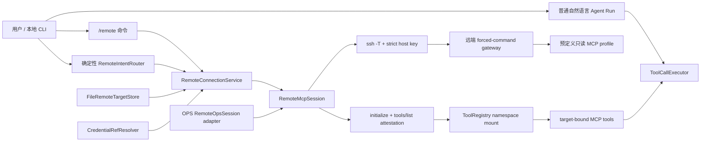
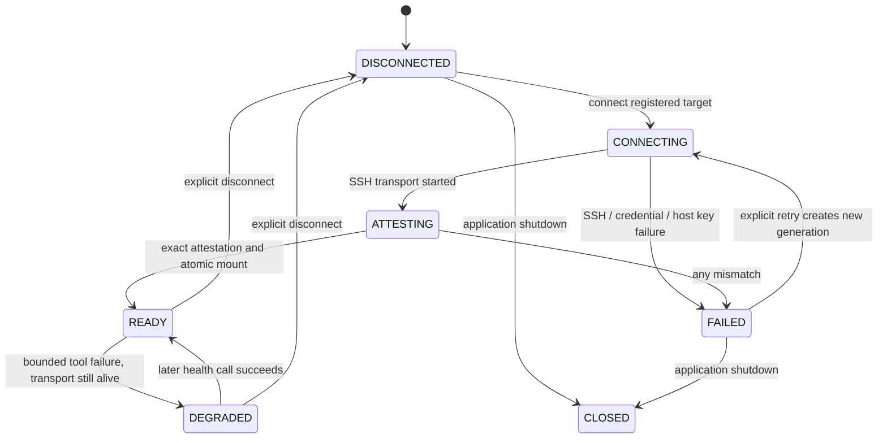

# REMOTE-0：个人 CLI 最小远程连接技术实现方案

> 日期：2026-07-28
> 状态：实现封板（2026-07-29）；本文保留为技术合同和历史决策
> 实现执行者：DeepSeek / Claude Code Agent
> 适用范围：REMOTE-0，不包含 OPS-2B、OPS-3 或新的远程写能力
> 后续产品体验以 [product-direction.md](product-direction.md) 为准；当前代码事实以 `TODO.md`、`DESIGN.md` 和仓库源码为准

## 1. 结论

REMOTE-0 不是把 Clawkit 部署到云端，也不是建设 SSH 管理平台。它只增加一个很窄的纵向能力：

```text
个人本地 Clawkit CLI
  → 选择一台用户已经登记的服务器
  → 使用本地 SSH 凭据建立受限 MCP 会话
  → 严格核对远端身份和工具合同
  → 把通过核验的只读工具临时挂载到现有 ToolRegistry
  → 用户可以直接查看状态，也可以让模型读取有界证据并总结
  → 断开后撤销该目标的全部临时工具
```

采用“在 `clawkit-tools` 内提炼最小通用远程会话 + OPS 薄适配”的实现，不让核心 CLI 直接依赖 `clawkit-ops-loop`，也不新建大型远程平台模块。

首版只支持一个活动目标、一个 SSH/MCP 长连接和五个只读工具：

- `service_status`
- `container_status`
- `ports`
- `http_probe`
- `logs`

任何任意 SSH 命令、SFTP、端口转发、sudo、Docker CLI、SQL、任意路径读取和远程写工具都不进入 REMOTE-0。

实现完成后的产品判断：

- REMOTE-0 证明了受控连接、严格能力核验、动态工具挂载、双层脱敏和非 Incident 远程调用可以工作；
- 它没有证明当前 `/remote add --config <yaml>`、hash 配置和 attestation 展示对普通用户足够友好；
- 后续不继续扩展 REMOTE-0 的工具范围，而进入 PRODUCT-1 服务器接入体验和 PRODUCT-2 Ops 调查入口；
- Remote 是产品入口，Ops Loop 是调查、处置和验证核心，不能把两者拆成互不相关的功能线。

## 2. 已确认的五个产品决策

本方案把前面讨论确定的五项决策作为不可被实现 Agent 擅自改变的基线。

### 决策一：Clawkit 继续运行在本地

用户本地运行 Clawkit，远端只部署受限 MCP 服务端。REMOTE-0 不提供云端 Clawkit 服务、Web 控制台或中心控制面。

### 决策二：只连接用户显式登记的服务器

模型不能输入 IP 后临时创建连接，也不能扫描云账号。目标必须先由确定性 CLI 命令写入本地 Target Store。

### 决策三：远程工具采用预定义能力

客户端和服务端共同核对固定 Capability Profile。模型只能看到核验通过的结构化工具，不能得到通用 shell。

### 决策四：当前是个人 CLI

配置、生命周期和交互首先服务单个本地用户。接口不绑定全局静态用户目录，方便未来替换 Target Store 或凭据解析器，但当前不实现多用户、RBAC、共享资产和团队审计平台。

### 决策五：增量提炼，不大规模重构

复用现有 SSH/MCP、工具执行、权限和观测主链。只抽出 CLI 必须复用的通用部分；Incident、Evidence Bundle、Diagnosis、Repair 和 Verification 继续属于 OPS。

## 3. 用户故事与首版交互

### 3.1 登记目标

目标登记必须是确定性命令，不经过模型：

```text
/remote add test-server --config D:\configs\test-server.yaml
```

为了避免在命令历史里出现主机和凭据引用，推荐从单目标配置文件导入。也可以提供交互式输入，但不得接受私钥正文和密码。

成功后：

```text
Target registered: test-server
Profile: APP_DOWN_V1
Credential: env:CLAWKIT_TEST_SERVER_KEY_FILE
Host key: strict, pinned known_hosts
```

### 3.2 查看目标

```text
/remote list
/remote show test-server
/remote status
```

默认展示：

- `targetId`
- 当前连接状态
- 最近连接时间
- SSH/MCP 总延迟
- `serverName`
- `protocolVersion`
- `probeVersion`
- `capabilityProfile`
- 服务端声明的 `toolSetHash`
- 客户端根据真实 `tools/list` 计算的合同哈希
- 实际挂载的工具名称
- 结构化失败码

默认不展示：

- 私钥内容
- 私钥完整路径
- 环境变量的值
- known_hosts 内容
- 原始 SSH 命令
- 原始错误堆栈

### 3.3 连接与断开

确定性入口：

```text
/remote connect test-server
/remote disconnect
```

自然语言入口：

```text
用户：连接到 test-server 服务器，告诉我连接和工具状态。
CLI：RemoteIntentRouter 识别严格格式，只解析已登记 targetId。
系统：不调用模型，完成 SSH/MCP attestation，返回结构化状态。
```

自然语言连接只是 `/remote connect` 的语法糖，只允许选择已登记目标。新增目标、修改 host key、修改预期 profile 或扩大工具合同仍必须使用确定性命令。不能匹配严格格式的普通句子继续交给模型，但模型本身没有连接管理工具。

首版同时只允许一个活动目标。已经连接 `test-server` 时尝试连接另一目标，返回 `RMT-015 ACTIVE_TARGET_EXISTS`，不做隐式切换。

### 3.4 读取日志并总结

```text
用户：查看 test-server 上 order-api 最近五分钟日志，总结异常。
模型：
  1. 发现 test-server 已 READY；
  2. 调用 mcp__remote_test_server__logs；
  3. 只传服务端 schema 允许的 service/windowSeconds/tail；
  4. 根据结构化结果总结；
  5. 在结论后引用 remoteEvidence.ref。
```

示例结果：

```text
order-api 最近五分钟出现 3 次上游连接超时，没有发现容器重启。

证据：
- run://run-123/tool/call-7（logs，2026-07-28T14:02:10Z）
- run://run-123/tool/call-8（container_status，2026-07-28T14:02:12Z）
```

“证据引用”指向本次 Run 中真实发生的工具调用，不创造 Incident，也不复用 OPS 的 IncidentEvidenceStore。

## 4. 当前代码事实

### 4.1 可以复用的部分

| 现有实现 | 可复用价值 |
| --- | --- |
| `StdioTransport` | 启动 SSH 子进程、JSON-RPC 请求关联、超时和关闭 |
| `McpClient` | initialize、tools/list、tools/call |
| `McpToolAdapter` | 把 MCP 工具映射为 Clawkit Tool |
| `ToolRegistry` | 向模型暴露工具 |
| `ToolCallExecutor` | 权限、超时、重试、事件和结果回注 |
| `RemoteTargetDescriptor` | 无秘密的 target/attestation 描述 |
| `SshConnectionConfig` | 严格 SSH 参数 |
| `RemoteOpsSession` | SSH/MCP 生命周期和 fail-closed attestation |
| `OpsCapabilityProfile.APP_DOWN_V1` | 首批五个只读工具 |
| `OpsMcpServer` | 服务端 profile、schema、annotations 和二次参数校验 |

### 4.2 不能直接照搬的部分

1. `RemoteOpsSession` 位于 `clawkit-ops-loop`，并硬编码 `serverName=clawkit-ops-mcp`，不是通用 CLI 契约。
2. `clawkit-cli` 直接依赖 `clawkit-ops-loop` 会让核心 Runtime 反向依赖 OPS 应用层。
3. `ToolRegistry` 只有注册，没有带所有权的批量挂载和撤销；断开后可能留下失效工具。
4. 当前 `McpToolAdapter` 只根据 annotations 建立元数据，没有绑定 target generation；旧连接工具可能在重连后错误调用新旧会话。
5. 当前日志工具有时间、行数和字节上限，但日志正文仍可能包含 token、Authorization、连接串或业务敏感字段。
6. 当前 `toolSetHash` 只覆盖工具名，不能发现 schema 被扩大或 annotations 被篡改。
7. 现有 OPS 入口从环境变量组装连接，不能直接承担个人 CLI 的 Target Store。

因此 REMOTE-0 需要一次小范围通用化，但不能把整个 OPS Loop 搬入 CLI。

## 5. 目标架构



模块责任：

| 模块 | 新增或调整 | 不负责 |
| --- | --- | --- |
| `clawkit-tools` | 通用 Remote MCP target、session、attestation、动态工具挂载 | Target 文件位置、CLI 展示、Incident |
| `clawkit-cli` | File Target Store、凭据引用解析、命令、状态展示、composition | SSH 协议实现、OPS 诊断 |
| `clawkit-ops-loop` | 现有 `RemoteOpsSession` 改为通用 session 的薄适配 | 通用 CLI 状态和目标管理 |
| `clawkit-ops-mcp` | 继续提供首批预定义只读 profile；补日志脱敏 | 任意 shell、通用主机管理 |

不新增 `clawkit-remote-platform`、控制面数据库或独立守护进程。

## 6. 核心数据契约

以下名称是建议名称。实现 Agent 可以在不改变职责的前提下微调包名，但不能把秘密字段放入安全 DTO。

### 6.1 `RemoteTargetDescriptor`

位置建议：

```text
clawkit-tools/src/main/java/com/clawkit/tools/remote/RemoteTargetDescriptor.java
```

字段：

```java
record RemoteTargetDescriptor(
    String targetId,
    String expectedServerName,
    String expectedProtocolVersion,
    String expectedProbeVersion,
    String expectedCapabilityProfile,
    String expectedToolSetHash,
    String expectedToolContractHash
)
```

该类型可以进入 CLI 输出、工具描述和 RunEvent，但不得包含 host、user、key path 或环境变量值。

### 6.2 `RemoteEndpointConfig`

仅保存在本地进程：

```java
record RemoteEndpointConfig(
    String host,
    int port,
    String user,
    CredentialRef identityFileRef,
    Path knownHostsFile,
    Duration connectTimeout,
    Duration requestTimeout,
    int maxOutputBytes
)
```

`CredentialRef` 首版只支持：

```text
env:CLAWKIT_TEST_SERVER_KEY_FILE
file:D:/keys/id_ed25519_clawkit_opsro
```

`env:` 的值必须是私钥文件路径，不允许把私钥正文放入环境变量。拒绝包含换行、PEM 头、空值和相对路径的结果。

不支持：

- password
- inline private key
- ssh-agent 自动枚举
- 默认 `~/.ssh/id_rsa`
- 自动选择 known_hosts

### 6.3 Target 配置文件

默认路径：

```text
~/.clawkit/remote-targets.yaml
```

单目标导入文件示例：

```yaml
schemaVersion: 1
targetId: test-server
endpoint:
  host: 203.0.113.10
  port: 22
  user: opsro
  identityFileRef: env:CLAWKIT_TEST_SERVER_KEY_FILE
  knownHostsFile: D:/keys/known_hosts_clawkit
  connectTimeoutSeconds: 10
  requestTimeoutSeconds: 15
  maxOutputBytes: 32768
attestation:
  expectedServerName: clawkit-ops-mcp
  expectedProtocolVersion: "2024-11-05"
  expectedProbeVersion: "1"
  expectedCapabilityProfile: APP_DOWN_V1
  expectedToolSetHash: d822b006a5dcb84c
  expectedToolContractHash: <canonical tools/list hash>
```

Target Store 使用临时文件加原子替换写入。重复 targetId 默认拒绝，只有显式 `--replace` 才能覆盖。

删除正在使用的目标必须拒绝，先断开再删除。

### 6.4 `RemoteAttestationSnapshot`

```java
record RemoteAttestationSnapshot(
    String targetId,
    String serverName,
    String protocolVersion,
    String probeVersion,
    String capabilityProfile,
    String advertisedToolSetHash,
    String computedToolSetHash,
    String computedToolContractHash,
    List<String> toolNames,
    long connectLatencyMs,
    long attestationLatencyMs,
    Instant attestedAt
)
```

只在全部校验通过后产生 READY snapshot。

### 6.5 `RemoteConnectionSnapshot`

```java
enum RemoteConnectionState {
    DISCONNECTED,
    CONNECTING,
    ATTESTING,
    READY,
    DEGRADED,
    FAILED,
    CLOSED
}
```

```java
record RemoteConnectionSnapshot(
    String targetId,
    RemoteConnectionState state,
    long generation,
    RemoteAttestationSnapshot attestation,
    List<String> mountedTools,
    RemoteError error,
    Instant changedAt
)
```

状态对象不暴露 `RemoteEndpointConfig`。

## 7. 连接状态机



规则：

1. 每次显式 connect/retry 创建新的单调递增 `generation`。
2. 工具实例绑定 `targetId + generation`。
3. 调用开始时如果当前 generation 不匹配，返回 `RMT-013 STALE_REMOTE_TOOL`，不发网络请求。
4. attestation 完成前不挂载任何远程工具。
5. 挂载失败必须整体回滚，不能留下部分工具。
6. disconnect 先阻止新调用，再等待或取消进行中只读调用，撤销 namespace，最后关闭 transport。
7. 关闭失败不能阻止本地 namespace 撤销。
8. 同一 target 的 READY connect 是幂等操作，返回当前 snapshot，不新建第二条 SSH 连接。

## 8. 严格 attestation

连接成功不等于 READY。必须依次通过：

```text
SSH transport started
  → MCP initialize
  → protocolVersion exact match
  → serverName exact match
  → probeVersion exact match
  → capabilityProfile exact match
  → initialize.toolSetHash exact match
  → tools/list succeeds
  → recomputed toolSetHash exact match
  → tool names exactly equal to APP_DOWN_V1
  → every annotation is safe
  → canonical tool contract hash exact match
  → atomic tool mount
  → READY
```

首版安全 annotation 必须同时满足：

```text
readOnlyHint=true
destructiveHint=false
openWorldHint=false
```

`idempotentHint` 缺失不用于放宽安全判断；如果存在，首版五个工具要求为 `true`。

### 8.1 工具合同哈希

当前 `toolSetHash` 只哈希工具名，继续保留以兼容 OPS，但 REMOTE-0 额外计算：

```text
SHA-256(
  canonical JSON of sorted [
    name,
    inputSchema,
    outputSchema,
    annotations
  ]
)
```

规则：

- 工具按 name 排序。
- JSON object key 递归排序。
- 不包含 description，避免纯文案修改导致合同漂移。
- 哈希使用完整 SHA-256 或至少 128 bit，不继续使用 64 bit 截断作为唯一合同证明。
- 实际工具多一个、少一个、schema 变宽或 annotation 改变都 fail closed。

### 8.2 为什么不能只做客户端过滤

如果服务端意外暴露 `restart_service`，客户端不能“过滤掉后继续 READY”。这说明远端 profile 已漂移。正确行为是整个连接进入 FAILED，并关闭 transport。

## 9. 动态工具挂载

### 9.1 `ToolRegistry` 增加带所有权的 namespace

建议增加：

```java
ToolMount mount(String ownerId, Collection<Tool> tools);
```

`ToolMount`：

```java
interface ToolMount extends AutoCloseable {
    String ownerId();
    List<String> toolNames();
    void close();
}
```

要求：

- 先检查所有名称合法、无重复、无已有冲突，再一次性挂载。
- 禁止覆盖内置工具或其他 MCP 工具。
- `close()` 只删除仍属于本 mount 的同一实例，不能误删后来注册的同名工具。
- `close()` 幂等。
- mount/lookup/list/close 并发安全。

不要继续使用当前“同名则告警并覆盖”的语义挂载远程工具。

### 9.2 工具命名

使用已有 MCP 命名风格：

```text
mcp__remote_<sanitized-target-id>__service_status
mcp__remote_<sanitized-target-id>__container_status
mcp__remote_<sanitized-target-id>__ports
mcp__remote_<sanitized-target-id>__http_probe
mcp__remote_<sanitized-target-id>__logs
```

`targetId` 只允许 `[a-z0-9][a-z0-9_-]{0,62}`，挂载前把 `-` 转成 `_`。不同 targetId 不得在规范化后碰撞。

### 9.3 Target-bound adapter

通用 `McpToolAdapter` 外增加一层 target-bound decorator，职责：

1. 校验 target generation。
2. 校验连接状态为 READY 或允许的 DEGRADED。
3. 调用前再次确认工具属于 attested set。
4. 对返回 JSON 做大小限制和二次脱敏。
5. 增加 `remoteEvidence`：

```json
{
  "ref": "run://<runId>/tool/<toolCallId>",
  "targetId": "test-server",
  "tool": "logs",
  "observedAt": "...",
  "collectedAt": "...",
  "current": true,
  "truncated": false
}
```

6. 保留原有 `ToolExecutionStatus`、error、duration 和 output stats。

这些工具仍由 `ToolCallExecutor` 执行，不能由 CLI、Agent 或 RemoteConnectionService 绕过 Registry 直接调用。

## 10. CLI 装配

### 10.1 新增服务

建议类型：

```text
clawkit-cli
  remote/
    FileRemoteTargetStore
    CredentialRefResolver
    RemoteConnectionService
    RemoteIntentRouter
    RemoteCommandHandler
    RemoteConsoleRenderer
```

不新增连接、断开、add/remove 的模型工具。自然语言连接、断开和查看状态只由窄格式的 `RemoteIntentRouter` 转换为确定性命令。

### 10.2 `ApplicationBootstrap`

启动时：

1. 创建 `FileRemoteTargetStore`，路径由构造参数注入。
2. 读取并校验 Target 配置；单个坏目标不应泄露秘密。
3. 创建 `RemoteConnectionService`，但不自动连接。
4. 创建 `RemoteIntentRouter`，只识别已登记 targetId 的固定连接语句。
5. 把 service 注入 `ApplicationContext` 和 CLI handler。
6. 应用退出时关闭 service。

不要在启动时询问是否连接远端，也不要因为存在 Target 就发起网络请求。

### 10.3 Slash command

在 `SlashCommandRouter` 增加 `remote`：

```text
/remote list
/remote show <targetId>
/remote add <targetId> --config <file>
/remote remove <targetId>
/remote connect <targetId>
/remote disconnect
/remote status
/remote tools
```

Slash command 不调用 LLM。它与自然语言工具共用同一个 `RemoteConnectionService`，不能各自维护连接。

### 10.4 自然语言语法糖

首版只识别下列窄格式：

```text
连接到 <targetId> 服务器
连接 <targetId>
查看远程连接状态
断开远程连接
```

解析规则：

- `<targetId>` 必须与 Target Store 中的 ID 完全匹配。
- 不接受 IP、host、user、URL 或 key path。
- 句子含有额外动作，例如“连接并执行命令”时不匹配，交给普通对话；模型也没有任意连接工具。
- intent router 只执行连接管理，不执行 `service_status`、`logs` 等远端能力。
- 真正的远程能力工具全部由连接成功后挂载，并继续经过 `ToolCallExecutor`。

采用确定性路由而不是 `remote_connect` 模型工具，是因为当前 `ToolCallExecutor` 会把声明 `NETWORK_OUT` 的普通工具视为需要 ActionDescriptor 的副作用动作。REMOTE-0 不修改这条可靠性语义，也不伪称 SSH 连接“没有网络行为”。

## 11. SSH 与凭据边界

继续使用现有安全参数：

```text
ssh -T
-o BatchMode=yes
-o PasswordAuthentication=no
-o KbdInteractiveAuthentication=no
-o IdentitiesOnly=yes
-o StrictHostKeyChecking=yes
-o UserKnownHostsFile=<explicit file>
-o ClearAllForwardings=yes
-o ServerAliveInterval=10
-o ServerAliveCountMax=2
-i <resolved key path>
-p <port>
user@host
```

补充要求：

- 不使用 `ControlMaster`。
- 不拼接 remote command；由远端 authorized_keys forced-command 决定入口。
- host、user、key path 只进入本地进程参数，不进入模型 prompt、Memory、Session 摘要或 RunEvent 参数摘要。
- 启动日志使用 targetId，不使用 `user@host`。
- 未知 host key 直接失败，不提供“本次接受”按钮。
- host key 更新必须由用户在 Clawkit 外部完成，或未来单独设计确定性导入命令。
- 远端账号继续禁止 PTY、forwarding、agent forwarding 和 SFTP。

## 12. 日志与输出安全

这是 REMOTE-0 的阻断项，不是锦上添花。

当前 `logs` 虽然限制了时间窗、行数和字节数，但应用日志可能包含 token、Authorization、cookie、数据库连接串、邮件或业务数据。直接把原文交给模型会绕过现有“凭据不进模型”的原则。

### 12.1 服务端第一层

在 `clawkit-ops-mcp` 的日志返回前增加 `LogSanitizer`：

- bearer token / Authorization header
- 常见 api key、token、secret、password 键值
- URL userinfo
- PostgreSQL/MySQL/JDBC 连接串中的凭据
- PEM private key block
- JWT 形态
- cookie/session 值
- 超长单行截断

服务端返回：

```json
{
  "redactionApplied": true,
  "redactedMatches": 3,
  "text": "..."
}
```

禁止记录被替换的原值。

### 12.2 客户端第二层

target-bound adapter 在进入模型前：

- 递归按敏感 key 脱敏 JSON。
- 对 `text` 和 `error` 再做模式脱敏。
- 校验最终 UTF-8 字节数。
- 非合法 JSON、超限且无法安全截断或包含 PEM 私钥头时返回 `RMT-014 OUTPUT_REJECTED`。

### 12.3 范围声明

正则脱敏不能证明任意生产日志绝对安全。因此 REMOTE-0 的真实 E2E 首先只在 Fixture/测试服务器执行。接入新的真实服务前，必须单独确认该服务日志策略。

## 13. 结构化错误

```java
record RemoteError(
    String code,
    String safeMessage,
    boolean retryable,
    Map<String, String> safeDetails
)
```

首版错误码：

| code | 场景 | retryable |
| --- | --- | --- |
| `RMT-001 TARGET_NOT_FOUND` | targetId 未登记 | false |
| `RMT-002 TARGET_CONFIG_INVALID` | 配置缺失或越界 | false |
| `RMT-003 CREDENTIAL_REF_UNRESOLVED` | 凭据引用无法解析 | false |
| `RMT-004 HOST_KEY_REJECTED` | host key 未知或漂移 | false |
| `RMT-005 SSH_AUTH_FAILED` | SSH 鉴权失败 | false |
| `RMT-006 REMOTE_UNREACHABLE` | 超时、拒绝或 DNS 失败 | true |
| `RMT-007 MCP_PROTOCOL_MISMATCH` | MCP 协议不匹配 | false |
| `RMT-008 SERVER_IDENTITY_MISMATCH` | serverName/probeVersion 不匹配 | false |
| `RMT-009 CAPABILITY_PROFILE_MISMATCH` | profile 不匹配 | false |
| `RMT-010 TOOL_CONTRACT_MISMATCH` | hash/list/schema 漂移 | false |
| `RMT-011 UNSAFE_TOOL_ANNOTATION` | 工具 metadata 不安全 | false |
| `RMT-012 TOOL_NAMESPACE_COLLISION` | 动态工具名冲突 | false |
| `RMT-013 REMOTE_NOT_READY` | 断开、旧 generation 或正在关闭 | true |
| `RMT-014 OUTPUT_REJECTED` | 返回内容不安全或非法 | false |
| `RMT-015 ACTIVE_TARGET_EXISTS` | 已有另一活动目标 | false |

错误消息不得带原始 SSH stderr。原始 cause 只进入本地 debug 日志，并在写入前脱敏。

## 14. OPS 兼容适配

`RemoteOpsSession` 不能被删除后让 OPS 大面积重写。建议改成薄适配：

```text
RemoteOpsSession
  ├─ 接受现有 RemoteTargetDescriptor / SshConnectionConfig
  ├─ 转换为通用 RemoteMcpTarget / RemoteEndpointConfig
  ├─ 委托 RemoteMcpSession start/call/close
  └─ 保持现有 OPS public API 和错误语义
```

兼容要求：

- OPS 现有 `RemoteDiscoveryWorkflow` 不改变业务步骤。
- `McpEvidenceCollector`、Diagnosis、Repair、IndependentVerifier 不迁移到通用包。
- `OpsFixSession` 暂不通用化。REMOTE-0 禁止写 profile，不借机合并 opsro/opsfix。
- 现有 APP_DOWN、POSTGRES_DIAGNOSIS 和 MVP-3 合同测试必须全部通过。
- 只有通用 session 的重复代码被提炼；OPS 领域类数量和流程不做重构。

## 15. 分阶段实现任务

DeepSeek 应按以下顺序实现。每一阶段先补测试，再改生产代码；不得先远端联调再补本地合同。

### R0-PR1：通用合同与 attestation 提炼

目标：

- 在 `clawkit-tools` 增加通用 target、endpoint、attestation、状态和 session。
- 从 `RemoteOpsSession` 提炼 SSH/MCP 通用部分。
- OPS 通过薄适配继续运行。

必须测试：

- 正常 initialize + tools/list。
- protocol/server/probe/profile/init hash/list hash 分别漂移。
- 工具多一个、少一个。
- annotation 缺失或不安全。
- schema 漂移导致 contract hash 不匹配。
- attestation 失败立即关闭 transport。
- interrupted 恢复中断标志。
- close 幂等。

退出门禁：

```text
mvn -B -ntp -pl clawkit-tools,extensions/clawkit-ops-loop -am test
```

全部通过，且 OPS public behavior 不变。

### R0-PR2：Target Store 与凭据引用

目标：

- 实现版本化 YAML store。
- 实现 add/list/show/remove。
- 实现 env/file 两种 key path 引用。
- 所有路径和环境读取可注入。

必须测试：

- 合法导入和原子写。
- schemaVersion 未知。
- 重复 target。
- `--replace` 显式覆盖。
- 删除活动 target 拒绝。
- 环境变量缺失。
- inline PEM、相对路径、目录路径拒绝。
- YAML 中出现私钥正文、password 字段拒绝。
- Windows 绝对路径。
- 测试只使用临时目录和 fake env。

### R0-PR3：动态 namespace 与连接服务

目标：

- `ToolRegistry.mount()` 和 `ToolMount.close()`。
- 单活动目标 `RemoteConnectionService`。
- generation 防旧工具调用。
- 成功 attestation 后原子挂载五个工具。

必须测试：

- READY 前 registry 中没有远程工具。
- 五个工具一次性出现。
- 名称冲突时零工具挂载。
- disconnect 后五个工具全部消失。
- 重连 generation 增加。
- 旧工具实例不发网络请求。
- 重复 disconnect/close。
- 第二目标不能隐式替换第一目标。
- 并发 status 与 disconnect 不抛异常。

### R0-PR4：CLI 与自然语言主链

目标：

- `/remote` 命令族。
- 窄格式 `RemoteIntentRouter`。
- `ApplicationBootstrap` 和应用关闭接线。
- 远程 MCP 工具继续走 `ToolCallExecutor`。

必须测试：

- SlashCommandRouter 解析。
- RemoteIntentRouter 只匹配精确 targetId，不把 IP 当成 target。
- 无 Target 时输出。
- connect 成功/失败状态展示。
- 自然语言连接语法糖完成后，下一次普通 Agent run 能看到动态远程工具。
- PLAN 模式只能看到只读 remote 工具。
- ToolInvoked/ToolCompleted RunEvent 存在，参数摘要只含 targetId。
- 模型工具列表中不存在 connect/add/remove/change-profile。
- CLI 退出释放 session。

### R0-PR5：日志双层脱敏与证据引用

目标：

- 服务端日志脱敏。
- 客户端二次脱敏。
- remoteEvidence 引用。

必须测试：

- Authorization、Bearer、JWT、password、JDBC URL、PEM、cookie。
- 敏感值不出现在工具结果、模型消息、Session 和 RunEvent。
- 长日志按 UTF-8 字节安全截断。
- 每次远程工具结果的 evidence ref 与真实 runId/toolCallId 一致。
- 模型摘要引用的 ref 必须来自本轮真实调用。

### R0-PR6：OPS 回归与非 Incident E2E

本地回归：

```text
mvn -B -ntp clean verify
git diff --check
```

远端 E2E：

```text
1. 记录远端原 profile。
2. 切换或启动 APP_DOWN_V1 只读 profile。
3. 用 /remote add 登记 test-server。
4. /remote connect test-server。
5. 核对 READY 与 attestation 全字段。
6. 调用五个只读工具。
7. 读取 order-api 有界日志并生成带 ref 的摘要。
8. 尝试未知工具、restart_service、非法 service、超大窗口和超大 tail。
9. /remote disconnect。
10. 验证 registry 无远程工具、SSH 子进程已退出。
11. finally 恢复远端原 profile 并重新 attestation。
12. 扫描证据目录，确认 secretsDetected=0。
```

该 E2E 是普通 CLI 场景，不创建 Incident，不调用 RepairOrchestrator。

## 16. 测试矩阵与最终验收

### 16.1 自动化测试

| 层级 | 必须覆盖 |
| --- | --- |
| Unit | 配置、凭据引用、状态、错误分类、合同哈希、日志脱敏 |
| Component | fake SSH/MCP、attestation、mount、generation、close |
| Integration | CLI → ToolCallExecutor → target-bound MCP tool → RunEvent |
| OPS Regression | Discovery、MVP-3 precheck/verification、现有 profile |
| Remote E2E | 已登记测试服务器、五工具、负例、恢复和清理 |

### 16.2 机械化 PASS 条件

以下条件必须同时满足，不能用默认值代替测量：

```text
registeredTargets = 1
connectionsAttempted = 1
connectionsReady = 1
attestationFailures = 0
expectedTools = 5
mountedTools = 5
readOnlyToolCallsSucceeded = 5
prohibitedToolCallsRejected >= 2
invalidArgumentCallsRejected >= 2
staleGenerationCallsSentToRemote = 0
toolNamespaceLeaksAfterDisconnect = 0
sshProcessesAfterDisconnect = 0
profileRestorePassed = true
evidenceReferencesValid = true
secretsDetected = 0
mavenFailures = 0
gitDiffCheckPassed = true
```

### 16.3 演示脚本

最终演示不超过五分钟：

```text
/remote list
/remote connect test-server
/remote status
“查看 order-api 最近五分钟日志，并结合容器和 HTTP 状态总结问题，附证据引用”
/remote disconnect
/remote status
```

能够清楚讲出：

1. Clawkit 在本地，MCP 服务端在远端。
2. SSH 只负责承载受限 MCP，不提供 shell。
3. 连接成功后还必须做 attestation。
4. 模型只看到通过核验的预定义工具。
5. 断开后工具和进程都被撤销。

## 17. 明确非目标

DeepSeek 不得在 REMOTE-0 中顺手实现：

- 多活动目标
- 连接池
- 自动扫描云主机
- 云厂商 API
- 跳板机
- SSH agent 管理
- 密码登录
- 自动接受 host key
- 通用 shell/terminal/SFTP
- 任意文件读取
- 任意 Docker 或 SQL
- opsfix 或其他写 profile
- Web UI
- 团队 RBAC、多租户、共享凭据中心
- Cron、Incident Registry、Playbook
- Shadow/AUTO 修复
- 新的长期记忆格式
- 重写现有 MCP Manager

上述能力只能写入长期 TODO，不能作为“为未来扩展”混入本次实现。

## 18. 反方评审

以下评审故意站在反对 REMOTE-0 的角度，尝试证明方案不值得做或不安全。

### 反对意见一：这只是给现有 OPS 功能换了一个 CLI 外壳

质疑：

- 五个工具全部来自 OPS。
- 远端服务端仍叫 `clawkit-ops-mcp`。
- 如果没有非 Incident 场景，就不存在真正的通用化价值。

判断：部分成立。

收敛：

- 最终验收必须包含“普通 CLI 连接 → 读取日志 → 模型总结”的非 Incident E2E。
- CLI 不得创建 Incident 或调用 OPS workflow。
- 如果实现最终仍要求 `clawkit-cli -> clawkit-ops-loop` 依赖，则 REMOTE-0 判定失败。
- 暂时复用 `APP_DOWN_V1` 名称是可接受的历史债，但通用 session 不能硬编码该名称。

### 反对意见二：新建通用抽象会引发大重构

质疑：

- Target、Credential、Session、Store、Mount、CLI handler 会新增很多类型。
- 可能为了一个消费者制造“平台层”。

判断：风险真实。

收敛：

- 不新建独立大模块。
- 通用部分放在已有 `clawkit-tools`，因为 transport、MCP client 和 tool adapter 已在这里。
- OPS 只增加薄适配，不重写领域流程。
- 每个新类型必须对应一个当前验收需求；没有当前消费者的接口不创建。
- 若通用提炼导致 OPS 大面积行为修改，暂停并退回更窄方案。

### 反对意见三：自然语言“连接服务器”会扩大模型权限

质疑：

- 模型可能连接错误目标。
- 模型可能尝试构造任意 IP。
- 用户说“看看服务器”时，模型可能擅自联网。

判断：成立，必须限制。

收敛：

- 自然语言工具只接受精确 targetId。
- targetId 不存在时不回退为 host/IP。
- add/remove/replace/host-key/profile 不是模型工具。
- 只允许一个活动目标，不隐式切换。
- 连接语法糖由确定性 intent router 处理，不给模型连接管理工具。
- 连接成功后挂载的五个只读能力仍全部进入 ToolCallExecutor 和 RunEvent。
- 如果用户只问“有哪些服务器”，调用本地 status/list，不自动连接。

### 反对意见四：只读日志不等于安全

质疑：

- 日志可能有密钥和个人数据。
- MCP annotations 的 `readOnlyHint=true` 不能证明内容安全。
- 当前服务端返回原始日志文本。

判断：完全成立，是当前方案最大的安全风险。

收敛：

- 双层脱敏成为阻断门禁。
- 首个真实目标只允许 Fixture/测试环境。
- 服务端继续限制 service、窗口、行数和字节。
- 新服务接入前单独审查日志内容策略。
- 发现 PEM、Authorization 或无法安全解析的输出时 fail closed，而不是“尽量展示”。

### 反对意见五：toolSetHash 不能证明工具合同没漂移

质疑：

- 当前哈希只覆盖工具名。
- 同名工具可以把 `tail` 上限改大、把 endpoint 改成自由 URL，客户端仍会 READY。

判断：成立。

收敛：

- 增加本地计算并 pin 的 canonical tool contract hash。
- 校验 schema、outputSchema 和 annotations。
- 服务端参数仍必须二次白名单校验，客户端 schema 不是授权边界。

### 反对意见六：动态注册工具会产生并发和残留问题

质疑：

- 当前 Registry 会覆盖同名工具。
- 断开时没有 unregister。
- 旧 tool adapter 可能持有已关闭或错误的 client。

判断：成立。

收敛：

- 增加带所有权的原子 `ToolMount`。
- generation 绑定防止旧实例调用。
- disconnect 顺序固定为“停止新调用 → 撤销 mount → 关闭 transport”。
- E2E 必须测 registry leak 和 SSH 进程残留。

### 反对意见七：连接状态可能只是 UI 自报

质疑：

- CLI 显示 READY，但没有保存 initialize/list 的真实字段。
- DEGRADED 可能成为掩盖失败的模糊状态。

判断：成立。

收敛：

- READY 只能由完整 attestation snapshot 产生。
- status 展示 advertised/computed hash 和真实 tool names。
- profile、合同或身份漂移永远是 FAILED，不允许降级为 DEGRADED。
- DEGRADED 仅表示“身份和合同仍可信，但最近一次只读工具调用失败且 transport 仍存活”。

### 反对意见八：个人 CLI 为团队化预留接口是过度设计

质疑：

- Store interface、CredentialRef interface 可能成为没有价值的抽象。

判断：一半成立。

收敛：

- 只保留一个很窄的 `RemoteTargetStore` 和 `CredentialRefResolver` 注入点，用于测试和替换本地文件。
- 不增加 tenantId、owner、role、organization、policy server 等未来字段。
- 团队化只体现在“不把用户目录写死在核心逻辑”，不体现在当前数据模型。

### 反对意见九：REMOTE-0 会让项目重新偏向运维

质疑：

- 用户原本希望 Clawkit CLI 更通用，但首批工具仍全是运维查看。

判断：需要控制叙事。

收敛：

- REMOTE-0 的项目价值不是增加更多故障 Case，而是证明 Runtime 能安全挂载远端预定义能力。
- 实现中不新增 Incident、Diagnosis 或 Repair 功能。
- 完成后下一个远程能力是否继续扩展，必须由真实使用场景决定，而不是默认回到 OPS Loop。

## 19. 反方评审后的最终裁决

结论：**GO，但有四个 P0 条件。**

只有同时满足以下条件，REMOTE-0 才值得实现：

1. `clawkit-cli` 不直接依赖 `clawkit-ops-loop`。
2. 日志在进入模型前完成服务端和客户端双层脱敏。
3. 远程工具使用严格合同 attestation 和可撤销的 generation-bound mount。
4. 最终存在一个不创建 Incident 的真实 CLI E2E。

任何一个条件被删掉，方案应暂停，而不是以“后续补安全”为由先合入。

## 20. 给 DeepSeek / Claude Code Agent 的执行约束

1. 开始前读取 `CLAUDE.md`、`DESIGN.md`、`TODO.md`、本方案和现有 OPS MVP-1 设计。
2. 先输出代码事实核对表：现有类型、依赖方向、准备新增/修改的文件。
3. 不覆盖或回滚当前工作区已有改动，不使用 `git reset --hard` 或 `git checkout --`。
4. 按 R0-PR1 至 R0-PR6 顺序实施；每阶段先测试后生产代码。
5. 未经用户明确同意，不修改真实远端服务器；PR1 至 PR5 使用 fake transport。
6. 真实 E2E 必须使用唯一证据目录，保存原始命令退出码和结构化结果。
7. 汇总器不得用默认 0 代表未测，不得由最终 READY/成功状态反推副作用或安全计数。
8. 失败时报告真实失败，不为了得到 `passed=true` 放宽 verifier。
9. 不顺手实施 OPS-2B、OPS-3、多主机或远程写工具。
10. 完成后交付：
    - 文件清单
    - 架构变化
    - 测试总数与失败数
    - E2E 原始计数
    - 安全负例
    - 已知限制
    - 是否满足本方案四个 P0 条件
